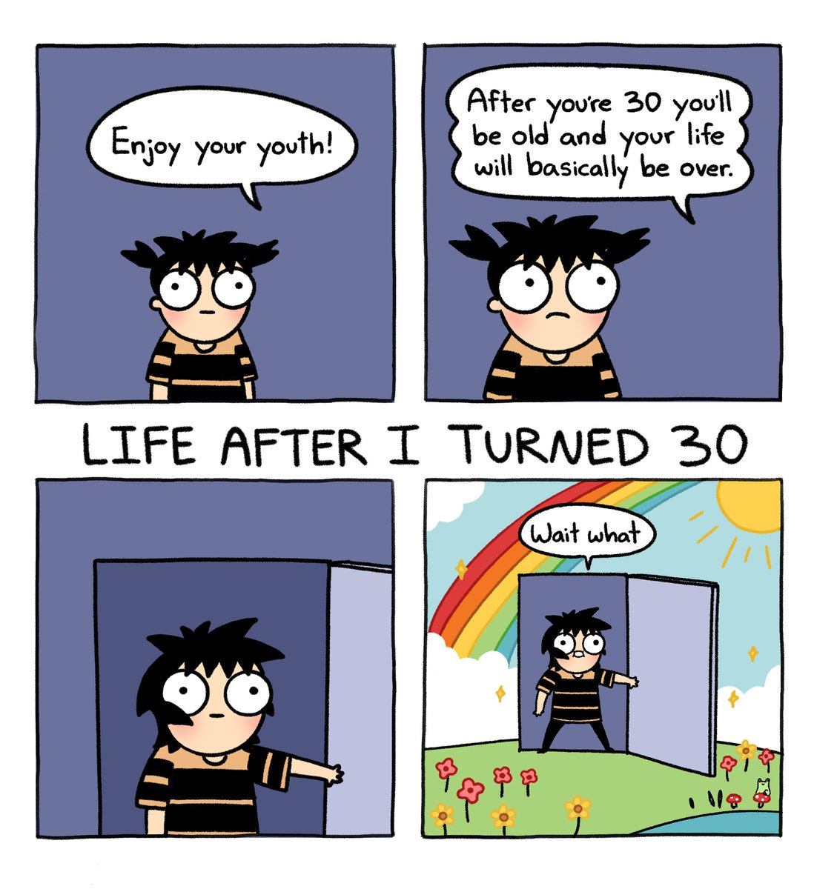
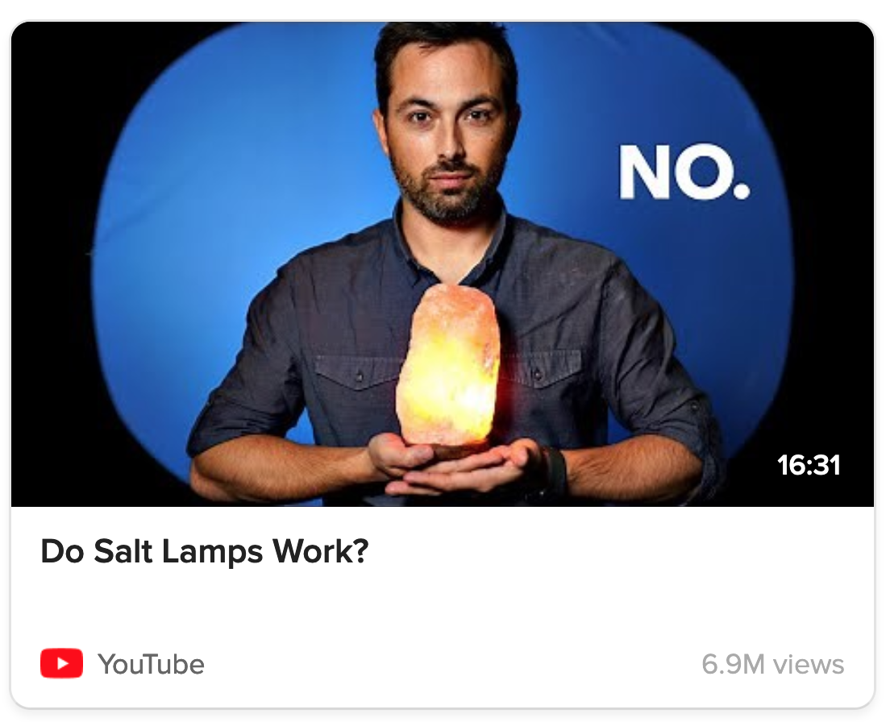

My birthday is September 11. Yes, my 7th birthday [sucked](https://en.wikipedia.org/wiki/September_11_attacks). But, today's my *30th* birthday! To celebrate and/or be masochistic, **here's 30 pieces of advice, that *thirty*-year-old me wishes I could've given to *thirteen*-year-old me.**  (These may or may not help *you* specifically; steal what's helpful, ditch the rest!)

Below is a summary of all 30 tips!

* **Click the ⤵ arrow to read more about a Tip.** (~1 minute read each, for ~30 minutes in total.)
* **Skip what doesn't interest you, you can read them in any order!** (There's also a Table of Contents tab on the right 👉)

**🏃‍♀️ Health**

1. Don't drink 2 Red Bulls and 1 Monster per day. [⤵](#tip_1)
2. Seriously, go outside & move your body. [⤵](#tip_2)

**💰 Finances**

3. Start saving *now*, shove it into an index fund, then forget about it. [⤵](#tip_3)

**🤖 Self-management** 

4. Write down what you care about most, then put this list somewhere you'll review regularly. [⤵](#tip_4)
5. Use a diary not just to record your life, but to scientifically experiment with it! [⤵](#tip_5)
6. Become a cyborg: use tools to augment your crappy memory, attention, and willpower. [⤵](#tip_6)
7. Emotions are neither truth nor lies; they're "just" tools. Learn to use them well! [⤵](#tip_7)

**💖 Relationships**

8. _You_ should organize the hangout. [⤵](#tip_8)
9. WIN-WIN OR BUST: say NO to win-lose narcissism & lose-win martyrdom. [⤵](#tip_9)
10. Healthy relationships are conditional & transactional (_in an open, honest way_) [⤵](#tip_10)
11. Yes, you can quit family, friends, and romances. [⤵](#tip_11)
12. But trust isn't all-or-nothing, or even a 1D spectrum. It's infinite sliders. [⤵](#tip_12)

🦄 **Self-Discovery**

13. Hey past Nicky, try cross-dressing, you may learn something about yourself [⤵](#tip_13)

**🌱 Learning**

14. Don't be afraid to suck. [⤵](#tip_14)
15. Get the intuitive understanding first. [⤵](#tip_15)
16. Use spaced repetition flashcards!!!!!!!!!!!!!!!!!!!! [⤵](#tip_16)
17. Learn it by teaching someone else. [⤵](#tip_17)

**🤔 Critical thinking / "Rationality"**

18. Cliché ≠ wrong, Contrarian ≠ right. [⤵](#tip_18)
19. Mythbust, factcheck & debate yourself. [⤵](#tip_19)
20. Sloppy words lead to sloppy thinking. [⤵](#tip_20)
21. Put numbers on it. (with error bars) [⤵](#tip_21)
22. Only a fool plays with one hypothesis. [⤵](#tip_22)

**🎁 Making art**

23. Make the kind of stuff *you* would've wanted. [⤵](#tip_23)
24. Small scope, Small tests, Small wins, Small bets! [⤵](#tip_24)
25. Having fun is efficient! [⤵](#tip_25)
26. Build a better mousetrap and they won't come; or, learn to "sell" your work. [⤵](#tip_26)

**💭 Philosophy / Ethics**

27. Happy Nihilism: nothing matters, including the fact nothing matters. [⤵](#tip_27)
28. Don't save the world. [⤵](#tip_28)
29. Just do what sparks joy in yourself & your loved ones, without burning others down. [⤵](#tip_29)

**👵 Getting older**

30. It's probably going to be okay. [⤵](#tip_30)

. . .

And now, to elaborate on each piece of advice to my past self!  (Again, *skip what's not useful to you.*)  Ahem:

**_Dear 13-year-old Nicky,_**

---

## 🏃‍♀️ Health

### 1) Don't drink 2 Red Bulls and 1 Monster per day.

What the hell is wrong with you, past Nicky

. . . 
### 2) Seriously, go outside & move your body.

Dear Past Nicky, you think you can *think* your way out of anxiety & depression. And sure, the "software" of your mind matters, but so does the "hardware". For better and worse, you *are* made of meat.

So, keep your meat healthy! Exercise reliably has *the* biggest effect size, not "just" on physical health, but on mental health too.[^exercise-mh] (👈 hover to expand footnotes) In fact, exercise helps with depression *more than twice as much as therapy or medication!*[^exercise-mh-2]

And it doesn't have to be CrossFit neither. Just do 30 minutes a day of moderate exercise! The specifics will depend on your budget, preferences & dis/abilities, but you could: jog, lift weights, join Zumba class, play VR exercise games, whatever! (See [Tip 25](#tip_25): Having fun is efficient!)

You're also probably not getting enough Vitamin D[^vit-d], go eat sun you vampire.

[^exercise-mh]: Meta-analysis by [Rosenbaum, Tiedemann, & Sherrington 2014](https://www.psychiatrist.com/jcp/physical-activity-interventions-mental-illness-systematic/): *“The primary meta-analysis found a large effect of physical activity on depressive symptoms [...] A large effect was found for schizophrenia symptoms [...] and moderate effects were found for aerobic capacity [...] and quality of life.”*

[^exercise-mh-2]: For context, in statistics there's a standard way to measure an "effect size", and by convention, 0.2 = small, 0.5 = medium, 0.8 = large. Adjusting for [publication bias](https://en.wikipedia.org/wiki/Publication_bias), the effect size of exercise on depression is **1.11**. ([Schuch et al 2016](https://www.sciencedirect.com/science/article/abs/pii/S0165032715314221)) For psychotherapy, it's **0.42**. ([Cuijpers et al 2018](https://www.cambridge.org/core/journals/the-british-journal-of-psychiatry/article/efficacy-of-cognitivebehavioural-therapy-and-other-psychological-treatments-for-adult-depression-metaanalytic-study-of-publication-bias/585841C1FAC63E0AAC140BA1557AEACA)) For medication/SSRIs, it's also **less than 0.50**. “Even based on our predefined minimal thresholds for clinical significance \[authors chose "effect size of 0.50", see note (8) in the paper\], the effects of SSRIs did not have a clinically meaningful effect on depressive symptoms.” ([Jakobsen et al 2017](https://link.springer.com/article/10.1186/s12888-016-1173-2))

[^vit-d]: [Cui et al 2022](https://www.ncbi.nlm.nih.gov/pmc/articles/PMC9573946/): In the US, 40.9% of people have insufficient Vitamin D, 22.0% have moderate Vitamin D deficiency, 2.6% severe deficiency.

---

## 💰 Finances

### 3) Start saving *now*, shove it into an index fund, then forget about it.

One of those "I can follow the math, but I still don't *really* believe it" things:

* If, **starting at age 18, you saved $10 a day**...
	* (skip the morning latté & pastry, or skip soda & snacks, or eat less takeout, etc)
* And put it in a **boring, passive, diversified index fund**...
	* (for example, the S&P 500's average annual growth rate, adjusted for inflation, is **6.8% a year**[^sp500])
* Then you **forget about it**, and don't try to day-trade or anything fancy...

[^sp500]: [Source](https://www.fool.com/investing/stock-market/indexes/sp-500/annual-returns/)

... you'd be **a millionaire by age 63, *inflation-adjusted*, without doing a god damn thing.**

*(from [my back-of-the-spreadsheet](https://docs.google.com/spreadsheets/d/1gjdJwQ1vcVM3y9T2Cdim6JYC-PcKIvh8ivV1ocb7yMo/edit?usp=sharing) calculations)*

"Just shove it in an index fund" is the advice of Warren Buffet[^buffet] and Nobel-Prizewinning economists[^nobel-economists][^economists].  I've been saving 10-20% of my income since age 18, but I'm still kicking myself that — up until just last year — I left it in my bank's savings account with negligible interest. As my friend put it, "Nicky, you *are* investing! You're investing in inflation." (Inflation will eat *half your savings every 20 years*.[^half]) 

[: Misc thoughts on the ethics of investing](#MoralityOfInvesting) (👈 click dotted-underlined links to expand sidenotes.)

Point is, if you're young (or even if not), **holy shit start saving _now_, put it in a low-fee, diversified, socially-responsible index fund, then _don't fucking touch it._**

*(Hat tip to BCRE8TIVE for teaching me about index funds [at a, uh, furry convention](https://sfw.furaffinity.net/view/44668909/). For more layperson-friendly money advice, I recommend [Millionaire Teacher](https://bookshop.org/p/books/millionaire-teacher-the-nine-rules-of-wealth-you-should-have-learned-in-school-andrew-hallam/12564730?ean=9781119356295) and [PoorCraft](https://bookshop.org/p/books/poorcraft-the-funnybook-fundamentals-of-living-well-on-less-c-spike-trotman/9319993?ean=9781945820014).)*

[^buffet]: Investor Warren Buffet once made a 10-year-long bet, over $2.2 million, that low-cost, diversified index funds would beat all the top "actively managed" hedge funds in the long run. [Buffet won.](https://longbets.org/362/)

[^nobel-economists]: Some Nobel Memorial Prize-winning economists who supported low-cost, diversified index funds include (not comprehensive list): **Paul Samuelson**, **Eugene Fama** ([2ndary source](https://www.onedayinjuly.com/who-supports-indexing)) and **Richard Thaler** ([source](https://www.fraserinstitute.org/blogs/economists-unanimous-index-funds-are-investing-101))

[^economists]: It's also the opinion of almost all economists. William Watson (2019) for Fraser Institute: [“Economists unanimous—index funds are 'Investing 101'”](https://www.fraserinstitute.org/blogs/economists-unanimous-index-funds-are-investing-101).
	
	“I get this from the latest survey of economists by the Initiative on Global Markets (IGM) [...] which is probably the best indicator of where mainstream economic opinion is on various issues[.]
	
	The statement was: **“In general, absent any inside information, an equity investor can expect to do better by holding a well-diversified, low-fee, passive index fund than by holding a few stocks.”** The responses on this one were: **“Strongly Agree,” 57 percent, and “Agree,” 36 percent. All other responses: 0 percent.** (The total is only 93 per cent because a couple of people didn’t respond.)” [emphases added]

[^half]: The historical average inflation rate is 3.3% a year. Losing 3.3% per year = Multiplying by 100% – 3.3% = 96.7% per year. 96.7% over 20 years = 0.967\^20 ~= 0.5. That is: half your money disappears every 20 years.

---

## 🤖 Self-management

### 4) Write down what you care about most, then put this list somewhere you'll review regularly

If you want to live well, *explicitly figure out what "well" means to you, and remind yourself of it often.* (Yes it's cliché, but [Tip 18](#tip_18) Cliché ≠ Wrong)

Prompts to ask yourself:

* **Future:** What would matter to me 1 year from now? 10 years from now? 100 years from now? (pretend that lifespans grow hugely)
* **Past:** What were the happiest & most meaningful moments in my life so far? What did they share in common?
* **Present:** What sparks joy?

Use these prompts to create a "What I Care About" list. This list can be a mix of short-term goals, long-term dreams, and timeless values.

For example, here's my current list, more or less:

* 🏃‍♀️ Be healthy: eat, sleep, exercise, meditate.
* 👯‍♀️ Be a good friend.
* 💖 `[private relationship goal redacted]`
* 🧠 Be a "Renaissance Woman": learn deeply, create art & science.
* 🤖 Pivot to research in 2025? In particular: AI, AI alignment, causal statistics, systems biology.
* 💃 Gender euphoria: "beat" my dysphoria, and get sustainably femme & comfy in my body.
* 🐣 Raise a kid one day?
* ♾ Become biologically amortal.
* 😽 Become a genetically engineered catgirl.
* 👹 `[world domination plan redacted]`
* 💩 Inbox zero

(Bonus points if you add emojis/pictures to your list, so it's more emotionally resonant!)

Point is: **it's too easy to slip into autopilot for _years_, and forget about what _really_ matters to you.** (I know *I've* had full-autopilot years...)

So, make autopilot work for *you*, and put your list somewhere you'll *automatically* see often: your bedroom wall, your bathroom mirror, your phone/laptop background, etc!

. . .

### 5) Use a diary not just to record your life, but to scientifically experiment with it!

Common use for diaries: helps you savor each day, solidify your memories, keep you honest when you look back.

Less common use for diaries: *to do science on yourself!*[^n-1]

One of the most helpful habits I've gotten is to, at the end of each day, write down:

[^n-1]: See Slime Mold Time Mold's [N=1 Science](https://slimemoldtimemold.com/2023/01/05/n1-introduction/) research series

* `+` What was good today. (Observation)
* `-` What was bad today. (Observation)
* `?` *Why* the good/bad things happened. (Hypothesis)
* `!` *What to try* tomorrow, to get more good and less bad! (Experiment)

A quick tiny scientific-process loop to help me have better days!

. . .

### 6) Become a cyborg: use tools to augment your crappy memory, attention, and willpower.

Dear Past Nicky, you're probably sub-clinically ADHD.  But even if not, human memory/attention/willpower sucks, especially pitted against a media environment specifically designed to Get You.

So, steal back the power of tech, to fight back against other tech, and reclaim your mind by *becoming a cyborg!*

*(from my talk, [The Creative Cyborg](https://blog.ncase.me/the-creative-cyborg/))*

Or to be less dramatic & more specific, try using:

* A digital diary (see [Tip 5](#tip_5))
* Checklists & to-do lists[^checklist]
* Anti-procrastination apps like [LeechBlock](https://www.proginosko.com/leechblock/) & [minimalist phone](https://www.minimalistphone.com/)
* Routine-tracking apps like [RoutineFlow](https://routineflow.app/)
* [Habit-tracking apps](https://zapier.com/blog/best-habit-tracker-app/)
* Spaced repetition flashcards to improve memory (see [Tip 16](#tip_16))

[^checklist]: See surgeon/writer Atul Gawande's famous article on [how checklists save lives](https://www.newyorker.com/magazine/2007/12/10/the-checklist).

. . .

### 7) Emotions are neither truth nor lies; they're "just" tools. Learn to use them well!

*(comic I made 4 years ago)*

One one hand, ignoring your emotions is clearly unhealthy repression. On the other hand, of *course* emotions aren't valid. People's emotions tell them they're worthless, or that their abusive lover is fantastic and I Can Fix Them, etc.

So, what *are* emotions for? After decades of emotional fuckery, here's the frame that helped me most:

* **Emotions are _sensors:_** Like thermometers or motion detectors, emotions help you detect stuff fast. Positive feelings for helpful stuff; Negative feelings for harmful stuff. But the tradeoff of sensors being fast is they're error-prone. So, use your slow reason to figure out where your feelings are mis-calibrated (reminder: *positive* feelings can be bad too, e.g. loving a narcissist) then re-calibrate your emotion-sensors. (by using exposure therapy or (de/re)-sensitization)
* **Emotions are _accelerators & brakes_:** An adrenaline-pumping emotion helps you urgently do stuff. (e.g. finishing the exam with minutes to go) A de-activating emotion helps you slow down & savor the moment. (e.g. cuddling with someone) Accelerators & brakes are *both* useful at times, but only in appropriate circumstances. Learn to re-connect the right sensors, to the right accelerator/brakes, in the right situations. (with standard habit-formation advice[^habits])

[^habits]: Easy-to-say, hard-to-do: Pick an action you want to do, pick a specific time/place to do it, then consistently do it for 10 weeks or until it becomes automatic. (See Box 1 of [this paper](https://www.ncbi.nlm.nih.gov/pmc/articles/PMC3505409/))

---

## 💖 Relationships

### 8) _You_ should organize the hangout.

> \> "we should hang out sometime!"    
> \> "yeah, we should!"    
> [REPEAT UNTIL BOTH PEOPLE DIE]    

It needs to be *YOU.* *You* organize the hangout you want. And modern tools make it easier: start a group chat, run polls on hangout's date/time/activity with emoji-reactions or [Doodle](https://doodle.com/), use a calendar app to remind everyone, etc.

And you don't have to be an extrovert to do this! *I'm* not an extrovert! I just want to see my friends more than five times before I die. If you do too, put this Tip 8 into practice.

(Personal anecdote: the *first* friend-hangout I ever initiated was when I was **age 23**.  It's never too late to build social habits!  Anyway, we went to see Blade Runner 2049.  It sure was a long movie where things happened.)

. . .
### 9) WIN-WIN OR BUST: Say NO to win-lose narcissism & lose-win martyrdom.

Past Nicky grew up with a narcissist parent and adopted bad habits, then Past Nicky over-corrected and became a self-sacrificing martyr. I'd like to believe I now understand the symmetric flaws of both, and the better perpendicular direction:

* Narcissism: You have to lose so that I win.
* Martyrdom: I have to lose so that you win.
* Healthy relationships: **We both help each other win, or no deal.**[^7-habits]

[^7-habits]: Hat tip to the classic OG self-help book, [7 Habits of Highly Effective People](https://en.wikipedia.org/wiki/The_7_Habits_of_Highly_Effective_People). "Win-win or No Deal" is from there.

(also Win-Neutral and Neutral-Win: I do something nice for someone that costs me very little, and vice versa. e.g. Politeness, small acts of charity/kindness, etc)

Win-Win is clearly good with lovers & friends, but even in my more economically-transactional relationships, I want it to leave us *both* better off. Ethics "aside", it just makes business sense to build long-term trust. When I make "a piece of content", I do *NOT* want it to be a psychohazardous slot-machine or outrage-stroking fluff-piece. I want it to *actually help you.* (even if "just" to help you relax!)

Alas, Win-Win isn't possible with *everyone* (trolls, narcissists, etc), hence the "or No Deal" clause. If my interaction isn't Win-Win, I first try bringing up my needs, and/or asking if I'm satisfying the other person's needs. If that doesn't work after several attempts, then fuck it I'm out. ([Tip 11](#tip_11): *Yes you can quit people.*)

. . . 
### 10) Healthy relationships are conditional & transactional (_in an open, honest way_)

For some reason, most people think "not thinking about stuff" is more *authentic*: unplanned, un-edited, raw. In contrast, explicitly thinking about things means you're *cold and calculating*, no?

I think this is BS. A prepared wedding vow is *more* authentic for being prepared. The first draft is always shit; editing means you can make your words *more* aligned with your values.

In general: I think you should think about things.

In particular, I think you should think about the *specific conditions & transactions* in your relationships, on both your end *and the other person's end*. This isn't unfairly-manipulative as long as you're considering their needs too, and you're both open and honest about them. (If you need nicer-sounding words: "conditions" → "boundaries", "transactions" → "matching your needs/desires with my needs/desires".)

*But true love is unconditional*, you say? Okay, what if your partner kills your dog? I think "don't kill my dog" is a reasonable condition. Or less extreme, "don't prevent me from hanging out with my friends because you're jealous". Even if your partner never *actively* does anything bad, but never shows affection, never asks how you're doing, never helps with the house or the kids or your life... if you give them your heart, and you get near-nothing in return... yeah, that's a bad *transaction*, and ~everyone would recommend fixing it or getting out.

*But what about loyalty?* Yes, that's a transaction. e.g. I got your back, you got mine.

In [Tip 4](#tip_4), we learnt, "to live well, actually explicitly figure out what matters to you". Likewise: To have win-win relationships, *explicitly figure out what your relations are adding to your life, and – CRUCIALLY – vice versa: what you bring to the table for others.*[^jason-pagrin]

[^jason-pagrin]: "Explicitly figure out what *YOU* bring to the table" is excellent advice from this classic, maybe-a-bit-too-bro-y-and-edge-y article by Jason Pagrin (pen name David Wong): [6 Harsh Truths That Will Make You A Better Person](https://www.cracked.com/blog/6-harsh-truths-that-will-make-you-better-person).

. . .
### 11) Yes, you can quit family, friends, and romances.

Sometimes, it's not anyone's fault you two can't have a win-win relationship anymore. You both just grew down different paths, and now have different needs/wants. A friendship or romance that ends isn't necessarily a "failure", any more than a meal that ends is a "failure": it nourished you when y'all needed it, and you can still be grateful for that.

Buuuuut sometimes it's totally someone's fault. And if you've tried hard to fix it, but they refuse to fix it with you, then: quit. Get out.

*Even if you've been friends since childhood?* Yes.

*Even if you're married?* Consider the finances & kids first, but possibly yes. (Related: no-fault/unilateral divorce laws *sustainably* reduced womens' suicide by 20%[^divorce])

[^divorce]: Paper: [Stevenson & Wolfers 2003](https://www.nber.org/papers/w10175), see Figures 1-3 at the end of the PDF. (Figure 3 especially clarifies the suicide reduction is in *marriage-age female persons specifically.*) [Layperson-friendly press release here](https://www.nber.org/digest/mar04/divorce-laws-and-family-violence).

*Even if they're family?*

Let's think step by step:

* Do you owe love to a sperm donor?  No?  Then *mere shared genetic material* isn't a basis for love.
* Does a genetically-engineered super-soldier owe love to the military mad scientist who created them?  No?  Then *merely causing you to exist* isn't a basis for love.
* Do you owe love to a prison warden?  No?  Then *merely feeding, clothing, and sheltering you* isn't a basis for love.
* Does a public artist owe love to a generous donor?  No?  Then *giving you money & investing in your education for nothing in return* may be a basis for gratitude... but still not a basis for *love*.

The basis for love is the same as *every other damn relationship*: robust, mutual, win-win emotional nurturance.  Your "real" family is the one that *actually acts like a family should*, even if they're not your bio-family or legal-family.  Even if you haven't found this family yet.

(Related: we romanticize family too much. I remind you that 1) child sexual abuse is common, and 2) a child is *five times* more likely to be sexually abused by family than a stranger.[^csa] "Family" is not some magic juice that makes shitty people suddenly good to each other. I hope one day, we'll see "But they meant well & tried their best! You'll see how hard it is when *you* try it" as insane a defense for botched parenthood as for botched surgery.)

"Blood is thicker than water"? Yeah and printer ink's thicker than blood. (More expensive, too)

I'm writing in a slightly exaggerated manner, because if you — like Past Nicky — were trapped by sunk cost and called it "loyalty", I want to *snap you out of it.*

*YOU CAN FUCKING LEAVE.*

*(image from [@dasharez0ne](https://x.com/dasharez0ne/status/979810839749210112))*

[^csa]: RAINN is a good source for [depressing statistics](https://rainn.org/statistics/children-and-teens): Roughly 1 in 9 girls, 1 in 20 boys (so, 1 in 12 or 8% of kids total) are sexually assaulted (and 1/3 of victims are below age 12). Perpetrators of child sexual abuse are 7% strangers, 93% known to victim (59% acquaintance/friends-of-family, 34% family themselves). 34 ÷ 7 ~= 5, so: an abuser is *five times more likely* to be family than a stranger.
	
	Just to overkill it: if 8% of kids are sexually abused, and of those 34% of perpetrators are family, then 8% x 34% = 2.72%, or ~1 in 37 people were sexually abused *by family* as kids. Since the average person has ~291 people in their social circle ([source](https://meridian.allenpress.com/human-organization/article-abstract/60/1/28/71320/Comparing-Two-Methods-for-Estimating-Network-Size?redirectedFrom=fulltext) also Dunbar's number is a myth), that means, on average, you'd *personally know 7 or 8 people* who were sexually abused by family. (Though of course, they may not be "out" about it to you.)
	
	This shit is not rare, "family" is not magic. I hope a century from now, they'll look back at this time — when potential adopters/adoptees have to go through years of bureaucracy, while we allow any random two assholes to *create & own a person* for 18 years — as insanely barbaric.

. . .
### 12. But trust isn't all-or-nothing, or even a 1D slider. It's infinite sliders. 

That said, ("that" being the dramatic prose of Tip 11), probably don't overnight-flip from 100% trust to 0% trust on someone.

Don't do 0% to 100% either, as in "love at first sight". *What the sigma*, I hear you cry, *Nicky doesn't believe in love at first sight?* No I do not. At least, not as a requirement nor ideal. Here's the stats to back it up: two-thirds of romances started off as long-term friendships.[^friends-to-lovers] Not only is it *possible* to slowly increase intimacy from friends to lifelong lovers, it's the *majority* of cases. (Other studies on 'love at first sight':[^lafs])

[^friends-to-lovers]: [Stinson, Cameron, & Hoplock 2022](https://www.ncbi.nlm.nih.gov/pmc/articles/PMC8892041/), a series of studies with 1,897 participants: 68.2% of romantic partners report being friends-first, on average they were friends first for 21.9 months (a year & three seasons), and 70.3% of them had no romantic intentions going in.

[^lafs]: [Barelds & Barelds-Dijkstra 2007](https://sci-hub.se/https://journals.sagepub.com/doi/abs/10.1177/0265407507079235): Couples who "fell in love at first sight" have more different personalities than "friend-first", but had neither higher nor lower Relationship Quality (aggregate) scores. [Zsok et al 2017](https://pure.rug.nl/ws/portalfiles/portal/55165499/ZSOK_et_al_2017_Personal_Relationships.pdf)finds that "love at first sight" is highly predicted by "Eros"/physical attraction; the authors even suspect that *“LAFS \[Love At First Sight\] is not a distinct form of love, but rather a strong initial attraction that some label as LAFS, either in the moment of first sight or retrospectively.”*

Okay, so it's better to think of trust as a *slider* from 0% to 100%... or, wait, is trust \*a\* slider? Or is it *multiple sliders?* For example: I can 95% trust a friend to be a kind, non-judgmental listener, yet 0% trust them to arrive to hangouts on time. And they're independent axes: it doesn't make sense to think "ah, they're not punctual, therefore they won't be kind to me."

The confusion around what trust *is*, caused Past Nicky (who probably has Asperger's[^aspergers] \[I guess Current Nicky does too\]) some social trouble.

[^aspergers]: *For now*, I'm going to keep calling it Asperger's, even if the term's been officially deprecated. It's less ambiguous than "autistic", and "minimal support-needs autism" is too wordy to say each time. Besides, now that Asperger's is no longer an official diagnosis, I can't get in trouble for self-diagnosing now can I? Neener neener.

So, here's my current model:

* **Trust is infinite sliders: I can trust folks different amounts on different things.**
* "I trust Alice" is not a complete statement, the same way "Bob is taller" isn't. Taller than *who*, and by *how much?* Trust Alice to do *what*, and *how reliably?*
	* (better: "I trust Alice to not share my secrets, and I'm 90% confident about this.")
* "Trust" is shorthand for "I predict this person will reliably do this thing". The best way to predict what someone will do is what they've already repeatedly done, especially under pressure. (With more weight given to recent years, since people can change.)

---

## 🦄 Self-Discovery

### 13) Hey past Nicky, try cross-dressing, you may learn something about yourself

Took you long enough to figure it out, "Nick".

(This tip is more specific to the 1-in-167 people[^trans-stats] who are like me, but there *is* a general life lesson for all: **"Make a habit of trying safe, low-stakes experiments, to learn more about yourself & what works for you."**)

[^trans-stats]: [Source, Williams Institute](https://williamsinstitute.law.ucla.edu/publications/trans-adults-united-states/): “Over 1.6 million adults (ages 18 and older) and youth (ages 13 to 17) identify as transgender in the United States, or **0.6%** of those ages 13 and older.” \[emphasis added\] 0.6% ~= 1 in 167. Since the average person has ~291 people in their social circle ([source](https://meridian.allenpress.com/human-organization/article-abstract/60/1/28/71320/Comparing-Two-Methods-for-Estimating-Network-Size?redirectedFrom=fulltext) also Dunbar's number is a myth), the average person knows 1 or 2 trans people (even if they're not out to you).

---
## 🌱 Learning

### 14) Don't be afraid to suck.

To quote the dog of wisdom[^dow]:

[^dow]: Jake the Dog from Adventure Time. Not to be confused with the other [dog of wisdom](https://www.youtube.com/watch?v=D-UmfqFjpl0).

When you do something outside of your comfort zone, you *will* suck at it. It *will* seem cringe. And alas, lots of people — who don't regularly push themselves outside of their comfort zones — will laugh at those who *do*. The worst is when it's your own "friends" doing this. Those people are not your friends. Ditch them (see [Tip 11](#tip_11)).

And remember: **A failure's only a failure if you don't learn from it.** Go through what failed, what *almost* failed, and plan to fix it for next time! (See [Tip 5](#tip_11): Diary as self-science)

. . .
### 15) Get the intuitive understanding first.

Too much of school is plug-and-chug, just memorize names & dates. But it's more motivating *and* more learning-efficient to first get an intuitive, high-level understanding! So, whatever you learn, seek that first.

I specifically recommend [Crash Course](https://thecrashcourse.com/) & [Khan Academy](https://www.khanacademy.org/) for most high school topics, [3Blue1Brown](https://www.3blue1brown.com/) & [Better Explained](https://betterexplained.com/) for math. I've also found Anthropic's [Claude](https://claude.ai/) to be great for studying; it can even bulk-generate spaced repetition flashcards! (See next tip) 

. . .
### 16) Use spaced repetition flashcards!!!!!!!!!!!!!!!!!!!!

Yes, my 20 exclamation points are justified: it is *criminal* how not-widely-used **Spaced Repetition flashcards** are.

For a habit that only take 15-30 minutes a day, I can commit *hundreds* of new facts to memory a month. Spaced Repetition was how I self-learnt French, AP Physics C, the names/places of every country in the world, and various Math/Stats/AI stuff. And flashcards aren't just for rote memorization, you can also use them to remember intuitive explanations & visuals!

Spaced Repetition was an *easy* 10× to my learning, a low-hanging-fruit the size of a car. I didn't know about it until *after* dropping out of college — I wish I knew about it sooner.

[: Click here to learn more about Spaced Repetition flashcards!](https://aisafety.dance/#SpacedRepetition)

(Want to get started? I recommend [Anki](https://apps.ankiweb.net/), and then downloading the pre-made [NATO Phonetic Alphabet deck](https://ankiweb.net/shared/info/1639957723) to try it out. It's a small deck \[26 cards for 26 letters\], yet you'll learn a real if slightly-useless skill!)

. . .
### 17) Learn it by teaching someone else.

Learn-by-teaching is basically my career!  I learn thing X, I like X, so I solidify my understanding by making a game/comic/article about X, repeat.  (Heck, that's what I'm doing with *this very blog post.* Oooooh so meta~)

How learning-by-teaching helps: it forces you to confront the gaps in your knowledge ([Tip 19](#tip_19)) and express ideas in plain words instead of hiding behind jargon ([Tip 20](#tip_20)).

You don't *actually* have to teach someone else; you just can write an "explain it like I'm 12" essay, but keep it fully to yourself. Still, it *is* nice to help someone else understand something you enjoy!

(This technique is also sometimes called the Feynman Technique, though Feynman had nothing to do with it.[^feynman-technique])

[^feynman-technique]: See Scott Young's advice for using [the Feynman Technique](https://www.scotthyoung.com/blog/2024/03/26/5-keys-feynman-technique/). *Contrary to popular misconception, Richard Feynman did not create this technique.* Who named it after him, then? Unknown. I assume it was named after Feynman because he was a masterful explainer of hard physics concepts. Also, maybe because Feynman once said: “You know, I couldn’t do it. I couldn’t reduce \[this quantum mechanics conception\] to the freshman level. That means we really don’t understand it.”
	
	(See [the sourced answers on this page](https://skeptics.stackexchange.com/questions/8742/did-einstein-say-if-you-cant-explain-it-simply-you-dont-understand-it-well-en) for more quotes similar in spirit to, "If you can't explain it to a layperson, then you don't understand it.")

---
## 🤔 Critical thinking / "Rationality"

### 18) Cliché ≠ wrong, Contrarian ≠ right.

If a broken clock says it's noon, that doesn't prove it's midnight. If society is wrong, that doesn't mean saying the opposite of society is right. Intelligence is not reversed stupidity.[^reversed-stupidity]

[^reversed-stupidity]: Paraphrased quote from [this essay](https://www.lesswrong.com/posts/qNZM3EGoE5ZeMdCRt/reversed-stupidity-is-not-intelligence), which maybe over-hammers the point with more examples.

So, don't pride yourself on being contrarian, and be skeptical of people who boast about being contrarian (e.g. "unpopular opinion", "this will be downvoted to Hell but").  That shit is how you become a Flat Earther (*wow, so contrarian!*) or equivalent.

But! Also beware becoming *meta*-contrarian: contrarian ≠ wrong, either. Slavery & flat earth used to be common sense, and saying otherwise was contrary to that.

So how to "balance" this? Easy: **just ignore whether or not something's popular or unpopular, and focus on the thing itself.** If a broken clock says it's noon, that's neither evidence it's midnight nor noon. Just *go outside and check.*

Tips 18–22 are dedicated to teenage edgelord Past Nicky.

. . .
### 19) Mythbust, factcheck & debate yourself.

Being smart will not save you. Higher education, numeracy, scientific literacy leads to *more* polarization on partisan topics, in *both* directions.[^polarization] By default, people use their smarts to *rationalize*, not to be *more rational*. Maybe great minds think alike, but merely smart minds think whatever they're already incentivized to think.

[^polarization]: From [Drummond & Fischhoff 2017](https://www.pnas.org/doi/abs/10.1073/pnas.1704882114): “Individuals with greater science literacy and education have more polarized beliefs on controversial science topics [...] more knowledgeable individuals are more likely to express beliefs consistent with their religious or political identities for issues that have become polarized along those lines (e.g., stem cell research, human evolution), but not for issues that are controversial on other grounds (e.g., genetically modified foods). These patterns suggest that scientific knowledge may facilitate defending positions motivated by nonscientific concerns.”
	
	Similar papers: more knowledge increases polarization *in both directions* [on climate change risk](https://www.nature.com/articles/nclimate1547) and [on immigration](https://journals.plos.org/plosone/article?id=10.1371/journal.pone.0274680).

So: 

* **MythBust yourself:** Got a belief? Put it to a test that *can* fail. Recently, I believed I was good at forecasting, so I signed up for [Manifold Markets](https://manifold.markets/) (a prediction market/game) and got my ass handed to me. (But hey, [Tip 14](#tip_14): Love the suck, learn from failure.)
* **FactCheck yourself:** About to share a 'fun fact'? Spend 2 minutes checking if it's actually true, or if there's nuances you missed. Try to find the original source. Wikipedia is helpful for getting overall context, but actually *do* click & read the citations.[^citation-needed]
* **Debate yourself:** Believe something strongly? Switch teams, and argue for the opposite side – not merely to imitate them, or to steelman them, or even to understand them – but to *actually try* to persuade yourself of the opposite. ([: notes on the confusion around 'steelmanning'](#Steelmanning))
	* Look up intelligent counter-arguments *from a framework you're already sympathetic to*. This results in fun mashups like "The conservative case for gay marriage"[^conservative-gay] or "The social justice case for capitalism".[^social-justice-capitalism]

[^citation-needed]: Yeah, like that! You're getting the hang of this.

[^conservative-gay]: From the politically influential essay by gay conservative Andrew Sullivan, all the way back in 1989: [“Here Comes The Groom: A (Conservative) Case for Gay Marriage”](https://slate.com/news-and-politics/2015/06/gay-marriage-votes-and-andrew-sullivan-his-landmark-1989-essay-making-a-conservative-case-for-gay-marriage.html)

[^social-justice-capitalism]: Arthur Brooks, former President of the American Enterprise Institute, has long defended the free market on social-justice grounds. [For example](https://www.nationalreview.com/2015/08/arthur-brooks-conservative-heart-will-make-for-a-better-america/): “Since I was a child, the percentage of the world’s population living at starvation levels has declined by 80 percent! At least 2 billion people have been pulled out of absolute poverty. It was not progressive para-state entities such as the United Nations that did this; it was American conservative ideas that spread around the world, such as globalization, free trade, property rights, rule of law, and entrepreneurship. We should be shouting this from the rooftops.” See also [his 2016 TED Talk](https://www.ted.com/talks/arthur_brooks_a_conservative_s_plea_let_s_work_together/transcript?subtitle=en).

As physicist Richard Feynman [once said](https://calteches.library.caltech.edu/51/2/CargoCult.htm):

> **The first principle is that you must not fool yourself—and you are the easiest person to fool.** [...]
> 
> After you’ve not fooled yourself, it’s easy not to fool \[others\].  You just have to be honest in a conventional way after that.

. . .

### 20) Sloppy words lead to sloppy thinking.

**Culprit #1:** ["Emotive conjugations"](https://en.wikipedia.org/wiki/Emotive_conjugation), like these:

* *We* do advocacy, *they* spread propaganda.
* *We* have a strategy, *they* have an agenda.
* *We* have principles, *they* have an ideology.

When you use different words for *the exact same thing* depending on whether your team did it, it'll turn you dishonest & stupid.

**Solution: use simple, consistent language.** You should be able to explain why good things are good and why bad things are bad, without using fancy words.

**Culprit #2:** Words that are emotionally powerful, yet vague.  Like: Cancel culture, Woke, Neo-liberal, Fascist, Good, Evil, Love, Art.  Emotional + vague is *guaranteed* to make people yell uselessly past each other.

*What the skibidi,* you ask, *Nicky wants to abandon the words "love" and "art"?*  I think, as long as the stakes are low, it's fine to use non-rigorous language. But consider how much relationship strife is caused because two people have different ideas of "love". Or how bullshit the *Is AI Art 'Art'* debate is, in part because nobody agrees on a definition of "art". Or even "AI".

**Solution: be painfully specific.** Here's an extended example:

* *"Do we have free will?"*
* "Free will" is too vague. Let's re-write it, but taboo[^taboo] "free will", "choose", "autonomy", etc. Here's two ways to be more specific:
	* *Is it true that when I'm at an ice cream stand, if I want vanilla I will likely order vanilla, if I want chocolate I will likely order chocolate?* Clearly, yes.
	* *Is it true that my actions are not caused by biology or physics?* Clearly, no.
* Aha, we've discovered the problem with the free-will debate!  People mix up "my actions are consistent with my will" and "my actions literally defy the laws of cause-and-effect".
* We got rid of the sloppy words, so we got less-sloppy thinking! 🎉

[^taboo]: [More examples](https://www.lesswrong.com/posts/WBdvyyHLdxZSAMmoz/taboo-your-words) on using the game of Taboo to de-muddy one's thinking.

(See also Orwell's classic essay [on sloppy language & thinking](https://www.orwellfoundation.com/the-orwell-foundation/orwell/essays-and-other-works/politics-and-the-english-language/). His 6 rules on writing, at the end, I've also found helpful.)

. . .
### 21) Put numbers on it. (with error bars)

Another way to avoid the vagueness of words is to not use *just* words. That is:

**Put a number on it. Then, to avoid the illusion of false precision, put error bars on it.**

(I mean, obviously use words, not *just* words. I'm — shocker — using words right now!)

Two (2) benefits of numbers:

**Numbers help you be more nuanced.**  With words, an audience won't know how unlikely I mean by 'unlikely'. With numbers, I can distinguish between a 17% chance (~rolling 1 on a dice) and a ~3% chance (~rolling two 1's \["snake eyes"\]). Same with words like "big", "costly", etc.

**Numbers help you make trade-offs.**  With mere words, someone could say, "seatbelts save some lives, but sometimes seatbelts prevent folks from escaping a car on fire or underwater" and it *sounds* even-handed.  But if you put down *actual numbers*, you find that car accidents involve fire/water around < 0.5% of the time, and the other 99.5% don't.[^car-fire]

[^car-fire]: [Secondary source](https://saferide4kids.com/blog/car-fires-vehicle-submersion/), with citations to the NSTSA (National Highway Traffic Safety Administration, of USA)

In sum: you should use numbers. (~90%[^ninety] of the time)

[^ninety]: My [source](https://www.youtube.com/watch?v=r7l0Rq9E8MY) is that I made it the fuck up

. . .
### 22) Only a fool plays with one hypothesis.

If it's painful to give up your beliefs, well, then just have multiple beliefs! "Backup beliefs".

But seriously, this is good advice for thinking in general.

* A detective keeps a list of multiple suspects.
* A scientist considers & tests multiple explanations.
* A game designer explores with multiple prototypes.

Same for life, really. "What do you want to be when you grow up?" is probably one of the worst questions to ask kids, coz it implies you need to lock in your *one* dream, your *one* path, as soon as possible.

Naw. Spread out, diversify! Only a fool plays with one possible life story.

---

## 🎁 Making art

### 23) Make the kind of stuff *you* would've wanted.

Dear Past Nicky, every time you try to make a project "for impact" or "for an important cause", it *shows*, and in a bad way.

Instead, what's reliably worked is asking myself, **"What thing would past-me have wanted?"** For example, my story-games [Coming Out Simulator](https://ncase.itch.io/coming-out-simulator-2014) and [Adventures with Anxiety](https://ncase.me/anxiety/) were the stories I wish *I'd* seen years before. And my interactive explanations [The Evolution of Trust](https://ncase.me/trust/) and [Covid-19 Futures](https://ncase.me/covid-19/) were the educational material I wish *I* had in school.

Thinking "what would past-me have wanted" helps me be more precise & accurate about what's helpful/not-helpful. In contrast, thinking "what would help the world" usually leads to making merry-go-round water-pumps[^playpumps] that break down in months.

In *theory*, using my own N=1 personal experience should generalize terribly to what others want. In *practice*, it somehow works, and millions of others like my stuff? (Possible solution to this paradox: Only 0.1% of people share my wants, but there's billions of people out there, so 0.1% of that is still millions of people.)

(Related: In software engineering, it's widely considered good practice to "eat your own dogfood". e.g. If you're making a note-taking app, then try to use your app *while it's still in development.* This forces you to see what your app *really* needs, or really *doesn't*. More powerfully: trying to make an app *you* want, instead of what "the market" wants, is – paradoxically – more likely to lead to something the market wants.)

(But what about making stuff for demographics you're *not* a part of, like making prosthetic limbs for amputees if you're not an amputee yourself? Well, then at least hire an amputee as a consultant, so *they* can help you make the stuff *they* would've wanted.)

[^playpumps]: [PlayPumps](https://en.wikipedia.org/wiki/Roundabout_PlayPump) was a concept that won an award from the World Bank, with much celebrity support from Jay-Z to Bill Clinton to Laura Bush, etc. The problem: kids in Africa often don't have playgrounds, and they also need water. The idea: make a merry-go-round that's also a water pump! Anyway, turned out kids would need to "play" 27 hours a day to meet a village's water needs. Also the things cost 4x as much as traditional hand pumps, yet broke down fast & couldn't be locally repaired.

. . .
### 24) Small scope, Small tests, Small wins, Small bets!

<u>Small scope</u>: Past-Nicky, *DO NOT MAKE A MAGNUM OPUS.*  Every time you try to make a grand project, a Great Work, it ends up bloated and unfocused. Go smaller. Besides, it's cliché-but-true that tight constraints make you more creative.

<u>Small tests</u>: Leaps of faith are dumb. Don't leap, *step*. Test the waters. Get feedback early & often. Share the design mockups, story outline, game prototype, etc as soon as possible, to *actually test* your ideas — rather than take them on faith.

<u>Small wins</u>: If you're as undiagnosed-ADHD as me, even a two-month-long project feels like eternity. Keep yourself motivated by having frequent milestones, as "small wins"! For example, sharing concept art, polished drafts, screenshots of works-in-progress, etc. (This will also let you get feedback early & often.)

<u>Small bets</u>: Alas, popularity on the internet is highly random. A project I spent a *year* on can get 10,000 views, and a project I spent a *week* on can get 1,000,000 views. Given this "power-law" distribution[^power-law], it's better to put out lots of "small bets", because if one wins big, it'll win *BIG* big.
* But don't pump out crap. Put out small, beautiful things you're proud of.
* Shipping small things regularly will also help you learn faster, and be more consistent.
* Success cases: Jonathan Coulton of *Still Alive* fame got his start by making [one song a week](https://en.wikipedia.org/wiki/Thing_a_Week). Also, (almost) every famous blogger, columnist, podcaster & webcomic creator has mastered the art of "make small things regularly".
	* *What about once-a-year artists like Perry Bible Fellowship or Contrapoints?* Okay, yeah, well, whatever.

[^power-law]: [In movies](https://entertainmentstrategyguy.com/2018/09/12/the-most-important-shape-in-entertainment-part-ii-logarithmically-distributed-returns/), the top 10% movies for a given year will make *over 50%* of all box office revenue. And the top 1% of movies will make over 25% of all revenue. A [power-law distribution](https://en.wikipedia.org/wiki/Power_law), roughly speaking, is when there's very few winners, but the winners win BIG big. Media popularity, wealth, population sizes, etc, all tend to be power-law distributed.

Note: this article is meant to share advice that works *when I take it*, not advice I regularly remember to do. Anyway, for the past year I've been working on [a 60,000-word three-part series on AI Safety](https://aisafety.dance)...

. . .
### 25) Having fun is efficient!

Dear Past Nicky, you've tried to make projects optimizing for:

* Being cool & impressive & prestigious
* Having a positive impact on the world
* Learning things that are good for you

It turns out all those suck your energy dry.

*UNLESS*... you also intentionally re-design the work to *replenish* your energy. In other words: having fun! Importantly: having fun *even when it's at the expense of other, more-legibly-important things.*

For example, did I *need* to draw this snail-cat?

Drawing that certainly didn't save time on this article. It's not cool or impressive. I doubt it even increased your learning much, and it's probably distracting from the reading-flow.

But: it's silly, it's fun, and it helps *keep me going*. (& oh god I have 5 more of these Tips to go)

Fun *is* efficent — energy-efficient! — because it *gives you your energy back*.

(This advice also applies for other things in life, like exercise or learning. e.g. make exercise fun by choosing rock climbing or Zumba dancing, make learning fun by using chatbots or taking beautiful notes, make *anything* fun by sharing it with friends! See also: [Ali Abdaal](https://www.youtube.com/watch?v=a46eYoUpVBM).)

(Obvious exception: don't have fun at the expense of someone else's safety. If you're a surgeon, please don't "have fun" *during* my surgery. You can play with my extra guts *after*, though.)

. . .
### 26) Build a better mousetrap and they won't come; or, learn to "sell" your work.

Probably the emotionally-hardest lesson to learn, as an independent creator.

*But marketing is gross, shouldn't the work speak for itself?* you protest. *People shouldn't judge a book by its cover!*

Okay, think about that last phrase literally.

Would you *actually* want to walk into a bookstore where every book had a grey blank cover?

Ugliness aside, that'd be *wasting life*. We have finite time & energy. Given the millions of books & videos & games out there, we *need* filters, to pre-judge what's even *worth* fully judging. These filters include the book cover, the review quotes, the video trailer, the free game demo, the title & thumbnail, etc. That is, the M-word: *marketing.*

Yes, lots of marketing is clickbait or dishonest. But that's even more reason to make *yours* honest: in this attention economy, *just being honest and not being a piece of shit* makes you a rare item, indeed!

(The best advice I've received on "honest marketing" is to [: give away a free sample!](#FreeSample))

(Follow-up, the emotionally-hardest lesson to learn *as a person:* People will judge *you* by *your* cover, *and they're correct to do this.* 8 billion people + Finite time & effort = A need to pre-judge people by their surfaces. So, we need to work on our own "book cover". Thankfully it doesn't need to be scummy or cliché, or require you "mask" who you are: honest marketing still pays off in the long run. [: Misc tips on that](#BookCoverOfYou))

---

## 💭 Philosophy / Ethics

### 27) Happy Nihilism: nothing matters, including the fact nothing matters.

*(original comic [by Borba](https://knowyourmeme.com/memes/i-will-survive), edit by who knows)*

If you were like Early-Teen Nicky, here, let me help you skip years of being an emo edgelord.

So: you've realized there is no God, no purpose, no afterlife, no free will, no reason to love humanity, no moral arc to the universe. You may feel listless after realizing "nothing matters in the grand scheme of things".

The trick is to realize *that* doesn't matter either. Fuck it. So what if playing Dance Dance Revolution "doesn't matter on a cosmic scale"? Who gives a shit about the cosmos, it's 99.999999% empty space, and not as fun as Dance Dance Revolution.

([: More philosophical notes on Happy Nihilism](#HappyNihilism))

Also, your ennui is probably mostly physical health ([Tip 1](#tip_1)) & loneliness ([Tip 8](#tip_8)). Go find a chubby puppygirl to play Dance Dance Revolution with.

. . . 
### 28) Don't save the world.

So, there's a classic piece of advice that I endorse:[^covey-circles]

[^covey-circles]: Loosely paraphrased from the OG self-help book, Stephen Covey's *7 Habits of Highly Effective People*. [Summary of that chapter](https://www.abrahampc.com/blog/2020/3/16/what-can-i-do-the-circles-of-concern-and-influence)

> "Your circle of concern should be equal to your circle of control."

*(Also see: [the Serenity Prayer](https://en.wikipedia.org/wiki/Serenity_Prayer). Also, since "I care about this" and "I can control this" aren't all-or-nothing, here's a more continuous, mathematical way of phrasing the above: \\(\text{Concern} = \text{Controllability} \times \text{How much it matters to me}\\) )*

I don't know why, but it took me *decades* to realize this directly contradicts all the messaging I've ever gotten about being a hero:

* "Think global, act local!"
* "Serve humanity!"
* "Have an impact on the world!"
* "Be part of something bigger than yourself!"
* etc

I truly internalized all that, my circle of concern got way bigger than my circle of control, and I developed an anxiety disorder and neglected my loved ones for the sake of doing "work to help humanity".

Fuck that. **Do not save the world.** Think *local* and act local. Have fun & help the folks in *your* life (without significantly screwing over others). *Then* those people can have fun & help the folks in *their* life, then *they* help folks in *their* life — N degrees of separation later — and the world will be better!

*But that should be a nice side-effect, not the point.*

Anec-data: among the people I've personally known,

* The folks I know who are motivated by scratching their *own* itches, expressing *themselves*, or having selfish fun... somehow end up doing work that brings value to a lot of people!
* The folks I know who are specifically motivated by "save the world"... *at best*, get stuck in over-scoped analysis-paralysis Anxiety Hell... and *at worst*, are narcissistic sociopaths who deem anyone who disagrees with them as being brainwashed & evil.

**DO NOT SAVE THE WORLD.**

. . .
### 29) Just do what sparks joy in yourself & your loved ones, without burning others down.

That's it. That's my prime directive. My simple, credibly-neutral, win-win social contract.

(For now. And to be clear, I fall short of abiding by this rule 100% of the time.)

So: if it sparks joy for you, without risking significant harm to others? Good for you! I'm not going to shit-talk your joy, call it "cringe" or "disgusting" etc. (For example: in hindsight, I regret making fun of folks who liked Twilight. If you wanna fuck a shiny vampire, you do you, folks.)

So: I'll let the Gen Alphas have their Skibidi Toilet. I've enjoyed [dumber stuff](https://www.youtube.com/watch?v=OHxyZaZlaOs) in my day.

---

## 👵 Getting older

### 30) It's probably going to be okay.

One of my friends is scared to turn 20 this year. That's not a typo. *20*. Bitch, I --

-- now know how I made my 40+ year-old friends feel, when I expressed fear of turning 30.  To those friends: I apologize, and thank you for your reassurance and advice for when I hit the Big Three-Zero.  Maybe it's cope-ium, but *right now*, I feel 4/5 optimistic for my next decade!

Allow me to end with two comics, found on the internet:

*(heavily jpeg'd edit of [a comic by Hannah Hillam](https://knowyourmeme.com/memes/are-you-going-to-sleep))*

*(by [Sarah Andersen](https://sarahcandersen.com/))*

So, dear Past Nicky, don't worry (or, *do* worry, but the optimal amount of anxiety is 1/5 of your what you have), and here's cheers 🥂 to hopefully many more decades of life to come!

**Futurely Yours,**    
**~ 30-year-old Nicky**

<iframe src="https://ncase.me/ncase-credits/signup.html" frameborder="no" width=640 height=200></iframe>

<iframe src="https://ncase.me/ncase-credits/supporters/sep2024.html" frameborder="no" width=640 height=640></iframe>

---

**Misc Nutshells:** (click to expand)

## : Notes on the confusion around 'steelmanning'

⏱ *(4 min read)*

*Straw*-manning is the classic shitty debate trick of caricaturing ideas you disagree with as insane or supervillainous. For example:

> All those pro-life people secretly hate women, they want to bring Handmaid's Tale to life.
> 
> All those pro-choice people have a "culture of death", that's why they want to kill babies.

*Steel*-manning is doing the opposite: trying to defend your opponents' ideas *far better than their average supporter would*.

Steelmanning has long been considered good practice among philosophers. As JS Mill said:

> *He who knows only his own side of the case, knows little of that. His reasons may be good, and no one may have been able to refute them. But if he is equally unable to refute the reasons on the opposite side; if he does not so much as know what they are, he has no ground for preferring either opinion.*

I *kinda* support Steelmanning, but there's confusion about *exactly why and how* to do it. Like:

* <u>"Intellectual charity"</u>: Why would I *want* to be charitable to people who hate me.
* <u>Persuasion</u>: *Maybe* describing someone's beliefs more logically & nobly than they can is a way to earn trust, but it seems like *before* I persuade someone of X, I myself need to double-check *X is a true/good idea in the first place*.
* <u>Understanding how the other side thinks</u>: If you look at the social media feed of the other side ([WSJ's now-offline-but-cool experiment](https://knightlab.northwestern.edu/2016/06/21/how-wsj-used-data-and-design-to-show-americans-their-polarized-politics-and-media/)), it's not progressives & conservatives making thoughtful reasoned arguments. It's almost all monkey shit-slinging: Our Team DESTROYED Other Team, Reprehensible, etc. "Steelmanning" will not help you understand how the *average* believer thinks/feels.
	* I don't think it's reasonable to "charitably assume" most people have internally-coherent moral or political views, since [they barely have it for basic science](https://worrydream.com/refs/Kay_1995_-_Powerful_Ideas_Need_Love_Too.html). (as a note of humility: up until when I read that essay at age 23, I thought the moon's phases were caused by the *Earth's* shadow. 😬)
	* Just because most people interpret the other side as dumber/more evil than they actually are, doesn't mean the *right* move is to interpret them as smarter/kinder than they actually are. Remember, [intelligence is not reversed stupidity](https://www.lesswrong.com/posts/qNZM3EGoE5ZeMdCRt/reversed-stupidity-is-not-intelligence). 
* <u>"Intellectual Turing Test"</u>: A game where you try to pass as an intelligent supporter of the other side. One problem is the same as above: it doesn't help you understand the *average* believer. Another problem is it's biased in favor of *inscrutable* belief systems. It's simple to pass as someone who believes the Earth is round & the planets go around the Sun, because the idea is simple. It's *really hard* to pass as a [Time Cuber](https://en.wikipedia.org/wiki/Time_Cube) to someone who's spent years in a convoluted Cube conspiracy rabbithole.

We can de-confuse "steelmanning" by splitting up the goals. **I think, in order from most to least important:**

1. Rigorously testing my own beliefs
2. Understanding how folks on the other side of an issue think/feel
3. Persuading others of my beliefs

(I should make sure my idea is right *before* I persuade others of it! And also it helps a lot \[and courteous\] to understand someone, before trying to persuade them.)

These are *different goals*, which call for different techniques. For example:

1. <u>Rigor-checking my own beliefs</u> → Come up with counter-evidence & counter-arguments against my beliefs, even if they're *NOT* what the average opponent believes, or what most others would find persuasive.
	* For example, I'm pro-choice, but I find the vegan argument against abortion most persuasive. (I'm not currently vegan, but I'm sympathetic to it.) However, most pro-life people *aren't* vegan, nor would a vegan argument be persuasive to most folks undecided about abortion.
	* So why do this? Well: when I kick the tires on my bike, I'm not doing it to persuade or prove something to others; I'm doing it for *me.* Likewise, when I come up with counter-arguments to my beliefs, I'm doing it for *me.* I don't want to get on a bike, or a belief system, that will topple over. This is for *my* sake.
2. <u>Understanding how the other side feels</u> → It's 90% tribes & vibes. To be clear, it's the same for my/your side, too.
3. <u>Persuading others</u> → *Do* be honest & explain your reasoning well. But also, use the right tribe & vibe signals. e.g. Andrew Sullivan, a gay conservative in 1989, [making a conservative case for gay marriage](https://slate.com/news-and-politics/2015/06/gay-marriage-votes-and-andrew-sullivan-his-landmark-1989-essay-making-a-conservative-case-for-gay-marriage.html), using standard conservative values & beliefs & terms. But still laying out an honest, logical case.
	* Also: sharing personal stories seems to help (as scientifically tested, for *durably* changing attitudes on transgender folks & unauthorized immigrants. [**PDF**, Kalla & Broockman 2020](https://files.osf.io/v1/resources/z2awt/providers/osfstorage/5fe9786ae3acd102254a6df4?format=pdf&action=download&direct&version=1)).

**In sum: my current take is to do those things, _in this order:_**

* Check yourself first & maybe change your own mind,
* *then* understand folks who feel differently from you,
* *then* persuade with logic + tribes/vibes + personal stories.

## : Thoughts on the morality of investing

Some thoughts that kept me away from investing for a while:

* Investing in a grab-bag of big corporations felt icky to me. What changed my mind is realizing that, if I kept my money in a savings account, the bank *already* uses my money to invest in random big corporations. I'm just not told how, nor do I get the full dividends. The only way to avoid my savings going to megacorps, is to withdraw it all as cash, and put it under my mattress, where it'll be eaten by inflation and bedbugs.
* Instead: I can put my savings in a "socially responsible" index fund portfolio. For example, [WealthSimple's](https://www.wealthsimple.com/en-ca/managed-investing/socially-responsible-portfolio) (the one I'm using) is a portfolio of companies *minus* the top carbon-emitters, weapons manufacturers, and boards with low gender diversity. It's not perfectly aligned with my values (it omits nuclear, it keeps Coca-Cola) but eh, close enough.
	* I will acknowledge that choosing a Socially Responsible portfolio *does* give you slightly lower returns than a Classic Portfolio. Averaged across its whole history, WealthSimple's Socially Responsible vs Classic Portfolio's annual return was 6.8% vs 7.5%. Small, but it compounds.
	* An alternate I've heard to invest in Classic, then buy offsets with your extra money. Even if offsets are ethically ok in theory — (invest in military weapons, then offset with donations to Red Cross???) — let's be honest, if you and I are lazy enough to just "put it all in a passive index fund", we'd be too lazy to research & buy the most effective offsets.
	* WealthSimple also has a [Green Fund](https://www.wealthsimple.com/en-ca/quote/neo/wsgb) if you want to fund green tech specifically.
* Another thing that feels icky about "shove it into an index fund, do nothing, and become a millionaire" is... well, internalized reciprocity-morality, feels icky to get a lot for doing nothing.
	* But then I realized, wait, that's *also* the reason a lot of people dislike the idea of a Universal Basic Income (UBI), getting free money for doing nothing. The parallel goes further: early advocates of a basic income (e.g. Henry George) called it a "citizen's dividend", to make an analogy to getting dividend from investing your money.
	* So, funny parallel: both staunch capitalists, and capitalism-skeptics who endorse a UBI, *do* endorse "get free money for doing nothing". Just call it a "(citizen's) dividend" and it's suddenly a-ok.

## : The 'Free Sample' approach to honest marketing

"Talk is cheap", so how do you send a *credible signal* that your thing's actually good?

There are many ways\*, but for *honestly marketing* art, perhaps the best tip I've gotten is "give away a free sample"!  I mean, it works for cafés and bakeries.  Prove your food/drink is delicious by, well, letting the taste a small bit for free.  It also works for software: most paid apps these days let you try a limited-trial version first.

Likewise: you could give away the first few book chapters, or a few tracks on an album, or a few-level game demo, or a few free posts on your newsletter/Patreon, etc.

If we're a bit *less* literal about this idea, your "free sample" can also be a video trailer for a movie or game, or even the *title and thumbnail* of a link. (It's "free" as in you get a sample of the thing, even before paying the attention-cost of opening it in a new tab.)  Done well, if you give a *lot* away in the title/thumbnail, it can even serve as *Anti*-Clickbait.  One of [my favorite funny examples of Anti-Clickbait](https://www.youtube.com/watch?v=ZQ--scjcAZ4):

Gotta respect the up-front honesty there.

. . .

(\* Other credible signals of quality:)

* Full refunds if you're not satisfied, no questions asked
* Word-of-mouth (the most effective form of marketing, but you can't really control this much)

## : Re-designing the Book Cover of You

Notes on "honestly marketing *yourself*".

In the long-run, you want people to like you for *you*, not a fake mask or parody of yourself.\* Hence, the requirement your "book cover" — your surface, your first impression — is an honest compressed summary of yourself.

(\* Though keep in mind you *can* modify yourself, your personality & habits. If you suck, you probably should.)

Thankfully, this doesn't require "masking" or buying expensive clothes (you can still do the clothes thing if you want to & can afford it). Here's some ideas on how to "honestly market" your values, interests, personality, conversation style, etc... so that folks can get an accurate idea of you ASAP:

* Clothes/pins/tattoos/badges directly showing off your interests/values. The furry pin, the queer patches, the programming stickers, etc.
* Smiling, if you want to present yourself as friendly. (If in an unsafe/unsure environment, code-switch away from this.) Remember to [smile with your orbicularis oculi muscles](https://en.wikipedia.org/wiki/Smile#Duchenne_smile) for a subconsciously-genuine-looking smile, and [follow the 50/70 rule during eye contact](http://www.joshwoodtx.com/is-it-just-me-eye-contact-edition-right-eye-or-left-eye-duration/).
	* uh
	* I am quickly realizing I may be too Asperger's to convincingly write this section
	* Ok sorry everyone, I don't actually know how to market myself
* Wear a hat that says "Please Be Patient, I Have Autism"

## : More notes on 'Happy Nihilism'

⏱ *(2 min read)*

**No afterlife:**

Everybody & everything eventually dies? Nobody lasts infinitely long in time?

Fuck it, time and space are (somewhat) interchangeable, and I'm fine taking up finite space, so why not finite time? It was only thanks to people selling me Heaven and "living forever through your work" that I ever felt like immortality was owed to me.

*Those bastards!* I shall live excellently with a finite life to spite them. (Let's see how long I can go for, though. I'm hoping centuries!)

**No free will:**

But all this existentialist rebellion requires free will, does it not? But aren't our brains constrained by physics, which is either pre-determined (classic physics) or un-choose-ably random (quantum mechanics)?

Answer: saying "oh we can't really make choices, we're just our neuro-chemistry" is like saying "oh this calculator isn't really adding 2 + 2, it's just moving electrons." The moving electrons *are* the addition process. The neuro-chemistry *is* my choice-making process. And I *choose* to not give a shit that my mind is "merely" physical, not meta-physical.

(See: [Compatabilism](https://plato.stanford.edu/entries/compatibilism/))

**No reason to 'love humanity':**

But what about being part of the grand story of the human species? We slayed smallpox, went to the moon, we grasp at the big questions?

First: Why the fuck would I personally care about a category like "human". Why would a category *so broad* it includes both Hitler and Martin Luther King be of any use to me. Why would "ah yes, you too are a fellow hairless bipedal primate with 23 pairs of chromosomes" be compelling.

Second: The idea of "common humanity" erases our individual differences & neuro-diversity.

Third: You know the idea of a parasocial relationship, thinking you love someone without really knowing them? That's what "love of humanity" is. You *don't* know all 8 billion people's names, birthdays, favorite foods, hopes & dreams. To say you "love" them is an unhealthy parasocial relationship, an insult to the word "love" itself.

So, the healthier alternative: *just love the people you actually love.*

**No objective morality:**

But what about ethics? Without Gods or objective morality or free will or a love of all humanity, what's stopping a school shooter from shooting schools?

Well, uh, *us?* They want to shoot schools, we don't want them to, there's more of us than them, so we lock 'em up or shoot them first. (And/or, preventative measures like better mental healthcare, stronger social ties, commonsense gun laws, character/virtue-based education, etc.)

Might makes right — but might comes from coalitions, and coalitions come from <u><i>credibly-neutral, legible, win-win social contracts.</i></u> Contracts like: "I help you, you help me", or, "you do you, as long as everyone's a consenting adult".

In sum: Ethics is "just" sophisticated self-interest! (See: [Contractualism](https://plato.stanford.edu/entries/contractualism/))

. . .

Anyway, that's how to get past sad nihilism into a happy nihilism!

Saved you years of painful teen-edgelord philosophizing, you're welcome.