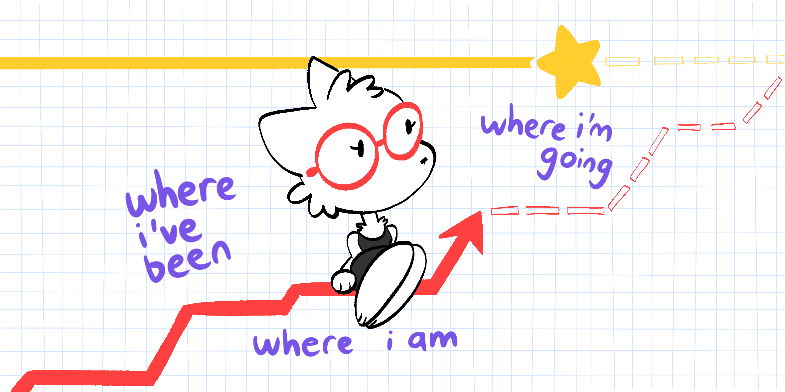
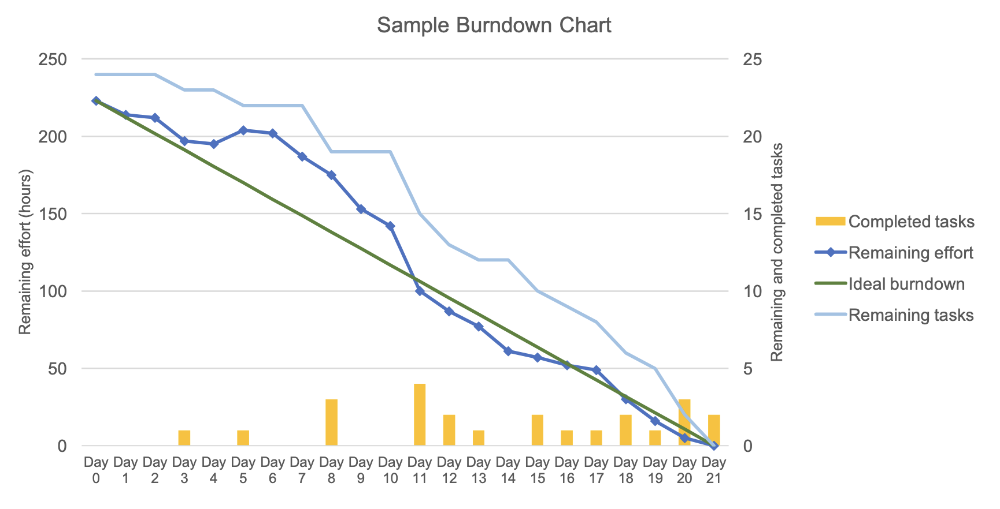
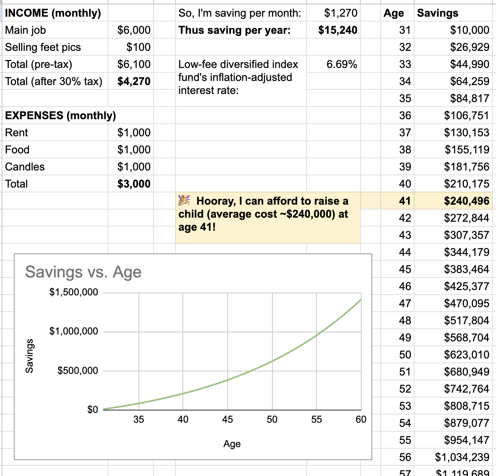
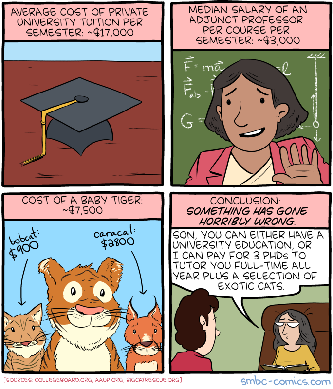

So you have a Dream.

Like all worthy Dreams, it may take years or decades to achieve. Alas, the human motivation system _can’t_ learn from rewards with a year-long delay.

So, you're instead advised to “trust the process”, and convert your long-term goal into regular short-term micro-goals:

- Write a novel ⇒ write 500 words a day.
- Cure your social phobia ⇒ talk with one stranger a day.
- Get married in 10 years ⇒ get 2,000 [micromarriages](https://colah.github.io/personal/micromarriages/) a week.

This _is_ great advice, and I endorse it, but… it feels incomplete? If every day I just focus on this day, I feel like I'm in a hamster wheel, hitting my same micro-goal over and over again, but for what? Intellectually, I know "for what" — the Dream — but I don't _feel_ it anymore.

So, here's a solution that reliably helps me _feel_ the connection between my past, present & future: **lines on a graph!**

Let's look at 3 examples: project management, money, and weight loss.

---

## 🚀 Example 1: Projects

The good news is I’m my own boss. The bad news is my boss is a moron.

Specifically, my boss (me) is bad at project management. She (I) still is (am), to be honest. But the tool that's helped me the most is the [Burndown Chart](https://en.wikipedia.org/wiki/Burndown_chart).

How it works: First, give your project (or "sprint") a deadline, and break it down into small tasks. Give each task a number of "points" it's worth (I just make points = hours). Then each day, do tasks. Your burndown chart software will then show you, in a single graph:

- Your past: how many points/hours you've gone through
- Your present: how many points/hours you need to do _today_ to stay on track
- Your future: when you'll finish your project!

( [example chart by User:PabloStraub](https://commons.wikimedia.org/wiki/File:SampleBurndownChart.svg) ⤵ )

When I shipped my latest project, [a 20,000-word-with-40-illustrations behemoth](https://aisafety.dance/p3/), I used a variant called a Burnup Chart, which also tracks total estimated time _over time_, to see how badly I mis-estimated how long tasks would take. Here's my actual chart:

( As you can see: I started off estimating that project would take ~25 hours, but by the end it turned out to be ~75h. I was off by a factor of three, yeesh. But thanks to this Burnup Chart design, _I could account for my own mis-accounting_, and see where the blue & red trendlines would intersect, to get a better estimate of when I'd actually finish my project. And I did, in fact, finish by Dec 1st 2024, as planned! )

The best part about Burndown/Burnup charts? **I can see how different decisions will affect the future, _today._** For example, I can try deleting a task, or taking an extra break day, or increasing hours worked a day, and _immediately_ see how that'd affect when I'll finish my project.

By tying my past-present-future together into lines on a graph, not only am I more motivated, I also get _instant feedback_ from the future.

([Here's a blank template](https://docs.google.com/spreadsheets/d/1AyFS1ufnYWcGjjC5KxvSrfb04f64UYwNChvqlR7cNwI/edit?usp=sharing), and [here's an actual example of when I used it](https://docs.google.com/spreadsheets/d/11faTjGrXp_pUn-NzBG-ioYPew-IDMVS5RViqYPH_R8U/edit?usp=sharing).)

## 💸 Example 2: Money

Another example of "see your effect on the future, today" — just enter your current income & spending into a spreadsheet, multiply by the compounding interest of your savings/investments, and voilà: (example data, not my real finances)

Again, this lets you play with decisions like "what if I tried to increase income by this much", "what if I tried to reduce my rent by that much", and you get _instant_ future-feedback.

But more importantly, it helps you viscerally _see_ the connection between your short-term micro-goals, and long-term Dream. "Save $10 a day" is doable but doesn't sound like much, but — just do the math — and you'll find it's enough to _retire a millionaire at age 63, already adjusted for inflation, starting from zero money!_

( Quick aside, [the best advice for almost all laypeople](https://blog.ncase.me/30/#tip_3): ditch the fancy BS mutual funds, and forget about day-trading stocks. Just put your money in a very-low-fee diversified index fund. If that feels icky because you're investing in capitalism, remember, if you put your money in a savings account, your bank will _still_ invest it, they'll just give _you_ nothing but crumbs. Also: you can pick a socially-responsible index fund that excludes weaponry & fossil fuels. )

( Here's [the spreadsheets for both the above money examples](https://docs.google.com/spreadsheets/d/1-Bqc9K_WiBVUD5dhS0bGmwZsw07e4boe3DZB7bDU5tk/edit?usp=sharing) )

## 🏋️‍♀️ Example 3: Weight

Finally, the most cliché New Year's Resolution: losing weight. Again, use a spreadsheet with lines on a graph: (my actual data)

You can see, at a glance, the connection between:

- Your past: weight over time
- Your present: your target caloric deficit for _today_
- Your future: when you're likely to hit your weight goal

( I find that visualizing the trendline is emotionally helpful, because weight is _so variable_ from day to day. Seeing the trendline helps reassure me, ignore the daily noise, I'm on the right track. )

And again, you can play with _what if's_, and get instant future-feedback.
A daily micro-goal like "250 calorie deficit" (one less cookie a day) — do the math[^cal-math] — becomes "lose 50lb (23kg) in two years" (enough to get you from moderately-Obese to "Healthy" BMI!)

[^cal-math]: A simple (but inaccurate) rule-of-thumb is Wishnofsky's Rule: 1 pound of fat ~= 3500 kcal. ([This rule is inaccurate & there are better models, but honestly it's not _too_ far off.](https://pmc.ncbi.nlm.nih.gov/articles/PMC4035446/)) In other words, with a calorie deficit of 250 kcal a day, you'll have a deficit of 3500 kcal in 14 days, or burning 1 pound of fat per 2 weeks. So, over 2 years, that's ~104 weeks, or burning 104/2 = 52 pounds (23kg). Given [the standard BMI model ](https://commons.wikimedia.org/wiki/File:BMI_chart.png)(which, yes, is also inaccurate but let's roll with this for now), 52lb/23kg is enough to take you from moderately Obese to "Healthy".

( **IMPORTANT:** a) Yes both BMI and the Calorie-In-Calorie-Out model are _very_ incomplete and flawed, b) Being Overweight & Obese Class I (25 < BMI < 35) is probably fine health-wise; previous studies didn't control for exercise levels & cardiovascular fitness ([see Figures 3 & 4](https://dip2023.s3.amazonaws.com/Lecture%204/Barry-2014.pdf)), c) May I interest you in the [Potato Diet](https://slimemoldtimemold.com/2022/07/12/lose-10-6-pounds-in-four-weeks-with-this-one-weird-trick-discovered-by-local-slime-hive-mind-doctors-grudgingly-respect-them-hope-to-become-friends/)? Potatoes fill you up very fast (high protein & high fiber if you keep the skins), have almost all the daily nutrients you need, and are versatile foods you can cook in many ways to keep the diet interesting. I did the Potato Diet for a month and lost 10 pounds, and I was _already_ "Normal" BMI! d) Or, ask your doctor about semaglutide. ([see Figure 1](https://www.nejm.org/doi/full/10.1056/NEJMoa2032183)) )

[Here's my weight-tracking Google Sheets template!](https://docs.google.com/spreadsheets/d/1N9tBR_qn7J4kBPcGkeG-S_kf6mHUlPoJs44unSS_msA/edit?usp=sharing)

Anyway, let’s wrap up:

---

## 🚀 Get started with lines today!

> "Huh, what an interesting & inspiring article! I'll try this later"    
> (one year later)    
> "Oh no I forgot."    
> 
> ~ you, if you don't implement this _right now_.

So before you close this tab, at least ask yourself:

**1) What's a Dream you have, that you've wanted for a long while, yet haven't done it yet?**

No shame here, it can be as wacky or tacky as your heart desires. For example:

- 📕 Write the next Great Canadian Novel
- 🧠 Master the secrets of the universe

No, seriously, stop & think of a Dream you have. Silently think it and/or write it down, before continuing.

Got one?

Good. Next step:

**2) How can you convert your long-term Dream into a regular micro-goal?**

What makes a good micro-goal:

- You can do it regularly & often. (e.g. daily, weekly)
- There's a clear, specific pass/fail. (e.g. "write 500 words" vs "do some writing")
- It _causes, not just correlates with_, your long-term goal. (to mitigate [Goodhart’s Law](https://en.wikipedia.org/wiki/Goodhart%27s_law), where “what gets measured gets gamed”)

Running with the above examples:

📕 "Write a Great novel" ⇒ **Write/edit 500 words a day.**

- 500 words a day is easy. You probably write that much alone in text messages.
- A novel is around 50,000 words.[^book-words] At 500 words a day, you can finish the first draft in 100 days, by mid-April. Then, _editing_ 500 words a day, you can create a polished draft by mid-July. Then, editing 500 words a day _again_, you can create a good final version by mid-October.
- So: by writing/editing a mere 500 words a day, you can _publish a novel every year_, with two months to spare!
    - (The exact numbers vary if you want to write longer books, or do more revisions, but the general result holds: you _could_ complete a polished book every 1 or 2 years, by writing/editing only 500 to 1000 words a day.)
- Your first novel is very unlikely to be Great, but with more practice & feedback, you maximize your chances of writing a truly Great work. Persist! Remember that Slaughterhouse-Five was Vonnegut's _sixth_ novel! (As for GenAI? The people will be thirsty for quality, amidst the coming flood of AI slop.) 

[^book-words]: Random web sites claim that most published books "should" be around 80,000 to 100,000 words, with Young Adult having a smaller word count, and 40,000 at minimum to count as a novel, not "novella". I'm picking 50,000 to make the math easy to follow.
    
    Some Great novels around 50,000 words: Kurt Vonnegut's _Slaughterhouse-Five_, Douglas Adams's _The Hitchhiker’s Guide to the Galaxy_, F. Scott Fitzgerald's _The Great Gatsby_. 50k words is plenty!

🧠 "Master ~~the secrets of the universe~~ Physics" ⇒ **Study 1 hour a day.**

- 1 hour a day is easy-ish. You probably waste that much time a day on Internet Attention Sinks. (I know I do)
- Here's a study plan, at 1 hour a day:
    - Day 1, Day 2: Watch one of [Leonard Susskind's free online Stanford University lectures](https://theoreticalminimum.com/courses). Each lecture is around 2 hours, so watch half today, half tomorrow. Write down your notes & questions. 
    - Day 3, 4, 5: Ask [Claude](https://claude.ai/) or [Gemini](https://gemini.google.com/) your questions, to clarify your understanding. (I don't trust ChatGPT or Grok.) What about LLM hallucinations? As of Jan 1st 2026, I find that large language models are pretty good on educational topics, _as long as they're undergraduate-level or below_.
    - Day 6, 7, 8: Web search for "\[topic\] practice problems with answers", then _actually do them_. If you get stuck, ask your chatbot of choice for help _but not full solutions_. A gym coach shouldn't lift the weights _for_ you.
    - Day 9, 10: Make [Anki flashcards](https://apps.ankiweb.net/) to remember the core ideas & formulas, easy-ish-ly and effectively. ([8 min YouTube video](https://www.youtube.com/watch?v=eVajQPuRmk8) on how & why spaced repetition works)
- So that's 10 days = 2 weeks with weekends off, per Susskind lecture. There's 10 lectures per course &times; 6 courses = 60 lectures. At 2 weeks per lecture × 60 lectures = 120 weeks, or 2 years.
- So: you can get _a college-level understanding of Newtonian physics, Electrodynamics, Quantum mechanics, Special & General relativity, Cosmology, and Entropy_... at the cost of _1 hour per weekday_ (and $20/month for a chatbot)… spread across 2 years, which is _half_ the time of a 4-year college degree.

( It is not exactly a well-kept secret that the modern university system is horribly broken. [Relevant SMBC](https://www.smbc-comics.com/comic/college-level-mathematics): )

( If you don't have the pre-requisite math skills for Susskind's lectures, add an extra five months of "study 1 hour a day", and use Khan Academy for [high-school algebra](https://www.youtube.com/playlist?list=PL7AF1C14AF1B05894) (~12 hours of lectures), and 3Blue1Brown for [calculus](https://www.youtube.com/playlist?list=PLZHQObOWTQDMsr9K-rj53DwVRMYO3t5Yr) (~3 hours) and [linear algebra](https://www.youtube.com/playlist?list=PLZHQObOWTQDPD3MizzM2xVFitgF8hE_ab) (~3 hours). So that's an extra 18h of lectures, and given our above study plan where we tackle 2h of lectures per 2 weeks, that's an extra 18 weeks, or about five months, of self-study. Again, at just 1 hour a day. What a steal of a deal! )

Okay, back on track:

Step 1, know your long-term Dream. Step 2, break it down into a sustainable regular micro-goal. This step _is_ tricky; if you're stuck, paste a link to this blog post into Claude (with web search turned on), tell 'em your Dream, and ask Claude to help you break down your Dream into sustainable micro-goals, with inspiration from the above two examples.

After that, your final step:

**3) DRAW LINES ON A GRAPH**

I strongly recommend using a spreadsheet program like Google Sheets, Excel, or Numbers. It needs more setup than an app, but you get full freedom to customize it however you like! If you need help setting up a spreadsheet, look up YouTube or consult Claude. Again, you can also get started with my templates:

- 🚀 Project Burnup: [template](https://docs.google.com/spreadsheets/d/1AyFS1ufnYWcGjjC5KxvSrfb04f64UYwNChvqlR7cNwI/edit?usp=sharing), [example with my actual data](https://docs.google.com/spreadsheets/d/11faTjGrXp_pUn-NzBG-ioYPew-IDMVS5RViqYPH_R8U/edit?usp=sharing)
- 💸 Money: [templates with examples](https://docs.google.com/spreadsheets/d/1-Bqc9K_WiBVUD5dhS0bGmwZsw07e4boe3DZB7bDU5tk/edit?usp=sharing)
- 🏋️‍♀️ Calorie Tracker: [template](https://docs.google.com/spreadsheets/d/1N9tBR_qn7J4kBPcGkeG-S_kf6mHUlPoJs44unSS_msA/edit?usp=sharing)

Alternatively, you can use these apps:

- 🃏 [Trello](https://trello.com/) for productivity (with [a Burndown Chart add-on](https://trello.com/power-ups/search?q=burndown))
- 🐝 [Beeminder](https://www.beeminder.com/) for any quantifiable goal. (this app helps you set up "commitments with a sting"! every time you slip behind your goal, Beeminder will take some of your money.)

(If you don't want to do this final step today, _set an exact day & hour in your Calendar to do this_, so you don't forget to do it!)

. . .

And that's all the steps!

Try it out for one area of your life, then slowly expand to others, one Dream at a time.

---
## 🤔 Q & A

**Q:** If it really _is_ that trivially easy to write one book a year, become a millionaire by middle age, go from Obese to "Healthy" BMI, and gain university-level mastery of hard skills & topics… why isn't everybody already doing this? Heck, why aren't _you_ doing this, Nicky. Why aren't _you_ already a millionaire polymath scientist-artist supermodel bestselling author?

**A:** lol i dunno. i guess everyone's only living at 2% of their true potential

( in 2026, i resolve to live up to _5%_ of my true potential! )

---

“Write a novel a year” sounds impossible. Most bestselling authors aren’t that prolific. “Write 500 words a day” sounds trivial. You do that unthinkingly between texts & DMs & Slacks.

Yet _they’re the same goal_, just on different time-scales.

That’s the magic of micro-goals and lines-on-a-graph, seeing your past + present + future at a single glance: you can connect the impossible Dream with the possible Daily, see your effect on the future _today_, and _browse the multiverse of possible futures_ for the one your heart desires.

📈 Happy Line-making, everyone!    
~ Nicky Case

---

**P.S:** One of my Dreams this year is to write _one blog post a week._ I hope you found value in this first entry of my "one post a week" challenge for 2026!

Let's do the math: I expect my posts to be 2,000 words on average. (this one's 2,600 words long.) So if I write & polish 500 words a day, I can get 1 post done per 4 weekdays, giving me a good buffer. 2,000 words per week × 52 weeks per year = 104,000 words. That's the size of _two books_.

If you'd like to keep up on my "books disguised a blog", sign up for my low-volume, monthly newsletter! Every end of month, I'll share links to the 4 or 5 posts I wrote — this way, you can skip the ones that don't interest you:

<iframe src="https://ncase.me/ncase-credits/signup2.html" frameborder="no" width=640 height=250></iframe>

I also reflected on 2025 and wrote more on my resolutions for 2026, [in this public Patreon post](https://www.patreon.com/posts/h-n-y-2026-from-147107425). You can support my research & writings (always free, online, and open-source!) via [Patreon](https://www.patreon.com/ncase), [Ko-Fi](https://ko-fi.com/nickycase), or [PayPal](https://www.paypal.com/paypalme/nickycase) ⤵

<iframe src="https://ncase.me/ncase-credits/supporters/jan-2026.html" frameborder="no" width="640" height="640"></iframe>

Bless your cotton socks!  Happy new year 2026!  🎉 🎊 🎉

