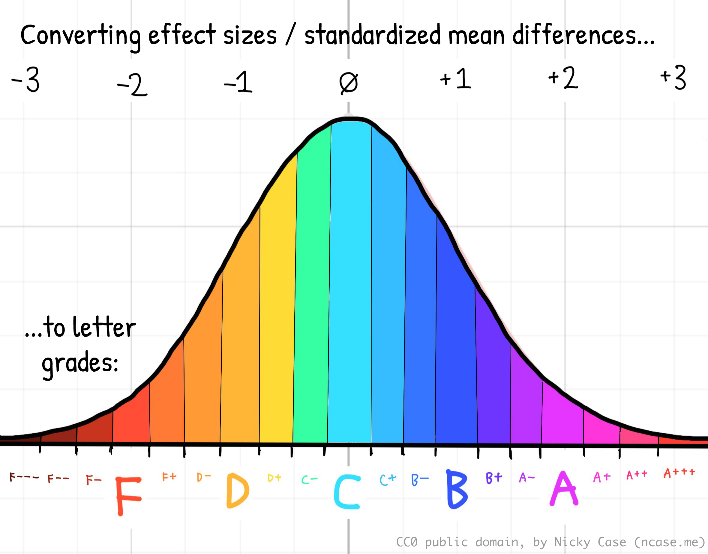
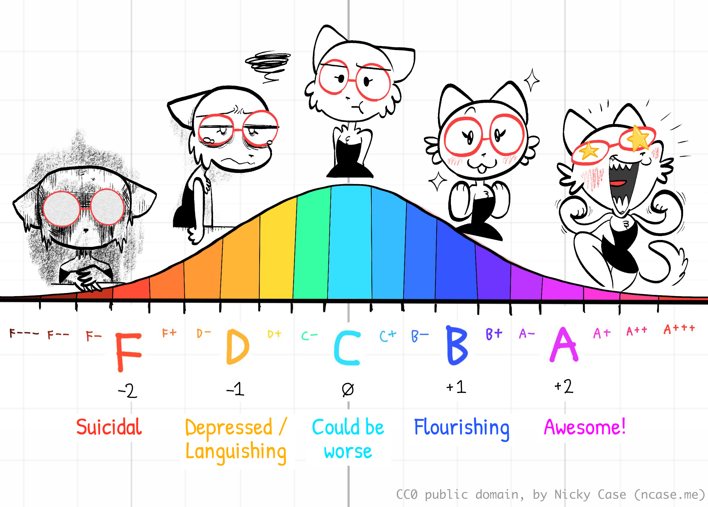
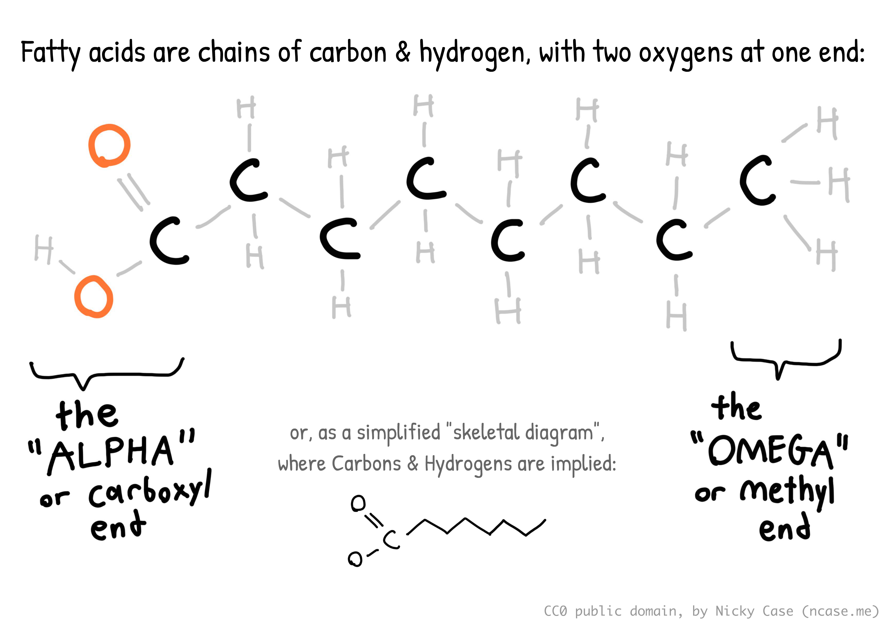

_(content note: scientific discussion of depression & suicide)_

<b>"Too Long; Didn't Read" Summary:</b> 
Exactly what the title says.

The "standardised effect size" of antidepressants on depression, vs placebo, is around 0.4. (This is like going from an average **C to a C+**.)

In contrast, the effect size of 1500mg/day of "≥60% EPA" Omega-3 supplements — which are cheaper & have fewer side effects than antidepressants — is a bit higher, around 0.6. (This is like going from a **C to a B–**.)

But, much better: the effect size of 5000mg/day of Vitamin D is around _1.8!_ (This is like going from a **C to an A–**!) It works even for people who _don't_ have a Vitamin D insufficiency, which almost half of American adults _do_.

Even if you're already taking Vitamin D & Omega-3, you may _still_ not be taking enough. The "official" recommendations _are all 3 to 10 times too low_. Both these supplements are safe, cheap, and over-the-counter, with _positive_ side-effects (on Covid & cognition).

So, unless you have specific reasons to not take Vitamin D & Omega-3 — (kidney stones, blood thinners, etc) — please try them, for at least a month! They could save your mental health. Maybe even your life.

**Table of Contents:**

- A crash course in "effect sizes" [↪](#effect_sizes)
- Interpreting effect sizes on depression [↪](#interpreting_depression)
- Antidepressants [↪](#antidepressants)
- Omega-3 [↪](#omega_3)
- Vitamin D [↪](#vitamin_d)
- Conclusion: _All this time, you lacked the Vitamin?_ [↪](#conclusion)

---

## A crash course in "effect sizes"

In Alicetown, the average person has 4 younger cousins.    
In Bobtown, the average person has 3 younger cousins.

Alright, not so surprising. You may not even notice a difference.

In Alicetown, the average person has 4 limbs.    
In Bobtown, the average person has 3 limbs.

You'd *definitely* notice.

It's the same absolute difference (4 vs 3) _and_ relative difference (3/4). So what makes limbs more surprising than cousins? Well, partly it's more dramatic & visible, but also because: _we expect high variation in the number of someone's younger cousins, but not their number of limbs_.

This is why scientists calculate an **"effect size"** or **"standardized mean difference"** ("mean" = average). We take the difference between two groups, then divide by the total amount of variation, _to account for how surprising a difference is_.

(This is a health article, not a math article, so I'll skip the formulas in this post. If you're curious, [: check out this 4 min video](https://www.youtube.com/watch?v=tTgouKMz-eI).)

Unfortunately for laypeople, the effect size is usually just reported as a number, like "+0.74" for [spacing out your studying vs cramming](http://www.lscp.net/persons/ramus/docs/EPR20.pdf), or "–0.776" for [sleep deprivation on attention](https://pubmed.ncbi.nlm.nih.gov/20438143/).

But what's that _mean?_ How can we make these numbers _intuitive?_

Well, a common way for data to be is [a bell-shaped curve](https://en.wikipedia.org/wiki/Normal_distribution) (also called a "normal distribution"). And most of us are, alas, well-acquainted with the bell curve in school grades. ("grading on a curve")

So: school grades give us a useful way to think about standardized effect sizes! We can now convert that number _into an actual letter grade:_

- **F:** -2.0 below average
- **D:** -1.0 below average
- **C:** average
- **B:** +1.0 above average
- **A:** +2.0 above average

(see footnote for more precise ranges.[^precise-ranges] the units are in "standard deviations", or "sigmas". what's sigma? ~~sigma ba--~~ just a unit of "how far away this is from average, relative to the total variation".)

[^precise-ranges]: I made up these ranges by requiring the standard letter grades F,D,C,B,A, to have their centers be -2,-1,0,+1,+2. Then, I made sure all in-between grades like C+ or A– had equal intervals. Each interval is +/- ⅙, or ⅓ wide:

    - F---: -3.16 to -2.83
    - F--: -2.82 to -2.50 
    - F–: -2.49 to -2.17
    - **F: -2.16 to -1.83**
    - F+: -1.82 to -1.50 
    - D–: -1.49 to -1.17
    - **D: -1.16 to -0.83**
    - D+: -0.82 to -0.50 
    - C–: -0.49 to -0.17
    - **C: -0.16 to +0.17**
    - C+: +0.18 to +0.50
    - B–: +0.51 to +0.83
    - **B: +0.84 to +1.17**
    - B+: +1.18 to +1.50
    - A–: +1.51 to +1.83
    - **A: +1.84 to +2.17**
    - A+: +2.18 to +2.50
    - A++: +2.51 to +2.83
    - A+++: +2.84 to +3.17

For example: spacing out your studying, relative to cramming, will on average _lift_ your test scores from a C to a B–. (effect size = +0.74) And short-term sleep deprivation, relative to healthy sleep, will on average _tank_ your ability to pay attention from a C to a D+. (effect size: –0.776)

(Note — when reading about effect sizes, always remember: _effect of what, on what, at what dose, for which group, relative to what?_ See the Data Colada post, [Meaningless Means](https://datacolada.org/104).)

(Note 2 — the standard way of "intuitively" describing effect sizes is Cohen's recommendations: 0.2 = small, 0.5 = medium, 0.8 = large. Personally, I prefer the "school grade letter" comparison, since it's more concrete. But hey, you do you.)

But it's not limited to just grades & academic performance. Effect sizes can also help us understand any kind of difference between groups, in observation or in experiments!

For example...

---

## Depression!

Let's use our school grade analogy, to interpret effect sizes on mental health:

**What's an "F in mental health"?** By definition of a bell curve, ~2.3% of people are below –2 sigma (an "F"). (See: [this bell curve calculator](https://homepage.divms.uiowa.edu/~mbognar/applets/normal.html).) [In Canada](https://www.canada.ca/en/public-health/services/publications/healthy-living/suicide-canada-key-statistics-infographic.html), ~2.6% of people had suicidal ideation in 2022, while [in the US](https://www.pew.org/en/research-and-analysis/data-visualizations/2024/us-national-trends-and-disparities-in-suicidal-ideation-suicide-attempts-and-health-care-use), it was ~4.9% in 2019. So, it's not too far off to say: "F in mental health = literally suicidal". (Also, reminder that ~4% is 1-in-25 people. You likely know someone, or _are_ someone, who will feel suicidal this year. Please reach out to your friends & loved ones!)

**What's a "D in mental health"?** ~16% of people are below –1 sigma (a "D") on a bell curve. [The Keyes 2002 study](https://pubmed.ncbi.nlm.nih.gov/12096700/) estimated that ~14.1% of adults meet the DSM-III criteria for a major depressive episode. So, D = Depressed.

**What's an average "C in mental health"?** ~68% of people are within a sigma of average (a "C") on a bell curve. Same above study found that 56.6 percent had moderate mental health. They were neither "languishing" nor "flourishing". I guess C = Could Be Worse.

**What's a "B in mental health"?** ~16% of people are _above_ +1 sigma (a "B") on a bell curve. Same above study found that 17.2% of adults are "flourishing". Good for them! B = Flourishing, life is good.

**What's an "A in mental health"?** I don't know who these freaks are. I actually _could not_ find any scientific studies on "the +2 sigma in well-being". In contrast, there's _lots_ of research on suicidal ideation, the –2 sigma in well-being. In the absence of any actual data, I'll just say: A = AWESOME

So, if an intervention is found to have an effect size of +1.0, that's like going up a letter grade. If something's found to have an effect size of -2.0, that's like going _down_ two letter grades. And so on.

Okay, so how do we get peoples' "mental health grades" up?

Let's look at antidepressants, Omega-3, and Vitamin D, in turn:

---

## Antidepressants

The good news is they work. The bad news is they don't work as well as you'd think they may work.

**[Cipriani et al 2018](https://pmc.ncbi.nlm.nih.gov/articles/PMC5889788/)** is a recent meta-analysis (a study collecting lots of previous studies) that investigated 21 different antidepressants. The most effective antidepressant, _Amitriptyline_, relative to placebo, had an Odds Ratio of 2.13  — [which converts to](https://www.escal.site/) a Cohen's d effect size of 0.417 — which is "small-medium" according to Cohen's recommendations. Or, by our school-letter-grade comparison: **the best antidepressant would take your mental health grade from an F to F+, or C to C+.**

From Figure 3 of that paper, you can see that Amitriptyline has the highest estimated effect size, while the side effects are no worse than placebo:

Sure, "F to F+" _can_ be lifesaving, but… y'know… that's not a lot. And again, this is the effect _on average._ Some people respond _much_ better to antidepressants… while some respond much worse.

---

## Omega-3

Keep getting confused on which fat is what? Me too. So, here's a crash course on various fats:

Fatty acids are chains of carbons & hydrogens + two oxygens. They say "OOH" at one end, and "HHH" at the other end:

A saturated fatty acid is one where all the carbons' free spots are filled up with hydrogens. (Hence, "saturated") This makes the molecule stick straight out. This is why _long_ saturated fatty acids — like those found in butter — tend to be solid at room temperature.

(Contrary to popular belief, saturated fats don't _literally_ clog your arteries, like grease in plumbing pipes. What happens is _{ha ha I don't actually understand this}_. [Something about your cholesterol levels & inflammation](https://www.ahajournals.org/doi/10.1161/cir.0000000000000510).)

In contrast, _unsaturated_ fatty acids have at least one hydrogen missing. This causes them to have a double-bond "kink" in the molecule. This makes them _not_ stick out, which is why unsaturated fats tend to be liquid at room temperature. _Mono-unsaturated_ fatty acids (MUFAs) — like in olive oil — only have one kink. _Poly-unsaturated_ fatty acids (PUFAs) — like in fatty fish — have two or more kinks. Let's be mature adults about this, please.

For completeness: _trans fats_ are unsaturated fats whose "kink" is twisted around, causing them to go straight. That is the worst sentence I've written all month. The twisted kink is caused by the hydrogens being on opposite sides, hence "trans". (And yes, if they're on the same side it's "cis". Latin was a mistake.) The molecule being straight is why trans fats — which margarine _used_ to be full of  — are solid at room temperature, despite being an unsaturated fat.

It's neat whenever you can trace the history of something right down to its atoms! Margarine was first invented because it's cheaper, and is spreadable straight from the fridge, unlike butter. Margarine (used to be) made by taking _unsaturated_ vegetable oils, which were cheaper than animal fats, then pumping a bunch of hydrogens into it (hence, "hydrogenated oils"). If you _completely_ hydrogenate an oil, it becomes a saturated fat. But they only _partially_ hydrogenated those oils, leading to trans fats, which were cheaper & a spreadable semi-solid at fridge temperature.

In the 1970s & 80s, the US Food & Drug Administration concluded that trans fats were _not_ harmful to humans, and nutritionists _promoted_ margarine over butter, because butter had "unhealthy" saturated fats. [But in the early 1990s](https://www.cspi.org/resource/artificial-trans-fat-timeline), scientists realized that trans fats were _even worse_ for you than saturated fats. Only in the 2010's, did most Western countries start officially banning trans fats. Reminder: policy is often decades behind science.

_(Hey, what do you call it when you get thiccer on HRT? Trans fat! :D)_

I need to stop going on infodump tangents. Anyway, Omega-3 is any fatty acid with its first kink at the 3rd carbon from the Omega end ("HHH"), though it can have more kinks later down the chain. (And yes, Omega-6 has its first kink at the 6th carbon, and Omega-9 has its first kink at the 9th carbon. There's nothing _physically_ preventing Omega-4 or Omega-5's from existing, but due to some quirk of evolution, Omega-3, -6, and -9 are the ones biological life uses most. As far as I can tell, there's no specific reason they're all multiples of 3. Probably just a coincidence. There _is_ a less common Omega-7.)

_Finally_, there's three main types of Omega-3: EPA (Eicosapentaenoic Acid), DHA (Docosahexaenoic Acid), and ALA (Alpha-Linolenic Acid). ALA is mostly found in plants like chia seeds & walnuts, while EPA & DHA mostly come from seafood, though there _are_ algae-based vegan sources.

_(Figure 1.1 from [Roke 2016](https://atrium.lib.uoguelph.ca/bitstream/10214/9940/1/Roke_Kaitlin_201609_PhD.pdf).⤵ Thank you Kaitlin Samantha Roke for drawing this coz I'm too lazy to draw it myself. Note how the first double-bond "kink" for all these molecules is at the 3rd carbon from the Omega end — hence why they're all called Omega-3's.)_

**EPA & DHA are the focus of this section.** For bio-mechanical reasons I don't understand but I assume someone else does: EPA is the one associated with anti-inflammation, better brain health, and _less depression_... while DHA isn't. (But DHA is still needed for other stuff, like your neurons' cell walls, so don't cut them out completely!)

(Note: I could not find any _experimental_ trials of ALA on depression, though an _observational_ study in Japan ([Kurotani et al 2014](https://www.sciencedirect.com/science/article/abs/pii/S2212826313001085)) finds a correlation between higher ALA and lower depression. But reminder, correlation is not _necessarily_ causation.)

All the above info in a Venn (technically [Euler](https://en.wikipedia.org/wiki/Euler_diagram)) diagram:

Okay, enough yap. Time for the actual data:

**[Sublette et al 2011](https://pmc.ncbi.nlm.nih.gov/articles/PMC3534764/)** is an older meta-analysis, but it's the only one I could find that tries to estimate the _actual "dose-response" curve_, which shows: how much effect, for how much treatment. Why is that important? Because one problem with many meta-analyses is they'll do something like: "Study 1 gave patients 1 gram of medicine and saw a +1 improvement in disease, Study 2 gave 10 grams and saw +4 improvement, Study 3 gave 100 grams and saw _negative_ –5 improvement… the average of +1, +4, and –5 is zero... therefore the medicine's effect is zero." ...As mentioned briefly earlier, this is a [meaningless mean](https://datacolada.org/104). That's why we want to know the response _at each dose_.

So, the Sublette meta-analysis gathered randomized trials studying Omega-3 on depression (vs placebo, of course) and got the following dose-response curve.⤵ Note that the horizontal axis is _not_ just amount of total Omega-3, but specifically _the extra amount of "unopposed" EPA, above the amount of DHA._ Or in other words, "EPA minus DHA":

The top effect size is **around +0.558, which is like going from an F to D–, or C to B–.** You get this maximum effect around 1 to 2 grams of extra EPA, and _too much_ EPA gets worse results. The meta-analysis finds that Omega-3 supplements that are ~60% EPA (and the rest DHA) are optimal.

This finding is roughly in line with later meta-analyses. [Liao et al 2019](https://www.nature.com/articles/s41398-019-0515-5.pdf) also finds that ~1 gram of ≥60% EPA is best, but actually found a much higher effect size: +1.03. [Kelaiditis et al 2023](https://pubmed.ncbi.nlm.nih.gov/37028202/) also finds 1 to 2g of ≥60% EPA is best, but found a lower effect size of +0.43… which is still _as good_ as the _best_ antidepressant!

Either way, let's boil this down to a recommendation. You want around 1 gram of EPA a day. So if your supplements are 60% EPA, you need 1 gram ÷ 0.6 ~= 1.667 grams = 1667 milligrams. Let's round this down for convenience: **get 1500 mg/day of 60%-EPA Omega-3 supplements.**

In comparison, [most official health organizations recommend](https://www.healthline.com/nutrition/how-much-omega-3) "250–500 mg _combined_ EPA and DHA each day for healthy adults." _That is over three times too low,_ at least for optimal effects on depression. Which, as we calculated above, is probably around 1500 mg/day. (The official safe dose is 5000 mg/day)

Finally, a (small) study _directly_ investigating the link between suicide & Omega-3. [Sublette et al 2006](https://psychiatryonline.org/doi/pdf/10.1176/ajp.2006.163.6.1100): “Low \[DHA\] and low Omega-3 proportions \[...\] predicted risk of suicidal behavior among depressed patients over the 2-year period.” Though keep in mind this is a small study, and it's observational not experimental. Also, weird that contrary to the above studies on depression, _DHA_ predicted suicide but _not_ EPA. Not sure what to make of that.

Bonus: Omega-3 may also boost cognition? [Shahinfar et al 2025](https://www.nature.com/articles/s41598-025-16129-8.pdf): “Enhancement of global cognitive abilities was observed with increasing omega-3 dosage up to 1500 mg/day. \[effect size = 1.00, like going from a grade of C to B!\], followed by downward trend at higher doses.”

---

## Vitamin D

**[Ghaemi et al 2024](https://pmc.ncbi.nlm.nih.gov/articles/PMC11650176/)** is a meta-analysis on Vitamin D on depression. Again, it actually estimates a dose-response curve! Below is Figure 1 + Table 2, showing the effect of Vitamin D dosage on depression vs placebo. The solid line is the average estimated effect, dashed lines are 95% confidence interval. Note the effect size is negative in this figure, because they're measuring _reduction_ in depressive symptoms:

 of Vitamin D dosage on depressive symptoms.")

**The upper range of uncertainty is lowest at 5000 IU (International Units) of Vitamin D a day**, with an estimated effect size of 1.82, with a 95% uncertainty range, from 0.98 to 2.66. **An effect size of 1.82 is like taking your mental health from an F to a C–, or a C to an A–!** And even in the _most pessimistic_ case, 0.98, that's still _over twice as effective_ as the top antidepressant!

(The paper's summary says _8000 IU_ is best, with effect size 2.04, but there's much greater uncertainty there. The paper also finds that longer studies had smaller effects than shorter studies, but this does _not_ necessarily mean Vitamin D's effects are short-lived. Looking at Supplementary Table 4, it seems this is partly because longer studies used _lower_ average daily doses. For example, one 52-week study only gave participants 400 IU a day.)

This meta-analysis includes trials with participants who _don't_ have Vitamin D deficiency. There's still a good effect of Vitamin D on depression for them, even if smaller! Though, you probably _are_ lacking Vitamin D: [Liu et al 2018](https://pubmed.ncbi.nlm.nih.gov/29644951/) finds that a bit under half of all adults (41.4%) have Vitamin D Insufficiency.

And that's according to [the official recommendation](https://www.healthline.com/nutrition/vitamin-d-dosage), of 400-800 IU a day… which is _is too damn low_. Even the official _maximum safe dose_ of Vitamin D, of 4000 IU/day, is too low. [McCullough et al 2019](https://pubmed.ncbi.nlm.nih.gov/30611908/) gave over thousands of patients 5,000 to 10,000 IU/day, for _seven years_, and there were _zero_ cases of serious side effects. This is in line with [Billington et al 2020](https://pubmed.ncbi.nlm.nih.gov/31746327/), a 3-year-long double-blinded randomized controlled trial, where they found "the safety profile of vitamin D supplementation is similar for doses of 400, 4000, and 10,000 IU/day." (though "_mild_ hypercalcemia" increased from 3% to 9%. IMHO, that's a small cost for reducing the risk of major depression & suicide.)

And it makes sense that 10,000 IU a day _should_ be safe. Your skin, exposed to the Sun's ultraviolet rays, can synthesize up to (the equivalent of) 10,000 IU a day, before plateauing out. Source is [Vieth 1999](https://www.sciencedirect.com/science/article/pii/S0002916522043763): “Because vitamin D is potentially toxic, intake of \[1000 IU/day\] has been avoided even though the weight of evidence shows that the currently accepted \[limit\] of \[2000 IU/day\] is too low by at least 5-fold.” (So why are all the official sources still so paranoid about Vitamin D? Well, unfortunately, official/governmental policy is always a few decades behind the science in _any_ field. See Also: the trans fat debate, everything about educational policy.)

Speaking of the Sun, why take supplements instead of just getting Vitamin D from Sun exposure? Well, [skin cancer](https://pubmed.ncbi.nlm.nih.gov/29659012/). But also: because Sun-Skin D varies greatly depending on the season, your latitude, and your skin type. There's less ultraviolet rays from the Sun in winter/fall, and at latitudes further from the equator. And [the darker your skin is, the less Vitamin D your skin makes for the same amount of Sun exposure](https://pmc.ncbi.nlm.nih.gov/articles/PMC10861575/). As expected from the bio-physics of skin, Black adults have [the highest prevalence of Vitamin D deficiency](https://pmc.ncbi.nlm.nih.gov/articles/PMC6075634/) (82.1%!!), followed by Hispanic adults (62.9%). (But hey, at least Black adults have the lowest incidence of skin cancer. You win some you lose some.) The point is: speaking as someone with Southeast Asian skin, who's currently in Canada during winter... even if I stood outside naked for hours, I'd get approximately _zero_ IU/day of Vitamin D from the Sun. Thus: supplements.

Finally, a meta-analysis _directly_ measuring the effect of Vitamin D on suicide rates. [Yu et al 2025](https://link.springer.com/content/pdf/10.1186/s12888-025-06613-w.pdf): “Vitamin D in patients with \[suicidal behaviours\] were significantly lower than in controls (standardized mean difference: –0.69, or a 'medium' difference)”. Reminder that this paper _by itself_ only measures correlation, not causation — but combined with the above experiments of Vitamin D on depression, I think it's reasonable to guess it's partly causal.

To recap:

- Almost half of you have a Vitamin D deficiency according to the official recommendation (800 IU/day).
- And the official recommendation is _way_ too low. Even the official _maximum_ safe dose (4000 IU/day) is below the optimal Vitamin D for depression (5000 IU/day) or what your body can produce from the Sun in optimal conditions (10,000 IU/day). Recent randomized controlled trials confirm that 10,000 IU/day is, indeed, mostly safe.
- Your daily reminder than official policy is often decades behind the science.

Bonus: Vitamin D supplementation was found in several randomized controlled trials [to reduce mortality from Covid-19](https://pubmed.ncbi.nlm.nih.gov/39225947/)! It [probably helps guard against influenza](https://www.sciencedirect.com/science/article/pii/S2161831322010274) too, though the evidence is small & early.

---

## Conclusion: _All this time, you lacked the Vitamin?_

Scurvy is caused by a lack of Vitamin C. It's a condition that causes your wounds to re-open up & teeth to fall out. Scurvy used to kill _almost half(!)_ of all sailors on major expeditions; it's estimated millions died. It can be cured by eating lemons.

Rickets is mostly caused by a lack of Vitamin D. It's a condition where kids' bones go all soft and deformed. During the Industrial Revolution, up to 80% of kids suffered from it. It can be prevented with cod liver oil.

Goiters is mostly caused by a lack of Iodine. It's a condition where the thyroid gland in your neck swells up painfully, to the size of an apple. During WWI, a _third_ of adult men had goiters. It can be prevented with iodized salt.

[About 1 in 4 people are expected to have clinical depression sometime in their life](https://ourworldindata.org/mental-health). Depression is the \#1 source of the global "burden from disease" in the mental health category, [and _that_ category is the \#6 burden of disease in the world](https://ourworldindata.org/burden-of-disease#how-do-different-diseases-and-disabilities-contribute-towards-the-burden-of-disease), above Alzheimer's, malaria, and sexually transmitted infections.

(But honestly, did you need those stats? This is likely a lived experience for a lot of you reading this.)

The effective altruists are all, ["woah for just $3000 you can prevent a child's death from malaria"](https://www.givewell.org/how-much-does-it-cost-to-save-a-life) — and that's great! save them kids! — but where's the fanfare for the accumulating evidence that, "woah with cheap daily supplements we can save millions from suicide & depressed lives"?

Over and over again throughout history, some horrific thing that caused millions to suffer, turned out to be "yeah you were missing this one molecule lol". To be clear: not everything is gonna be _that_ simple, and mental health is _not_ "just" chemistry. Also, all the numbers on this page have with large error bars & uncertainty, more research is needed.

But, as of right now, I feel I can at least confidently claim the following:

- Vitamin D and Omega-3 are both _at least on par_ with antidepressants.
- The evidence is much stronger for Vitamin D; it's very plausibly at least _twice_ as good as antidepressants.
- Both supplements are cheap and safe, so what's the harm of trying? (positive "expected value" for this bet)

So:

**MY SPECIFIC RECOMMENDATIONS FOR YOU TO DO A.S.A.P:**

- Go to a pharmacy, buy the following supplements over-the-counter, in whatever form you like: (I like the easy-to-swallow gel capsules)
- **Vitamin D**
    - 🌱 By default, Vitamin D supplements are derived from… (quick web search)… _the grease in sheep's wool?_ Huh. Also fish liver oil. Anyway, if you're vegan, make sure your bottle specifically says "vegan" or "from lichen/mushrooms". (If you're vegetarian, the sheep's-wool Vitamin D is fine, they don't kill the sheep for it.)
- **Omega-3 _where EPA is ~60% of the Omega-3 total._** For example, my 500mg Omega-3 capsules have 300mg EPA, 200mg DHA.
    - 🌱 By default, Omega-3 supplements come from fish. If you're veg(etari)?an, there _are_ plant-based sources of Omega-3, but look carefully: most vegan Omega-3 supplements provide _more DHA than EPA_, which the above studies suggest fully cancel out the antidepressant effect. _Double check the nutritional label to make sure it's ≥60% EPA._ For example, [this one is 300mg EPA + 200mg DHA](https://www.amazon.ca/Natures-Way-NutraVege-Plant-Based-Vegetarian/dp/B078T4DC2K?th=1). (_not_ an affiliate link)

**Then, every day:**

- **Take ~5000 IU of Vitamin D**
    - ⚠️ be cautious if you have kidney stones, or are on medications that could interact with Vitamin D. "ask your doctor".
    - 4,000 IU is the "official maximum safe dose", if you understandably don't trust a random internet blogger, even though she cited academic sources.
    - 10,000 IU if you're feeling daring / have darker skin / live in less sunny climates.
    - bonus: may improve immune response to Covid & influenza?
- **Take ~1500 mg of ≥60%-EPA Omega-3**
    - ⚠️ be cautious if you're on blood thinners, or other medications that could interact with Omega-3. again, "ask your doctor". 
    - bonus: may improve cognition?
- (Don't quit your existing antidepressants if they're net-positive for you!)
    - you may also want to ask your doctor about _Amitriptyline_, or those other best-effect-size antidepressants.

Can you get these doses of Vitamin D & Omega-3 through whole foods alone, no supplements? Probably, but it'd be expensive & tedious: you'd have to eat something like 2,000 calories of farmed salmon _a day_ to get 5,000 IU/day of Vitamin D. As for Omega-3, eating mostly oily fishes _would_ get you >1000mg of Omega-3, but they'd be _more DHA than EPA_, which the above studies suggest would cancel out the antidepressant effects.

**The effect sizes on depression:**

- The best antidepressant: **+0.417**
    - like your mental health grade going from F to F+, or C to C+
- 1500mg of ≥60%-EPA Omega-3: **+0.558**
    - like your mental health grade going from F to D–, or C to B–
- 5000 IU of Vitamin D: **+1.82**
    - like your mental health grade going from F to C–, or C to A–

For completeness & comparison, here's the effect size of other things on depression:

- Any [mainstream "bona-fide" psychotherapy](https://en.wikipedia.org/wiki/Dodo_bird_verdict) (CBT, Psychodynamic, Humanist, Solutions-Focused): **+0.35**, source: [Kamenov et al 2016](https://pmc.ncbi.nlm.nih.gov/articles/PMC5244449/)
    - like going from C to C+
- Aerobic/Cardio Exercise: **+0.79**, source [Ioannis et al 2018](https://pure-oai.bham.ac.uk/ws/portalfiles/portal/54143117/Ioannis_Morres_et_al_Aerobic_exercise_for_adult_patients_Depression_and_Anxiety_2018.pdf)
    - like going from C to B–
    - (dose: "45 minutes, at moderate intensity, three times/week" ⇒ ~20 min/day)
- Good Sleep: **+1.10(???)**, a _lot_ of interpretation & calculations, see footnote[^iv-calculate]
    - like going from C to B
    - (dose: going from moderate insomnia to healthy sleep)
- Bright Light Therapy: **+0.487**, source [Menegaz de Almeida et al 2025](https://pmc.ncbi.nlm.nih.gov/articles/PMC11447633/)
    - (the above paper reports Odds Ratio of 2.42, [which converts to](https://www.escal.site/) Cohen's d effect size of +0.487)
    - like going from C to C+
    - I went [with Wirecutter's recommendation](https://www.nytimes.com/wirecutter/reviews/best-light-therapy-lamp/) for a UV-free 10,000 lux lamp.
    - (dose: 10,000 lux, 30 min a day)
- Mindfulness Meditation: **+0.42**, source [Breedvelt et al 2019](https://www.frontiersin.org/journals/psychiatry/articles/10.3389/fpsyt.2019.00193/full)
    - like going from C to C+
    - (dose: 7 weeks, "153 min each week" ⇒ ~20 min/day)

[^iv-calculate]: [Lee et al 2023](https://pmc.ncbi.nlm.nih.gov/articles/PMC10039857/) reports the following effect sizes. Digital therapy for Insomnia → Sleep = 0.76, and Digital therapy for Insomnia → Depression = 0.42. Assuming the therapy _for insomnia specifically_ affects depression _only_ through better sleep (Digital therapy for Insomnia → Sleep → Depression), we can do an ["Instrumental Variable"](https://cameron.econ.ucdavis.edu/e240a/ch04iv.pdf) estimate of the effect of Sleep → Depression = 0.42 / 0.76 = 0.55. **To be precise: this is saying, if you improve your sleep by 1 standard deviation, on average your depression improves by 0.55 standard deviations.**
    
    So: how many standard deviations is going from "moderate insomnia" to "healthy sleep"? The standard measure is the Insomnia Severity Index (ISI), which [you can take online](https://www.sleepprimarycareresources.org.au/questionnaires/isi). A score of 0–7 means no insomnia, 8–14 is subclinical insomnia, 15–21 is clinical insomnia (moderate), 22–28 is clinical insomnia (severe). Let's be conservative and say we're just going from barely clinical to barely healthy: 15 to 7, or a reduction of 8 points. [Yang et al 2009](https://pubmed.ncbi.nlm.nih.gov/19689221/) says a 6-point reduction is 1.5 standard deviations, which means 4 points is 1 standard deviation. So a reduction of 8 points is 2 standard deviations. **So, if you improve your sleep from insomniac to healthy, you improve by at least 8 points, which is 2 standard deviations, so your depression should improve by 2 × 0.55 standard deviations, or ~1.10.**
    
    Reminder that my estimate is _full_ of assumptions upon assumptions & these error bars will compound. But I'd be surprised if the true causal effect of going from insomniac to healthy sleep isn't _at least_ a "large" +0.8 effect.

(And remember, you can _stack_ any of the above interventions to get an even larger effect! You can't just naively add up the effect sizes, but I'd be surprised if the effect of \{vitamin d + omega-3 + bright lamps + cardio + good sleep + meditation\} _combined_ ends up being less than +2.00. Two letter grades up means going from D to B, or, theoretically, from clinically depressed to flourishing! For more papers & my working research notes on "best bang for buck on depression", [check out this Google Doc](https://docs.google.com/document/d/1hjNxJmNjoVktrJDFPtFH1hgzKmGpZkRFQ6Vwf0s7c6w/edit?tab=t.0#heading=h.e0blw3xq3cvm).)

Also, remember that all the above estimates are uncertain. And in general, when scientists replicate psychology experiments more rigorously, the effect size usually shrinks by ½. But, I think the overall _qualitative_ picture is still strong: there _exist_ high bang-for-buck ways to reduce depression, which are _at least_ on par with drugs & therapy (possibly 2x to 4x better), that aren't (yet) common knowledge amongst policymakers & the public. And again, they're dirt cheap with minor-to-no adverse side effects. Moderate chance of a big win, for a known tiny cost. That's a positive "expected value" bet right there.

I got onto this research rabbithole a few months ago while borrowing my housemate's ADHD meds, which I may or may not eventually collect into a "JOYMAXXING" informal meta-meta-analysis. ([: See me yap about it on video as a cartoon cat](https://youtu.be/JOj97Edna7k?si=xAUt3Kp54RyfGX50&t=334).) But for this blog post, I wanted to dive deeper into Vitamin D and Omega-3, since their effect sizes are so huge, _and_ they're insultingly cheap & easy, compared to therapy or regular cardio.

Stay safe this winter, keep away the seasonal depression. Get your supplements, and reach out to your friends & loved ones!

💖,    
~ Nicky Case

<iframe src="https://ncase.me/ncase-credits/signup2.html" frameborder="no" width=640 height=250></iframe>

<iframe src="https://ncase.me/ncase-credits/supporters/jan-2026.html" frameborder="no" width="640" height="640"></iframe>