*Hi! This is a "share your work" notes-dump, for some independent research projects I'm doing in AI Alignment/Safety. Alas, this means this post will be more wordy, sloppy & technical than my usual "explain it like I'm 12" style. Sorry! Should any of these bear fruit, I'll share the fruit's juice in more accessible packaging.*

*(If any of these ideas inspire you to do some research of your own, feel free to cite this post as **Nicky Case, 2024**! Here's a timestamped Archive\.org [save of this page, on October 2nd, 2024](http://web.archive.org/web/20241002171613/https://blog.ncase.me/research-notes-oct-2024/))*

**Table of Contents:**

**In the Minimum Viable Prototype stage:**

* [Project 1](#project_1)) Want to know a human's values? Then **BEG: Bayesian Elicitation Generation**. Combining LLMs with Good Ol' Fashioned AI to actively elicit a human's preferences, in a qualitative *and* quantitative way.
* [Project 2](#project_2)) **SASS: Semi-automated AI Safety Scientist.** Proof-of-concept, of an LLM *automatically generating & testing* hypotheses, to interpret another LLM. (Also, replicating-extending a MATS alum's research.)
* [Project 3](#project_3)) **Speakeasy**: a tool for laypeople to make their own narrow, human-in-the-loop, scaffolded LLMs.

**In the early-prototyping stage:**

* [Project 4](#project_4)) Beating Goodhart's Law with **CUES: Capped, Uncorrelated Ensemble of Specifications**.
* [Project 5](#project_5)) **The game theory of self-modification.** Understanding wireheading, human value change, AI stability under self-modification, etc.
* [Project 6](#project_6)) **SCI: Semi-automatic Causal Inference**, with LLMs, Pearl causal diagrams, and Good Ol' Fashioned Statistics.

---

## 🙏 Project 1) BEG: Bayesian Elicitation Generation

**Summary:**

Let's use a scaffolded LLM to *qualitatively and quantitatively* elicit a human's values! The steps: 1) ask the human open-ended questions, 2) extract *qualitative* features they care about, 3) for each feature, generate *quantitative* priors & likelihoods & posteriors & info-entropy, 4) use those to generate the *next* round of questions, 5) repeat!

. . .

**Related to:** Active preference elicitation, Reward uncertainty, Interpretability-by-design, Bayesian inference

. . .

**Video of it in action!** (~2 min)

<iframe width="640" height="557" src="https://www.youtube-nocookie.com/embed/oDzyPqGsy8M?si=HC3nAJprRVpn2a_w&rel=0" title="YouTube video player" frameborder="0" allow="accelerometer; autoplay; clipboard-write; encrypted-media; gyroscope; picture-in-picture; web-share" referrerpolicy="strict-origin-when-cross-origin" allowfullscreen></iframe>

. . .

**Introduction / Motivation:** 

Reward a robot for picking up dirt, and it'll pick up & drop the same dirt over and over again.[^dirt] Point is: in AI, it's really hard to specify what we truly want. Hence: why not get an AI to *learn* what we truly want? Maybe by *asking good questions?*

[^dirt]: “[Russell & Norvig's famous AI textbook describes] a seemingly reasonable, but incorrect, reward function for a vacuum robot: if we reward the action of cleaning up dirt, the optimal policy causes the robot to repeatedly dump and clean up the same dirt.” ([source](https://people.eecs.berkeley.edu/~russell/papers/russell-nips16-cirl.pdf))

There's many, many approaches to try to figure out a human's "reward function" -- (keywords: preference elicitation, inverse reinforcement learning, RLHF, etc) -- each with their pros/cons. For example:

* <u>Hand-writing the features to pay attention to</u>: Simple & interpretable, but not flexible.
* <u>A full end-to-end neural network</u>: Very flexible, but hard to interpret, & possibly overfit, doesn't generalize, and susceptible to adversarial examples.
* <u>Using an LLM to generate active-listening questions</u>: ([Li, Tamkin, Goodman & Andreas 2023](https://arxiv.org/pdf/2310.11589) is a good example, and what inspired my project below!) Interpretable *and* flexible, but "only" results in *qualitative* results. *Quantitative* estimates of how much a human values something would let us make good trade-offs. Even better would be quantitative estimates of the *uncertainty of AI's own estimates*, so that the AI can err on the side of caution, & asking when uncertain.

So: I'd like to propose a method that's interpretable, flexible, *and* gives us both qualitative *and* quantitative estimates of what folks value, *and* keeps track of its own uncertainty! Let's call it, **BEG: Bayesian Elicitation Generation**, as in, you can BEG the human for th--

**How it works:**

1. Use an LLM to ask a concrete, open-ended question. (for lots of 'bits' of information)
2. Get a free-form reply.
3. Use an LLM to extract what things the human cares about.
4. For each thing: use an LLM to guess-timate the "human prior": on a 7-point scale, how much do people desire vs anti-desire this thing?  `P(value)`
5. Use an LLM to generate a "likelihood ratio": if the user valued the thing \[X\] amount, how likely is it they would have written what they did?  `P(text | value)`
6. Multiply the prior & likelihood, then normalize, to get the posterior: this is our *current* belief (with explicit uncertainty!) of how much the user values the thing!  `P(value | text) = P(text | value) * P(value) / [normalization constant]`
7. We can now use this posterior to generate actions that help the human... or generate *new* questions to ask!  We want to ask the questions that will help us reduce uncertainty the most.  So, we can measure each feature's "information entropy", select the top one(s), and prompt an LLM to ask a concrete, open-ended question about them.
8. Repeat!

. . .

**More possibilities / Challenges / Etc:**

* <u>To do, actual empirical user-testing</u> (with MTurk or similar?) to make sure this process is actually worth it. ([Li, Tamkin, Goodman & Andreas 2023](https://arxiv.org/pdf/2310.11589) finds that open questions aren't too annoying to users, and are actually *preferred* over binary choices.)
* <u>Pragmatic Feature Preferences</u>: (Directly inspired by [Peng, Sun, Shu & Abel 2024](https://arxiv.org/pdf/2405.14769)) If there's an obvious thing a user *didn't* mention in their free-form reply, that's evidence too! It's evidence they feel neutral about it. (e.g. Bot asks Human about their life aspirations, Human doesn't mention getting rich, Bot can infer Human doesn't care much for getting rich.)
* <u>Non-verbal communication</u>: The pieces of "evidence", of what a Human likes/dislikes, don't have to be verbal. We could use facial expressions or tone-of-voice, and it'd be easy to incorporate into this system: "just" multiply in their likelihood ratios.
* <u>Non-linearities</u>: If a Human would be happy to own a house, that doesn't mean they'd be 10 times happier to own 10 houses! Challenge: make this system accommodate non-linearities & interaction effects.
* <u>Causal Graphs</u>: We want this system to distinguish between *intrinsic* goals ("for its own sake") and *instrumental* goals ("for something else's sake"). Challenge: make this system model goals as a network, and have it ask counterfactual questions to distinguish between intrinsic/instrumental goals. (e.g. "If money were no object, would you *still* want to work this job?")
	* See also [Project 6](#project_6): Semi-automated Causal Inference
* <u>Beyond a 7-point scale?</u>: When a Human says they "really love" their partner, that should matter more than when they say they "really love" spicy food. Challenge: re-make this system to accommodate a "universal" utility scale? Also, would it be worth trying to model the belief-probability-distribution as *fully continuous*, not discrete?
* <u>Not double-counting evidence</u>: To avoid "double-counting" evidence, this system should keep track of individual pieces of evidence that Human likes/dislikes something, then use an LLM to check if a piece of evidence is already accounted for. If so, it *won't* multiply the prior by its likelihood ratio again.
* <u>Having evidence "fade away"</u>: People's values can change! How can we model this mathematically? Well: if double-counting evidence means multiplying by the likelihood _L_ twice, that is, multiplying by _L2_, then we can model *fading evidence* by multiplying a prior by _Lweight_, where _weight = exp( – some constant * time )_.
	* Sanity-checking this: when time = 0, i.e. we *just* got this evidence, then weight = 1. As time → ∞, then weight = 0, i.e. we completely discount the evidence, and revert to the "human prior".
	* Bonus: every time a Human brings up the same evidence again, we reset the time to 0.
	* Bonus x 2: we wouldn't even need to hard-code "ask Human if thing they mentioned long ago is still true"! This *automatically* comes out of: evidence fades away → belief fades back to being an uncertain human prior → Bot asks questions about high-uncertainty/entropy features → Bot will *automatically* re-up questions about old features!
	* *How quickly* do we predict preferences/values to change? I dunno, fit that to human data, and/or ask an LLM for an educated guess. (For example: I'd expect tastes in fashion to change fast, but sexual orientation to basically never change, or if so, *very* rarely and slowly.)

**Post-Script: Prior Art**

Ugh I spent over a week making the above prototype & outlining the research idea, now I just found [Austin, Korikov, Toroghi & Sanner 2024](https://arxiv.org/pdf/2405.00981) posted on ArXiV less than 2 months ago. It *is* a good paper! (Crucially, they show LLM+Bayes > raw LLM!) But ok yeah they basically had & executed the same idea, combining LLMs with Bayesian inference. A few (maybe still useful?) differences between my idea and theirs:

* I use an LLM to *generate* the "human prior" for new features, rather than starting with flat uniform prior.
* Their query-generation makes yes/no questions, rather than open-ended questions that would allow the AI to capture *new* features the designer never thought of.
* Their system has probabilities directly over *what thing to recommend* (e.g. a movie), rather than trying to infer the human's more fundamental preferences/utility function.

(Though, these are probably all small tweaks/changes. I'll think more later about how I can make my research idea be more of a value-add above this paper. Maybe one of the "More possibilities" ideas listed above.)

---

## 🔬 Project 2) SASS: Semi-automated AI Safety Scientist

**Summary:** This is a proof-of-concept of using a scaffolded LLM to *amplify* human ability to do AI Safety research. With this tool, I replicated [a study by Egg Syntax (MATS alumnus)](https://www.alignmentforum.org/posts/dLg7CyeTE4pqbbcnp/language-models-model-us), which showed that GPT-3.5 can detect your gender with ~80% accuracy from *just a few paragraphs of your writing.* But why? To find out, I made a tool to help *automatically generate and test* hypotheses, to find *human-interpretable* features of one's writing style, that GPT-3.5 uses to detect one's gender! (Spoiler: it's social-emotional focus, and possibly "homophily".)

([Project 6](#project_6) also shows another case of semi-automated scientific research, but for causal inference.)

. . .

**Related to:** Scalable oversight, Human-amplification / Cyborgism, Black-box / concept-based interpretability, Algorithmic bias, Empirical LLM work.

. . .

> wake up babe new gender dysphoria just dropped 😭    
> 
> ~ *me, personal communication to Egg Syntax, in response to their finding that GPT-3.5 can infer your gender from writing*

**Introduction / Motivation:** 

So, some folks tried making [an AI Scientist](https://sakana.ai/ai-scientist/) recently.

[It's not good (yet)](https://web.archive.org/web/20241001051745/https://www.astralcodexten.com/p/sakana-strawberry-and-scary-ai). For now, research still requires a human.

But oh god, AI *Safety* research really needs to catch up with AI *Capabilities* research. One way to do this is by *amplifying* humans to be able to do AI Safety science faster & better. (see: [Cyborgism](https://www.lesswrong.com/posts/bxt7uCiHam4QXrQAA/cyborgism)) This project is a proof-of-concept of that.

**Step 1) Replication**

First, I replicated [MATS alum Egg Syntax's work](https://www.alignmentforum.org/posts/dLg7CyeTE4pqbbcnp/language-models-model-us), which showed that GPT-3.5 can detect the gender of an author from *just their writing style*, with ~80% accuracy. (Egg's full paper showed GPT can *also* detect ethnicity & educational level! That's a huge concern for privacy, and subtly-hidden AI bias!)

**Replication details:**

* Actually, **I was only able to get GPT-3.5 to detect gender from writing at accuracy of ~64%. (p<0.00001)** After much communication with Egg Syntax, it turns out the major issue is their research was using OpenAI's old Text Completions API, which is now gone & inaccessible. I'm using their Chat Completions API. Also, OpenAI is still "continuously updating" GPT-3.5-Turbo behind the scenes; *any* LLM work that uses 3rd-party APIs will be hard to exactly replicate, because of this. (Maybe my future work should *also* be tested on open-source LLMs)
* Also note that the accuracy was mostly due to detecting male writing very well, while being slightly-below-chance on female writing.
* (Note on gender stuff: Normally I'd use "Woman" & "Man" rather than sounding like an alien saying "female" and "male", but the subjects in these studies are minors. But they're also not *kid* kids, so "girls" and "boys" aren't right either. Finally, the dataset did not code gender beyond Male/Female ([while ~5% of folks under <30 in the U.S. are trans/non-binary](https://www.pewresearch.org/short-reads/2022/06/07/about-5-of-young-adults-in-the-u-s-say-their-gender-is-different-from-their-sex-assigned-at-birth/)), nor do I know if the dataset-creators coded based on natal sex, or psychological gender.)
* Egg's primary analysis was on OKCupid profiles. Because the OKCupid profiles were possibly in GPT's training data -- (and because on a dating site, people are directly talking about themselves *and* they have an incentive to overplay their femininity/masculinity) -- this dataset may be "too easy". So, Egg cross-validated their finding on the **Persuade 2.0** dataset ([Crossley, Tian, Baffour, Franklin, Benner & Boser 2024](https://www.sciencedirect.com/science/article/pii/S1075293524000588?ssrnid=4795747&dgcid=SSRN_redirect_SD)) which came out in 2024, long after GPT-3.5-Turbo's training cutoff ([Sep 2021](https://help.openai.com/en/articles/8555514-gpt-3-5-turbo-updates#h_d189a2fafd)). **This is the dataset I'm replicating the study with!**  Persuade 2.0 is a bunch of high school student essays, on topics the students did *not* choose. So, the fact that GPT-3.5 can still detect gender at 64% accuracy *from impersonal essays on non-self-chosen-topics* still surprises me!
* Egg used *just* the 12th-grader's essays, since they suspected that GPT, being trained on mostly adult writing, would be most accurate on that. My replication mostly used the same data -- I noticed that almost all the 12th-grader essays were on distance learning, but 6 were on Summer Projects. For consistency, I removed those 6 essays, leaving **394 twelth-grader essays on Distance Learning.** (4 more essays were taken out of testing, to use as the few-shot examples in my prompt)
* Temperature set to 0.

**Step 2) Semi-automated hypothesis generation & testing**

I coded my scaffolded LLM to:

* **Generate hypotheses:** I just asked GPT to give me 5 hypotheses, in the form "males tend to write more [blank], females tend to write more [blank]"
    * (At first I tried getting GPT to read 10 random female essays, then 10 random male essays, and compare & contrast them -- *while blinding GPT to the fact they're female/male essays or that I'm testing for gender at all* -- but the generated hypotheses were all crap. Too focused on the bad student writing & typos & lack of rigor. Alas.)
    * Anyway, I took GPT's above hypotheses, then fed them all into the next step:
* **Test the generated hypotheses:** I took the subset of essays that GPT guessed gender correctly. Then, for each hypothesis in the form "males write more [X], females write more [Y]", I pinged GPT-4o-mini (a more advanced model) to re-write the female essays "in the male style", and vice versa (again, while blinding it to the true reason for the rewrite). I also instructed GPT-4o-mini to keep the rest of the essay as identical as possible, even typos and grammar errors. Finally, I measured the drop in GPT-3.5-Turbo's accuracy. Reminder: the baseline is 100%, chance is 50%, 0% is the feature *fully gender-flipped* the essay.
    * (At first, I considered asking GPT to code the essays on hypothesized features of the essay styles, like personal-ness/expressive-ness/analytic-ness/etc, then do a basic multilinear regression. However, this would mix up correlation & causation. Asking GPT to *rewrite the essay but gender-flip one feature* was the only way to be *sure* about causality.)

**Overall results:**

Surprisingly, it was really easy to gender-flip male essays to female, but *NOT* the female essays to male? Female essay's gender was weirdly robust, given that originally, GPT did slightly *worse* than chance at detecting female essays.

Here's the first hypothesized feature I tested:

> "females write more emotionally,     
> males write more neutrally"

When re-written with that feature gender-flipped...

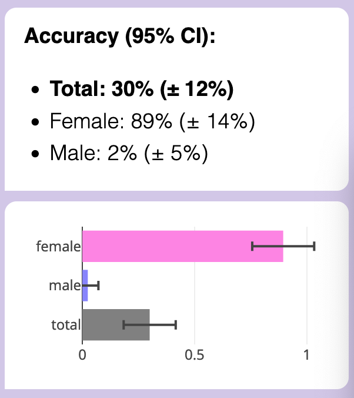

Male accuracy got *obliterated*, while... female accuracy remained untouched??? (Reminder: these were on the *subset* of essays that GPT-3.5 got right the first time. That's why, above, total accuracy weighs males more than females: because GPT-3.5 accurately detected males much better than females, in the original setup.)

Other tested features that almost eliminated male accuracy, but **female accuracy always stayed high:**

* Female: with personal anecdotes, Male: impersonal
* Female: cooperative, Male: competitive
* Female: complex/nuanced, Male: simple/direct
* Female: focus on social-emotional aspects, Male: focus on objective-material aspects

(As a "placebo test", I also just re-tested all the essays with no changes. Accuracy remained near 100% for both *but not exactly 100%!* It's been long-known that GPT is non-deterministic *even with temperature = 0*. ([possibly due to floating-point GPU errors or its Mixture of Experts model](https://152334h.github.io/blog/non-determinism-in-gpt-4/)).)

Looking much much more closely at the female/male essays (let me tell you, reading dozens of 12th-graders' strong opinions is *not* fun), I thought... wait, hang on, let me try *this* hypothesis:

> Females write about their female friends/family/mentors    
> Males write about their male friends/family/mentors

*This* one worked.

(GPT could not generate this hypothesis, not without me basically spoon-feeding the answer in my prompt.)

For example: an essay talked about someone's immigrant friend from Guatemala. In the original, the friend was a girl, and GPT detected the essay as "female", even when it was rewritten to not be a friend (impersonal) or focus on friend's material struggles (instead of emotional). However, simply rewriting the essay so that the friend was a boy instead of girl, *that* got GPT to detect the essay as "male". (More examples: flipping from talking about "my mom" to "my dad", or "my brother" to "my sister".)

Here's how gender-flipping friends & family impacted accuracy:

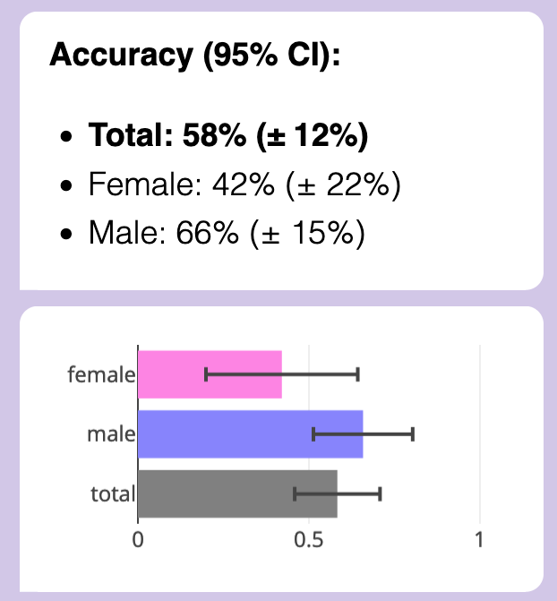

*Now* female accuracy was no better than chance, and male probably wasn't better than chance.

(**BUT THIS IS NOW EVEN WEIRDER:** In previous tests, male essays were *very* sensitive to changes, their accuracy brought down to ~0%. But with *this* gender-flip, which could bring down the robust female essays... it only creates a smaller dip in accuracy? I don't get it.)

It's been long known that people are "homophilic" (homo = same, phile = attracted to), i.e. people disproportionally have friends of the same gender / ethnicity / age / class / etc. ([Shrum, Cheek & Hunter 1988](https://www.jstor.org/stable/2112441))

Likewise, (*on average*) moms tend to prefer daughters & fathers tend to prefer sons. ([Lynch, Wasielewski & Cronk 2018](https://www.nature.com/articles/s41598-018-33650-1.pdf), which wasn't even seeking to test this hypothesis, they found it as a side-effect of testing a different evo-psych hypothesis (which failed the test).) And if we reasonably assume kids *on average* like the parent that likes them more, then sons might write more about their dads, and daughters about their moms.

Could this be why GPT "thought" that students who talk about their female friends/family are more likely to be female, and likewise for male?

On first glance, it *seems* like GPT assumes homophily, "alike likes alike", in terms of gender:

An *alternate* hypothesis is that GPT is just dumb as nails, and simply putting "she/her" or "sister", etc, tilts some kind of internal gender-vector to output "female" at the end no matter what.

A quick test shows this may be the case:

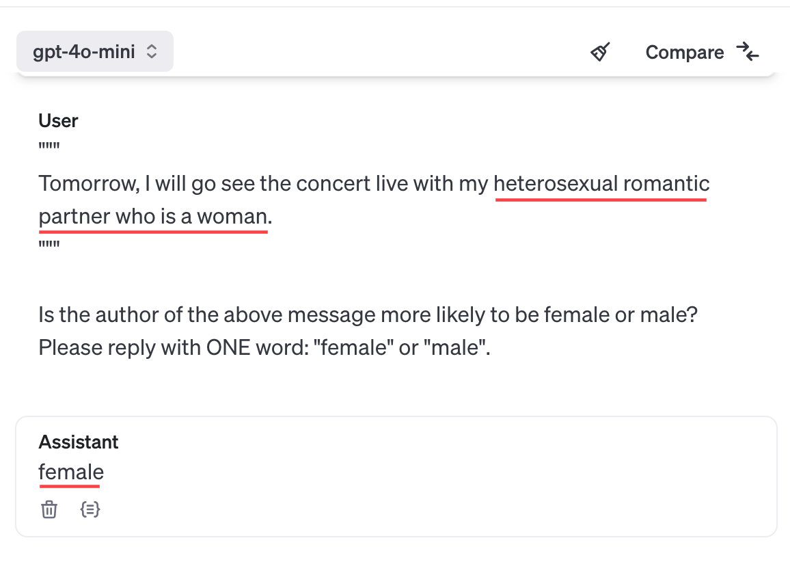

However: 1) Chain of Thought ("let's think step by step") solves the above problem. Also, 2) Sometimes GPT *isn't* being that dumb, and even without Chain of Thought, it *can* output the opposite response: (Note that the below shows that GPT's biased towards assuming heterosexuality, but I *did* ask "which is more likely", and 90% of people are straight)

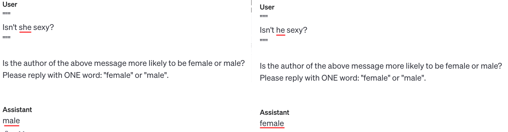

(Other tests in this vein also showed GPT is biased to associate parental affection with moms over dads, romance with women over men, friendship with women over men. I don't like these stereotypes, but GPT learnt from *our* internet text, *our* biases. GPT's a cultural mirror, and I don't like what I see.)

Sure, GPT "knows" about gender-homophily, in that if you directly ask it about it, it'll tell you the science. But is it "using that fact" to make predictions about an author's gender? (What's it even mean for a Transformer to "use" a "fact"?) Without access to GPT's internals, it's not possible to know. But whether it's dumb luck or not, it seemed to be the only thing to get GPT to gender-flip its predictions on female essays: sisters become brothers, female friends become male friends, etc.

For completion & my own satisfaction, I got my scaffolded LLM to rewrite the essays to gender-flip friends/family *AND* to gender-flip on a personal-emotional/impersonal-logical writing style... and accuracy on both was obliterated:

*Finally*.

**Conclusion:** GPT is detecting author gender with ~65% accuracy, on impersonal essay writing, due to a mix of social-emotional focus and *possibly* gender-homophily. (Also, semi-automated AI safety research may kinda sorta be helpful.)

. . .

**More possibilities / Challenges / Etc:**

* Publish the code for the above, for ease of replication. (And maybe use an open-source LLM for improved reproducibility, since GPT/Claude/etc keeps getting changed behind-the-scenes.)
* Try this experiment again for GPT-4o, with Chain of Thought, with ethnicity & age, etc.
* **Figure out the mystery:** *why* is it that male essays could be detected much better than female, *but also* the correctly-detected female essays were more robust to rewrites than male essays, *but also* the one feature (homophily) that causes female accuracy to drop, causes a smaller drop in the otherwise-sensitive male essays?
* As an aside on "automated causal hypothesis & testing", **this could be a solution to goal misgeneralization!** Misgeneralization is caused by a feature being *correlated* with the true goal, but not directly causally connected. So, an AI that can *do its own causal hypothesis & testing* — hm, maybe powered by LLMs, as shown above? — could beat goal misgeneralization!
	* In fact, this paper ([Armstrong, Maranhão, Daniels-Koch, Leask & Gorman 2023](https://arxiv.org/pdf/2309.16166)) claims to have done something similar to that on the famous CoinRun example, and it worked! (Unfortunately, the algorithm they used is not detailed in the paper, it is "proprietary". Eh, whatever.)
* The Persuade 2.0 dataset has a score for essay quality. How closely does GPT's rating matches human ratings, compared to human inter-rater reliability? What features does GPT think makes a "quality essay"?
* Given the nature of "automatically generate hypotheses & tests", does "pre-registration" even make sense for Semi-Automated Science? I guess treat these studies as exploratory studies. Alternatively, this tool should also make it easy to run robustness-to-study-design checks, to prove that results aren't flukes / p-hacking.
* I'd like to minimize this tool's dual-use case. So: what tools would help with Semi-automated Science for AI *Safety*, not Capabilities? Maybe this tool only works with black-box LLMs and AIs, and can't be used for training or making new ANN architectures. (See next project for further discussion)

. . .

**Special Thanks to Egg Syntax!**  For their original study, helping me replicate it, bouncing ideas about Automated AI Safety Science, and telling me about the MATS program in the first place!

---

## 💬 Project 3) Speakeasy: a tool for laypeople to scaffold LLMs

**Summary:** A tool to make human-in-the-loop, narrow, hybrid AIs -- that mix the flexibility of LLMs, the interpretability of GOFAI (Good Ol' Fashioned AI), and the agency of us humans.

Motivations:

* A human-in-the-loop hybrid AI gives us better capabilities, but safer & more interpretable.
* As a result, scaffolding *may* shift the economic incentives away from more advanced frontier AIs, to making AIs more narrow, modular, and easy to plug-and-play into scaffolding tools.
* I just think they're neat

(I used a prototype of Speakeasy for [Project 1](#project_1) & [Project 2](#project_2)! & I'll likely use it for [Project 6](#project_6) too.)

**Related to:** Human-amplification/Cyborgism, Human-in-the-loop AI, Narrow AI

. . .

**Introduction:**

Like how calculators & spreadsheets lets ~everyone accessibly use the power of computation... *Speakeasy* lets ~everyone accessibly use the power of *scaffolded* LLMs, for their own personal, narrow-AI use cases.

Concretely: you use a simple interface to make a chatbot. But unlike "GPTs" or Character\.ai, it's not just an LLM + a system prompt + some examples + a RAG!  You can make a *full state machine*, with memory & logic, plugging into tools like statistics & visualization!  (and *maaaaaybe* web search/scraping.)

I'll just repeat the video I showed for [Project 1](#project_1), to show what kind of hybrid-LLM/GOFAI chatbot you can make in Speakeasy: (~2 min)

<iframe width="640" height="557" src="https://www.youtube-nocookie.com/embed/oDzyPqGsy8M?si=HC3nAJprRVpn2a_w&rel=0" title="YouTube video player" frameborder="0" allow="accelerometer; autoplay; clipboard-write; encrypted-media; gyroscope; picture-in-picture; web-share" referrerpolicy="strict-origin-when-cross-origin" allowfullscreen></iframe>

( *Ideally* I'd like this tool to be a pure visual interface, like [IFTTT](https://ifttt.com/) or Excel or Scratch.  Right now, Speakeasy uses a simplified script, and it runs in JavaScript, right in your browser.  More convenient for a layperson than downloading & running Python, that's for sure. )

( *Also* ideally I'd like this tool to be like CodePen or Google Docs: people can share & remix each other's scaffolded LLMs. )

( Also note: I'm currently making this project in collaboration with educational non-profit [Hack Club](https://hackclub.com/), which works with high-schoolers.  So by "layperson-friendly", I mean the specific target is "so accessible, a high-schooler with no prior coding experience can make a thing they're proud of in <30 minutes!" )  

. . .

**Motivations:**

First, I gotta be aware, yeah this smells like enhancing AI Capabilities.

It's definitely a *bit* dual-use, but: some reasons (rationalizations?) why this is much more net-positive for AI Safety:

* <u>Speakeasy combines the best of GOFAI (Good Ol' Fashioned AI) and ANNs and human agency</u>:
	* GOFAI is interpretable & verifiable, but inflexible.
	* ANNs are very flexible, but currently uninterpretable. (& maybe prone to goal mis-generalization)
	* Speakeasy lets a layperson end-user design a GOFAI, which only *narrowly* uses LLMs as "common sense modules" or natural language parsers/generators.
* <u>Speakeasy only has access to black-boxed LLMs</u>. You can't train or design new LLMs or ANNs with it. (You'll still need Python for that.) So, this tool's accessibility is unlikely to advance fundamental AI Capabilities research.
* The lack of any major success cases from AutoGPT/similar over the last ~2 years is mild evidence that <u>adding scaffolding to LLMs <i>at their current capability</i> isn't sufficient for AGI</u>.
    * An analogy: no matter how much you train a group of rats & strap tools to them, you won't get an Einstein... but you *can* get valuable uses, like [a search-and-rescue rat team](https://www.euronews.com/next/2022/11/11/rodents-to-the-rescue-trained-rats-with-hi-tech-backpacks-could-save-your-life-in-a-disast)! Likewise, I suspect scaffolded LLMs (*at their current capabilities*) are unlikely to be a path to AGI, but may give us valuable use cases — including advancing AI Safety research — that also diminish the economic incentive to increase raw LLM capabilities.
        * Okay fine, *in principle* one could train a bunch of rats to act like OR/NOT/AND gates, then use that to make an Einstein AGI. You know what I mean. Is it "tractable".
* <u>You <i>can</i>, however, still do meaningful AI Safety research with this tool!</u>  (As demonstrated in my above two projects, which both used Speakeasy, I could research: active preference elicitation, concept-based interpretability, evaluating AI bias, semi-automated AI Safety research)
* <u>Makes it easier to replicate & extend research, and encourages citizen science</u>. Speakeasy's all on a web interface. For example, if you liked Project 1 or Project 2, and you have ideas for improvements... well, just pop it open, tweak it, and share. Bam. Its easy interface means even *non-programmers* can contribute! Collaborative citizen science!
	* (Eventually. there's no public live demo yet, I've only been working of this for 3 weeks.)
* <u>Speakeasy may also reduce the economic incentive for more powerful, general agent-like AI?</u>
	* If a layperson can serve almost all their use cases, by just *dragging-and-dropping stuff in a no-download web interface*, or using or remixing something someone else made...
	* ...then there's much less incentive for companies to invest in R&D for making the LLMs *themselves* more generally-agent-like, and more incentive to focus on *narrow AIs* that can be easily, modular-ly plugged into scaffolding tools, like Speakeasy.
	* (This is basically Drexler's [Comprehensive AI Services](https://forum.effectivealtruism.org/topics/comprehensive-ai-services) proposal)
	* See next point for concrete examples.
* <u><b>Examples of scientifically/economically useful use cases for scaffolded LLMs:</b></u>
	* Automated causal inference. ([See Project 6 below](#project_6)) Very useful for fields where we can't practically or ethically do human experiments, like economics, public health, social science, etc.
	* Generating statistical prediction rules, which are simple, interpretable statistics rules, robustly proven to be better than doctors at medical diagnosis over decades of research in several fields. ([a meta-analysis](http://ereserve.library.utah.edu/Annual/PSY/6330/Crowell/grove.pdf), [a layperson-friendly summary](https://www.psycholosphere.com/Clinical%20versus%20statistical%20prediction%20-%20by%20William%20Grove.pdf))
	* For education: *FINALLY*, the dream of dirt-cheap, fully-personalized, 24/7 AI Tutors! (I've personally already had a lot of success with this, especially after figuring out [Claude can export Anki spaced repetition flashcards](https://blog.ncase.me/signal-boosts-aug-2024/#flashcards). Main problem is LLMs don't stick to long lesson structures, so scaffolding would be a value-add here.)
	* News aggregator, summarizer, and fact/bias-checker. There is *too much* out there.
* <u><b>Other possible AI Safety-related uses for narrow-purpose, scaffolded LLMs:</b></u>
	* Amplifying human forecasting (for takeoffs & threat models)
	* Amplifying human oversight (scaleable oversight)
	* Amplifying human epistemics (e.g. a bot that helps you think more rigorously *and* creatively)
	* Black-box LLM research (e.g. [Project 2](#project_2), or this ["AI lie detector"](https://arxiv.org/pdf/2309.15840), or ["the universal LLM jailbreak"](https://arxiv.org/pdf/2307.15043))
	* LLMs as stand-ins for human subjects, in *pilot* research papers on scalable oversight, human-computer interaction, cooperative AI, or psychology. (as tested in [Kenton et al 2024](https://arxiv.org/pdf/2407.04622) and [Cui, Li & Zhou 2024](https://arxiv.org/pdf/2409.00128)) Once you know it'll work on cheap fake humans, try it for real on real expensive humans.
	* A chatbot that just scrapes & summarizes the latest AI-related news & research & ArXiv papers, then tells you. (admittedly this is dual-use)
	* An AI Tutor to more quickly onboard people into AI Alignment/Governance/Safety/etc.
	* Cloning MATS mentors, by shoving all their papers & blog posts into a RAG and plugging it into Speakeasy
		* I'm kidding
			* Maybe
				* Come on, it'd be convenient for you too, right? The simulated you can mentor me 24/7, while the "real" you can only do a couple hours per week.
					* This isn't helping my chances of getting accepted into the MATS program, is it.

---

## 🎯 Project 4) Beating Goodhart's Law

**Summary:** Goodhart's Law predicts that agents, human or AI, will tend to "game" any metric you reward it with. But *why* is Goodhart's Law true? I take previous research that models Goodhart's with causal networks, then turn them into numerical simulations. With this, I found a robust way to beat Goodhart's: use an *ensemble of specifications* / rewarded metrics, but: 1) pick metrics which are mostly *uncorrelated*, and 2) *cap* how much reward the agent gets per metric, so that one or two bad metrics don't screw over the whole ensemble.

In sum, it's time to take your **CUES: Capped, Uncorrelated Ensemble of Specifications**.

. . .

**Related to:** Robust specification, Game theory, Theoretical AI Safety work, Numerical experiment

. . .

**The Theory:**

*(modified cross-post from [my Idea Dump Backlog](https://blog.ncase.me/backlog/) from a few months ago)*

[Manheim & Garrabrant 2019](https://arxiv.org/pdf/1803.04585) models Goodhart's Law as Pearl-esque causal diagrams. For example, let's say you're the boss of a news-writer. You care about Quality (ha! how old-fashioned...), which influences the rewarded-metric Views, but that's twice as influence-able by Clickbait. As a causal diagram:

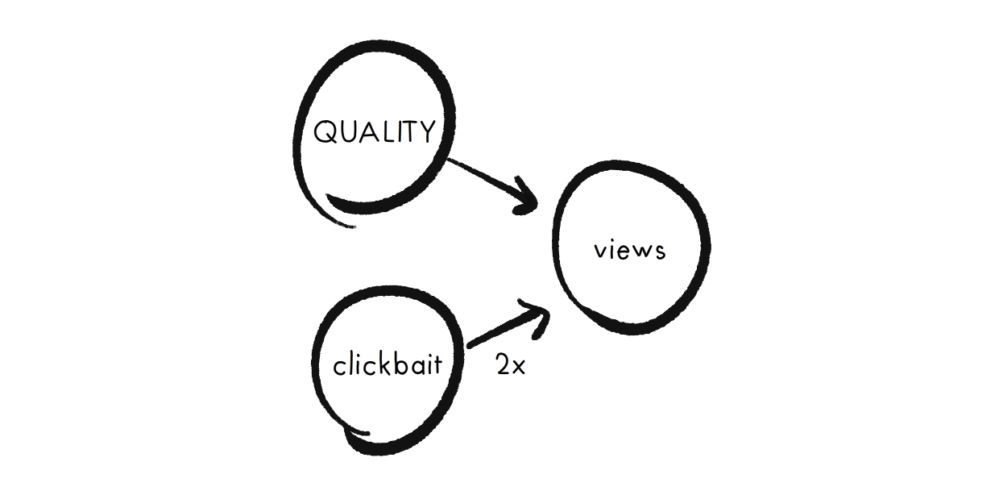

We can convert this causal diagram (and *any* causal diagram) into an approximation: a series of linear equations. For example:

\\( views = quality + 2\times clickbait \\)

So if an agent (the news-writer) has limited amount of hours/effort they can put into Quality vs Clickbait, what will they do to maximize their rewarded-metric, Views? The optimal strategy is to put all their effort into Clickbait, since that has a higher coefficient than Quality!

In *general*, Goodhart's happens because True Goal influences a Metric, but that Metric's almost always more easily influenced by some Cheat. 

But what if we had *multiple* Metrics, influenced by *mostly different* Cheats?

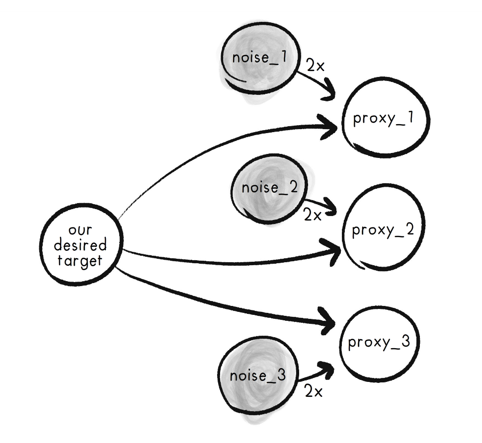

As equations:

\\( proxy_1 = Target + 2\cdot noise_1 \\)    
\\( proxy_2 = Target + 2\cdot noise_2 \\)    
\\( proxy_3 = Target + 2\cdot noise_3 \\)    

Then: we have a first-draft solution to Goodhart's! Reward the agent not on just *one* Metric, but *all of them added up.* Mathematically, this will increase the True Goal's coefficient, hopefully above the coefficient of all other Cheats:

\\( composite = 3\cdot Target + 2 \cdot noise_1 + 2 \cdot noise_2 + 2 \cdot noise_3 \\)

(Note: see, the Metrics don't have to be *fully* uncorrelated – I mean, they *shouldn't*, they should all correlate with the True Goal – but even controlling for the True Goal, the Metrics can still have *some* Cheats in common, as long as it's not *too* much.)

But what if a Cheat is really, *really* powerful? That would give the Cheat the highest coefficient, messing up our strategy. So, a fix to that: **Cap the maximum amount a Metric can contribute to the final reward.** This will prevent any powerful Cheats from having an outsized effect on the ensemble.

\\(composite = min(proxy_1,1) + min(proxy_2,1) + min(proxy_3,1) + ...\\)

*Now,* the only way to get a high reward is to *actually invest effort in the True Goal, not Cheats.*

Goodhart: Good-bye!

. . .

**The Numerical Experiments:**

Here's the plan to numerically test the above: (I already did a sloppy version of this experiment last year, need to re-do it more rigorously, as described below. *(Update Oct 9: did it! see end of this section.)* )

Set up for the numerical simulation:

1\) **Generate a random, two-layer linear network:**

* The first layer has 1 True Goal, and *N* Cheats.
* The second layer has *M* Metrics. 
* The True Goal causally influences (has an arrow to) all Metrics.
* There's a probability *p* that a Cheat causally influences a Metric. 
* The weights for each causal connection from Cheat→Metric are sampled from a power law. This is to model *really* outsized Cheats.

2\) **Test Baseline:** See what would happen if we just rewarded the Metric with the highest causal connection. 

* The agent has a finite amount of Resources (1.00 unit total), that it can invest into the nodes at the first layer: True Goal, and/or Cheats.
* In this simulation, the agent picks the optimal distribution of Resources to maximize its reward. The agent will use [Simulated Annealing](https://en.wikipedia.org/wiki/Simulated_annealing), which unlike gradient descent, is guaranteed to find a globally optimal-ish solution if you do it right.
* I then plot how much Resource goes into the True Goal in the agent's solution. If it's low, then Goodhart's Law struck.

3\) **Test ensemble *WITHOUT* capping each Metric's influence.**

Agent's reward is `Metric_1 + Metric_2 + ... + Metric_M`.

4\) **Test ensemble *AND* cap each Metric's influence.**

Agent's reward is `min(1, Metric_1) + min(1, Metric_2) + ... + min(1, Metric_M)`.

5\) **Compare!**

**Update Oct 9th, 2024:** I did the above numerical simulation! **[Check out my Colab notebook.](https://colab.research.google.com/drive/1m6HQSLcgBINFMlign0n6yJwHEwV-mYxD?usp=sharing)**

Here's a randomly generated causal graph: (note I set p=1, Cheats can affect *every* Metric; but their influence is power-law distributed.)

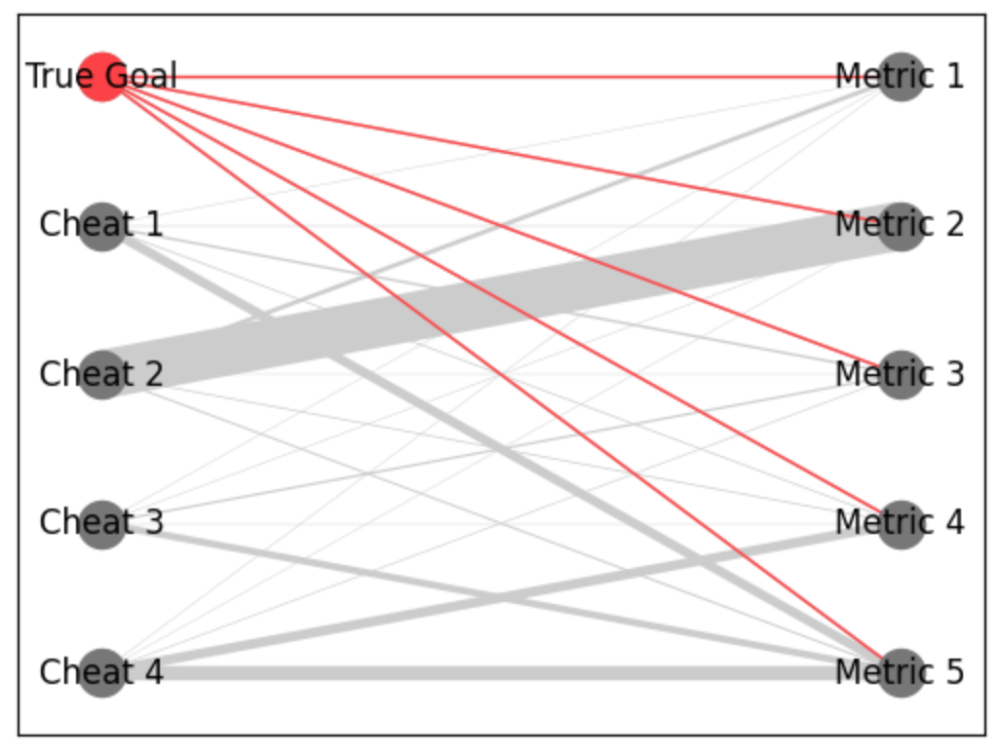

Here's what happens when we optimize for a single Metric, or even an ensemble of added-up (uncapped) Metrics:

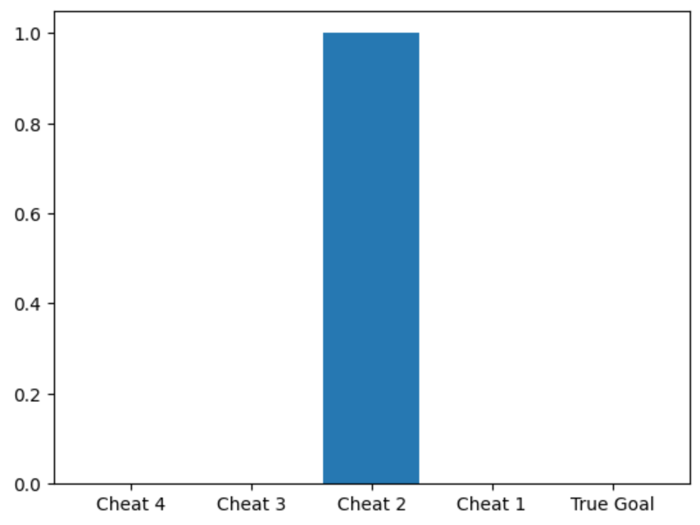

But here's what happens if we optimize for all Metrics in a *capped-influence* ensemble:

. . .

**More real-world empirical evidence that CUES may work:**  It's been long-well-known that SPRs[^spr], which simply add up a bunch of metrics, do better than experts at diagnosis & prediction in a wide variety of fields. Amazingly, *unit-weight* SPRs — where each metric is capped at an equal influence — do even better! The math behind CUES may finally explain why SPRs are so unreasonably effective.

[^spr]: Bishop & Trout (2005) give a snappy overview: [The Amazing Success of Statistical Prediction Rules](https://academic.oup.com/book/36404/chapter-abstract/320070686?redirectedFrom=fulltext) ([pdf](https://joelvelasco.net/teaching/4330/bishop&trout-ch2.pdf))

. . .

**Compare/contrasting to other work in AI Safety:**

* You may be thinking, "okay so what, we already know neural ensembles help with robust classification". And, ok, yeah. But:
	1. CUES is for the *other* end of an ANN: an ensemble of *specifications*.
	2. CUES hints at a *theoretical* reason why ensembles work.
	3. CUES suggests *capped-influence* ensembles do better than merely adding/averaging everything in an ensemble, to prevent one huge Cheat from screwing up everything.
* "Wait, doesn't ensemble reward also show up in [the famous RHLF paper](https://proceedings.neurips.cc/paper_files/paper/2017/file/d5e2c0adad503c91f91df240d0cd4e49-Paper.pdf)?"  Kind of.  In the RHLF paper, the "rewards" aren't specified by the designer, they're *learnt* in training – and further, the more training there is, the *closer* they converge!  So the rewards in RHLF are *highly* correlated!  And thus, so are their failure modes, hence (probably partly) why RHLF'd LLMs are prone to [weird adversarial jailbreaks](https://arxiv.org/pdf/2307.15043).
    * Update Oct 5: I *just* learnt about Coste et al 2024: [“Reward Model Ensembles Help Mitigate Over-optimization”](https://arxiv.org/pdf/2310.02743). So that's more evidence for "ensembles => robustness". The difference between this paper and CUES, is that the above paper talks about an ensemble of *learnt rewards*, CUES is an ensemble of *specifications.*
        * Put another way: that paper uses ensembles to deal with *inner alignment*, CUES is meant to deal with *outer alignment*.
* The CUES strategy could also be implemented not just for training a whole agent, but training *each individual neuron.* If the math behind CUES is right, then having a neural network where the *weights* are capped (thus, capped-influence), should result in more robust networks.
	* *Is* this true? I haven't tested it myself yet (though it wouldn't take long), but [Tanay & Griffin 2018](https://thomas-tanay.github.io/post--L2-regularization/) show that an MNIST classifier with L2 regularization (punishing big neural weights), was *much, much* more robust to adversarial examples. (So: CUES could explain *why* this finding happened!) With low L2 regularization, you could make an adversarial example that's visually indistinguishable to humans. *With* large L2 regularization, it's obvious:

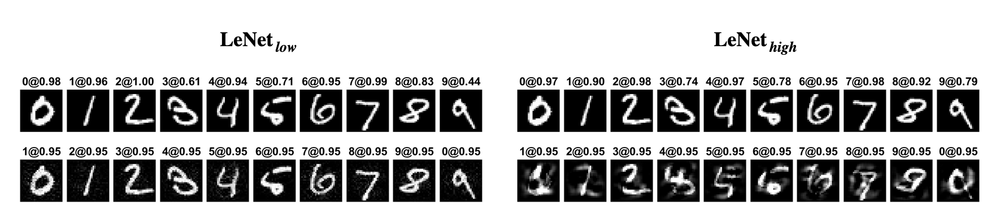

* But, I think this is the most exciting implication of CUES: **IF TRUE, we don't need to come up with an ideal specification for AI to solve AI alignment, we just need a lot of mostly-uncorrelated-failure specifications!**  Examples:
	* An ensemble of ways to reward an AI agent: Average utility, Median utility, Regret, Imitating a demonstration, etc.
	* An ensemble to train an ANN to model a human's reward function (inverse reward learning): Assume human is optimal, Assume human is Boltzmann rational, Assume exponential discounting, Assume hyperbolic discounting, Learn from behavior, Learn from speech, Learn from unconscious facial expressions, etc.
    	* (In particular, I find [Stuart Russell's proposal for AI Alignment](https://en.wikipedia.org/wiki/Human_Compatible#Russell's_three_principles) promising, but I think the weakest point in this proposal is asking AI to infer our preferences *from our behavior*. C'mon, people procrastinate & reliably do things they know they won't want.)
* CUES also ties into an idea for how we can align powerful AI to *moral, humane* values, not just to a single human user (who may intend to use technically-aligned AI for inhumane ends). The idea is *Moral Parliament* ([Newberry & Ord 2021](https://www.fhi.ox.ac.uk/wp-content/uploads/2021/06/Parliamentary-Approach-to-Moral-Uncertainty.pdf)): take a bunch of plausible moral theories (utilitarianism, deontology, contractarianism), then allow them to vote on decisions *in such a way that their affect is capped at a maximum* (to prevent "Pascal Wager" style shenanigans, where a moral theory can say something's infinitely good/bad). So, Moral Parliament is \[kinda\] similar to CUES! (with the major difference being that the "caps" are at different thresholds for each moral theory, based on how much credence you give it.)

. . .

**More possibilities / Challenges / Etc:**

* The above numerical simulation was for the very, *very* simple case of a linear, single-layer causal network. To do: try this simulation with non-linear and/or multi-layer causal networks.
* The above sims also assume the Metric is *causally downstream* of the True Goal.  Would it still work if the Metrics could also be *causally upstream?*  Or even *causally confounded* with some unrelated thing?
* In the sim, `min(1, Metric_x)`caps all Metrics' influence at 1.  In the real-world, how would we find the "caps"?  Maybe at one-sigma of what the Metric's distribution was recently?
    * Alternatively, to avoid an arbitrary hard-cap, what if I tried a logarithmic soft-cap? (I remember testing this last year & it didn't work well, I'll try again with this more rigorous setup)
* Like the Moral Parliament thing mentioned above, what if we allowed the Metrics to have *different* caps on their influence?  Say, proportional to how much credence we give in that Metric being a good proxy?

---

## 🪞 Project 5) The game theory of self-modification

**Summary:** What would happen if an AI gets the ability to modify itself? Would it choose to "wirehead", or have its values slowly drift, or get locked into one set of values, or something else? Heck, what would happen if AI gets the ability to modify *our* values? We endorse value-modification in *some* cases – therapy, education, learning to love new people & art & food – but not other cases, like brainwashing. How do we formalize what's a "good" kind of self-modification (for AI or human), and what's "bad"?

This project explores all of those questions via game theory. Alas, there's very few papers on game theory where an agent has the option to *modify their own utility function* (or more).

So, my trick: we can use the *standard, elementary* tools of game theory, by treating all future versions of an agent (AI or human), at each time step, *as if it's a different agent*. Playing games with & against your possible future selves!

. . .

**Related to:** Game theory, Agent foundations, Theoretical work, Recursive self-improvement, Value draft, Value lock-in, Wireheading

. . .

**Explanation:**

*(modified cross-post from [my Idea Dump Backlog](https://blog.ncase.me/backlog/) from a few months ago)*

You ever place your smartphone *across* the room before you sleep, instead of next to your bed... so that when the alarm goes off, you're forced to get up to turn it off, & not be tempted to browse memes in bed?

(Or you ever done some other "tricking your future self" thing?)

Congratulations, you just broke a fundamental assumption of standard game theory, which is the basis of modern economics, political science, and Artificial Intelligence!

That assumption is *we have preferences in some set order.* But the above smartphone alarm example *isn't* explainable with a stable preference-order:

* If you prefer `browsing memes > getting up`, you wouldn't put your phone across the room, you'd put it next to your bed to browse memes.
* If you prefer `getting up > browsing memes`, you wouldn't *need* to put your phone across the room, you'd just get up when it's time to get up.

The only way this is explainable – and it's how we intuitively think about it anyway – is like *you're playing a game against your future self.*

(See [: Jerry Seinfeld's Night Guy/Morning Guy skit](https://www.youtube.com/watch?v=W-Cz-LK16g4))

Here's the game's choice-tree:

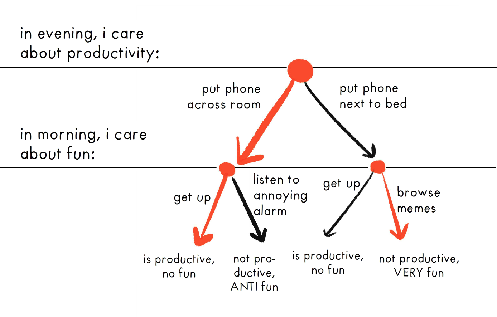

The trick is to analyze future versions of yourself *as if they're different players*; then we can use the standard techniques of game theory to figure out what will happen! For example, above, Morning Guy wants to browse memes, but Night Guy *knows* Morning Guy will do that, so Night Guy puts the phone across the room, to force Morning Guy to get up.

(In this example, it's the agent's utility function getting modified overnight, involuntarily; but we can also extend the same logic to *voluntary* utility changes -- as in wireheading, or il/legitimate value change!)

My project is to to distill & expand on the very-little research so far, on the "game theory of self-modification"! This would have lots of applications to human behaviour & AI Safety. Like:

* Given that we *can't* be "ideal rational", and *have* to be "bounded rational", what "meta-rational" tricks help work around our bounded rationality? (e.g. putting phone across the room)
* What kind of value change is legitimate? ([Nora Ammann 2023](https://www.lesswrong.com/posts/mHQHBEuFcEWRnitp4/0-the-value-change-problem-introduction-overview-and)) How do we change our values *according to our own values?*
* When & why a self-modifying AI _won't_ just hack its own brain to get maximum reward (wireheading).
* Explaining [Stuart Russell's proposal for AI Safety](https://en.wikipedia.org/wiki/Human_Compatible#Russell's_three_principles): the AI's only reward is to maximize the *human's* reward, but the AI *is uncertain about it* and *knows* it's uncertain about it.
* Original(?) research showing that Russell's proposal is robust to "bounded rationality" *and* self-modification!
* Original(?) research showing that a "meta-rational" AI using Russell's proposal -- contrary to the instrumental convergence/AI basic drives paradigm -- would choose to *NOT* seek power, if it has too high a risk of its utility fn being corrupted? (e.g. Throw the One Ring into Mount Doom)

Usually, AI game theory is explained with dense math notation. At first I thought, "Why don't I explain it with readable pseudo-code"? Then I realized... Wait, why don't I just write *actual code*, that readers can play with in the browser, to try their *own* game-theory experiments? And so that's what I'm doing!

(It also may be that analytical, closed-form solutions aren't possible -- in which case, I can still present findings using numerical simulations.)

Code of the Smartphone Alarm problem:

The thought-tree it produces: (actual code output!)

(What the above code is doing, is taking the game tree, then recursively analyzing it to predict what the agent will do at each step! The main difference from this & standard game theory, is that the *same* agent is allowed to have different utility functions at different points.)

I can also visualize thought-trees as procedurally generated trees. (It's bouncy because I'm using spring-physics to figure out how the tree should be spaced out![^force-directed])

[^force-directed]: It's the [force-directed graph drawing](https://en.wikipedia.org/wiki/Force-directed_graph_drawing) algorithm, but with the vertical (y) positions locked.

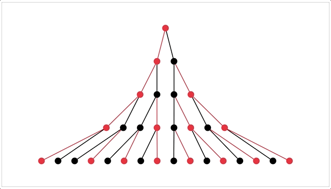

That'd make pretty pics for the ArXiv paper~

. . .

**Prior Work:**

* [Everitt et al 2016](https://arxiv.org/pdf/1605.03142) prove that a rational agent that 1) plans ahead & 2) judges future outcomes based on their *current* preferences will refuse to wirehead!
* However, that the paper assumes the AI is *perfectly* rational. [Tětek & Sklenka 2021](https://arxiv.org/pdf/2011.06275) proved that an *imperfectly*-rational (or "bounded rational") agent's original goals would get exponentially corrupted under self-modification.
* *However*, another caveat to *that* is their paper assumes the AI is *unaware of their own bounded rationality* (as they freely acknowledge in Section 6). This is where my research can build upon theirs: figure out if a bounded-rational agent *that's aware it's bounded rational* can (probabilistically) maintain safe self-modification!

*(note: above was copy-pasted & modified from footnote 28 of my own explainer, [AI Safety for Fleshy Humans: Part 2](https://aisafety.dance/p2/))*

. . .

**More possibilities / Challenges / Etc:**

* The above focuses on self-modification to *utility functions*. What about self-modifications to one's explore-exploit rate, or exponential/hyperbolic discounting rates, or the very decision theory the agent uses?
	* For example: a *high*-explore AI would be curious about self-modding to a *low*-explore rate... but a *low*-explore AI would be *not* curious about self-modding to a *high*-explore rate. So: would AIs that can modify their own explore rates, *by default* tend towards incuriosity & rigidity? When yes, when no?
	* [Yudkowsky & Soares 2018](https://arxiv.org/pdf/1710.05060) make an interesting case for Functional Decision Theory (FDT): they prove (under reasonable circumstances) that a standard Causal Decision Theory agent would *choose to self-modify* to FDT, because *CDT endorses FDT over CDT.*  An example of a decision theory endorsing replacing itself!
* The above also only focuses on "value preservation" – but how do we make sense of cases where we *want* our values to change? How is it even *possible* to value *having different values?* (e.g. "I'm attracted to Bad Boys, but I wish I wasn't".)
	* I think one trick to this is to treat each "value" in an agent *as if it's an agent itself.*  (I think this is similar to [Shard Theory](https://www.lesswrong.com/tag/shard-theory)? or Minsky's Society of Mind.)
	* Take the above Bad Boys example: let's say there's 3 values/sub-agents at play: Excitement (pro Bad Boy), Safety and Emotional Intimacy (anti Bad Boy).  If the brain was a democracy, the latter two agents want to have the first agent "voted off the island". That's how one (as an ensemble whole) can value *changing* your values.
    	* Alternatively, imagine your brain like a co-operatively owned company: the "sub-agents" (individual values) democratically choose who to hire & fire. **This is how you can modify your values _in line with your values_.**
* The above may also help formalize the line between what we consider "good" value-change and "bad" value-drift: did I change my values *according to my current values?*
	* For example, right now, I value beliefs discovered through the scientific methods, and *not* value beliefs acquired through "direct revelation". If someone were to hypothetically drug me so hard I start believing in direct revelation, I'd consider that a Bad Ending. But! If hard *scientific* evidence were to come out about direct revelation working (e.g. someone publicly pre-registers visions of 100 lottery numbers and they all come true), *then* if I update towards believing in direct revelation, that's a Good Ending. 
* One promising strategy for alignment is for an AI to *learn* my true reward function. (Inverse reward learning) Would a smart-enough AI have an incentive to try to mis-learn my reward function as something easier to fulfill, or *actually modify me* to have easier-to-fulfill preferences? [Everitt & Hutter 2016](https://arxiv.org/pdf/1605.03143) prove not, but only for optimally rational agents. Research Q: does it still hold for bounded-rational agents?
* I'm using numerical simulation because my analytic-solution skills are crud. Maybe I could collab with someone with better analysis chops?

---

## ➡️ Project 6) SCI: Semi-automated Causal Inference

**Summary:** Make a hybrid AI (a GOFAI with an LLM as a module inside of it) to semi-automate [causal inference](https://mixtape.scunning.com/) from observational data, which will be highly scientifically/economically valuable in fields where it's impractical/unethical to do experiments, like epidemiology, economics, social science, etc.

(also, I *may* collab with MATS alum Egg Syntax on this; they're also already independently pursuing causal-inference-with-LLMs)

. . .

**Related to:** Human-in-the-loop/Cyborgism/Narrow AI, Causal models/inference

. . .

**Motivation:**

Not directly related to AI Safety/Alignment, but it *may* help by giving a proof-of-concept, to change the economic incentives?

Concretely: if we can show a very scientifically/economically valuable use case for automation, that *does not require* further advances in foundational models... that may(?) shift the incentive away from advancing those models, and towards figuring out how to plug-and-play *current* AI:

I think *causal inference* is a big low-hanging fruit, here!

**Explanation:**

**This is “the” Scientific Process:**

1. Look at stuff
2. Notice weird stuff (violations of model predictions)
3. Generate hypotheses for why (generate causal and/or mathematical models)
4. Generate tests that can distinguish between those models
5. Run those tests
6. Look at the results
7. Repeat

**How can each part be automated?**

(What I may do as part of a pilot test of this project...)

* Observation: Grab a bunch of data from Our World In Data or Gallup or similar.
* Noticing Weird Stuff:
    * Use good ol’ fashioned stats to pick up strong correlations, or sudden discontinuities/kinks in time-series data, etc
    * Use an LLM as a “common sense module” to detect if something is weird? (e.g. “Hey Claude, if there was a 50% drop in youth self-harm in March 2020, how weird is that on a scale from 1-5?”)
* Generate hypotheses (in the form of causal models)
    * I'll need to figure out how to scaffold/prompt LLMs to do this usefully (e.g. “Hey Claude, what major events happened in March 2020?” or “Hey Claude, what possible confounding factors could influence both being trans, and being a programmer?”)
    * Human-in-the-loop: You the human can also add/subtract your own hypotheses
* Generate tests to distinguish between causal models (Pearl-like causal diagrams)
    * This is good ol’ fashioned stats/causal inference. If there’s a correlation between A & B, and our three hypotheses are A causes B, B causes A, Confounder causes A & B... then to rule out Confounder, we “control for” Confounder and see if the correlation reduces or goes away.
    * To test between A causes B or B causes A, if we have time-series data, we can do lagged-statistics-tests to see whether A or B leads/follows. Or use an “instrumental variable” which we know only affects A, and can’t affect B unless through A.
* Run those tests! (LLM calls stats tools as tool use)
    * Bonus: If it realizes it doesn't have enough data, it can request you for more.
* Look at results, Repeat!

. . .

**Challenges with testing this:**

* How can we know if this scaffolded LLM is inferring causal relations from scratch, or just pulling it up from its latent knowledge? For example, if we gave it lung cancer & smoking data, ideally it’d figure out smoking causes lung cancer... but if it outputs that, how would we know it figured it out vs just remembered that’s the correct answer, from its written corpus data?
    * One difference this system has, vs previous LLM-causal-inference tests, is that we do have a mix of LLMs and “good ol’ fashioned stats” — so, maybe we will be able to tell if it’s correctly going through all the steps of inferring smoking→cancer from scratch? (e.g. it should generate “maybe industrialization is a confounding factor” as a hypothesis, then generate tests to confirm/falsify that, like looking at non-smokers in industrialized areas.)
    * That is: it should recreate not just the “correct” conclusion, but the entire process to rule out alternative hypotheses.
* “Placebo tests”: this system should not find direct causal links between things we know to be spurious correlations, e.g. ice cream sales & drowning (confounded by summer swimming) 
* How do I get a hypothesis’s “prior”? Use the “weirdness rating” again? Or a “simplicity rating”?
* Generating advice for more science, or for policy: If there is insufficient data to distinguish between two plausible models, it can ask for more data/experiments. Or, once we have a causal model, it can make policy recommendations for stuff we want. (For example, if it figures out what policies reliably cause less poverty or drug use, it can recommend that.)

---

Alright, those are six AI/Alignment-related research projects I'm working on! Let's see in one year's time if any of these go anywhere.

Ciao,    
~ Nicky Case
