Hey folks! Things are still in the works. In the meantime, here's some recent-ish stuff I found valuable, and I hope you do too. 💖 (Sorry this post is, uh, over 10,000 words. Guess I'm making up for not posting a Signal Boost in almost a year!)

- **Much ado about The Algorithm**
	- 🎙️ An interview series with experts on this new algorithmic era [↪](#interview)
	- 😑 New study: It's probably not the algorithm's fault, we just suck [↪](#we-suck)
	- 🙃 Gradual Disempowerment: how even “dumb” AI could take over humanity [↪](#gradual)
	- 🤝 Bridging-Based Ranking: reverse political polarization by reversing the algorithm [↪](#bridging)
	- 🧐 Zero-Knowledge IDs: How to prove yourself without doxxing yourself [↪](#zkp)
	- 🧠 Cyborgism: How to make AI that enhances us, not replaces us [↪](#cyborg)
	- 🍻 The 6Pack of Digital Democracy [↪](#6pack)
- **Fun Stuff!**
	- 🕵️ Clues by Sam: a daily deductive detective game [↪](#clues)
	- 🐦 Snakebird: cute birbs, cruel puzzles [↪](#snakebird)
	- 🦉 ZeWei's Multiverse Tour Guide Adventures Continue [↪](#zewei)
	- 🤓 Emnerson: goofy internet gal [↪](#emnerson)
	- 🧇 "blahaj goes to waffle house at 3am" [↪](#blahaj)
- **SPOOKS FOR HALLOWEEN**
	- 👻 BOO! a silly music video & music album [↪](#boo)
	- 🩸 Bury Your Gays by Chuck Tingle [↪](#bury-your-gays)

---

## Much ado about The Algorithm

### 🎙️ Interview series with experts on this new algorithmic era

My friend Tobias Rose-Stockwell — author of the book [Outrage Machine](https://www.outragemachine.org/) — just launched a new interview series!  In this series, he'll yap with experts on the simple question of "seriously wtf is going on, what do we do when algorithms install depression & extremism into our kids, scientists can't agree if AI is hype of the end-of-humanity, also holy shit politics??"

Simple question!

**Episode 1: Jonathan Haidt**, psychologist and author of the bestselling books [The Righteous Mind](https://en.wikipedia.org/wiki/The_Righteous_Mind)[^mini-review] and [The Anxious Generation](https://en.wikipedia.org/wiki/The_Anxious_Generation).

[^mini-review]: This book personally changed my life, turning me from Mid-10's Smug Asshole Atheist to "atheist but at least _try_ to be kind & understand beliefs very unlike mine." The core ideas of the book — everyone's beliefs are mostly downstream of emotional reflexes, liberals/conservatives have overlapping but different emotional-reflexes — are still on solid scientific ground, though, be warned that since this is a psych book from 2012, probably most of the *specific* studies he cites may not replicate.

<iframe width="640" height="360" src="https://www.youtube-nocookie.com/embed/Dh4g0gxirSQ?rel=0" title="YouTube video player" frameborder="0" allow="accelerometer; autoplay; clipboard-write; encrypted-media; gyroscope; picture-in-picture; web-share" referrerpolicy="strict-origin-when-cross-origin" allowfullscreen></iframe>

[: click to expand — my notes from the Jon episode](#interview-with-jon)

**Episode 2: Tim Urban**, blogger behind [Wait But Why](https://waitbutwhy.com/) and author of [What's Our Problem?](https://waitbutwhy.com/whatsourproblem)

<iframe width="640" height="360" src="https://www.youtube-nocookie.com/embed/eGBhUXmxSbI?rel=0" title="YouTube video player" frameborder="0" allow="accelerometer; autoplay; clipboard-write; encrypted-media; gyroscope; picture-in-picture; web-share" referrerpolicy="strict-origin-when-cross-origin" allowfullscreen></iframe>

[: click to expand — my notes from the Tim episode](#interview-with-jon)

**Upcoming interviews:**

- **Tristan Harris**, ex-Google employee most famous for calling out Google, Apple & Facebook for using dark design patterns to keep us (literally, not just metaphorically) addicted — and promoting specific better designs that respect human attention & autonomy. (See: [Tristan's leaked internal Google presentation (2013)](https://www.slideshare.net/slideshow/google-deck-on-digital-wellbeing-a-call-to-minimize-distraction-and-respect-users-attention/109671786).)
- **Steven Pinker**, who I do not like because he keeps strawmanning/weakmanning all his opponents, and IMO is wrong on cognitive science (his own field), and most of the other fields he's written on, especially AI Safety. But he _is_ a leading voice & bestselling author, so, well, whatever.
- **Esther Perel**, psychotherapist best known for her talks & books about _SEX!_ and relationships.

Anyway if the above interests you, check out my friend's new interview series!

**On [YouTube](https://www.youtube.com/@IntoTheMachineShow) / [Substack](https://tobias.substack.com/) / [Apple Podcasts](https://podcasts.apple.com/ca/podcast/into-the-machine-with-tobias-rose-stockwell/id1824137015)**

Be one of the first thousand fans, it's *very* early days for this project.

### 😑 New study: It's probably not the algorithm's fault, we just suck

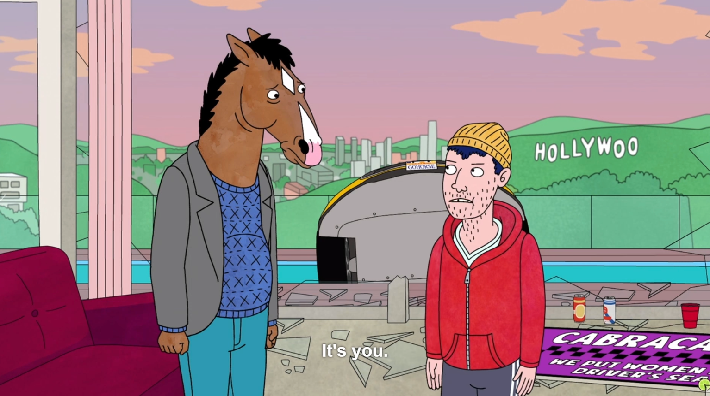

Tobias sent me [this paper](https://arxiv.org/abs/2508.03385) ([Ars Technica lay-summary](https://arstechnica.com/science/2025/08/study-social-media-probably-cant-be-fixed/)), which hurts him because it contradicts one of his core theses. +1 for Tobias's intellectual honesty, showing the counter-evidence.

Anyway, Tobias's thesis (a common one among researchers) is that social media breeds extremism because of their algorithmic feeds. *Enraging is engaging*. The data shows it: anger is _the_ best way to make a headline go viral.[^nyt-study] The algorithms, trained to predict us, train *us* to become *predictable*.

[^nyt-study]: [What makes online content viral?](https://papers.ssrn.com/sol3/Delivery.cfm?abstractid=1528077) by Berger & Milkman (2012) analyzed all headlines from the New York Times over a 3-month period. As seen in Figure 2, the top factor that makes a headline viral, is "Anger". (To be fair, the close runner-ups are "Awe" and "Practical Value")

But this *new* paper suggests that, no, it really is just our fault, no algorithm needed. The paper uses an interesting method: they simulate a social network, where each person[^paper-which-people] is simulated using LLMs[^paper-which-llms], deciding what to re-share and who to follow, etc. "Agent-based modelling" for social science isn't new, but using LLMs to do it is!

(But you should be rightfully skeptical: _can_ LLMs simulate people accurately? [This Stanford preprint](https://arxiv.org/abs/2411.10109) finds that LLMs can replicate 1,000 real people's answers 85% as accurately _as the people themselves 2 weeks later_. So, not perfect, but not bad!)

[^paper-which-people]: “The model centers on a population of simulated users, each represented by a persona drawn from the American National Election Studies (ANES) dataset. These personas reflect real-world distributions of age, gender, income, education, partisanship, ideology, religion, and personal interests.”

[^paper-which-llms]: Main analysis was done with GPT-4o-mini, results replicated successfully with llama-3.2-8b and DeepSeek-R1

Back to the paper: they use LLM agents to simulate a "baseline" social network[^paper-base], then simulate proposed solutions to social media — e.g. chronological feeds, hide engagement metrics, bridging-based algorithms, etc — and measure they're effect on political polarization, attention-economy inequality, etc.

[^paper-base]: The "baseline" simulated social network has the following algorithmic feed: it shows each user 10 posts: “five from followed users and five drawn from high-engagement content posted by non-followed users, with repost probability used as a proxy for algorithmic amplification.” All interventions are tested compared to this baseline.

**The headline result: it's our fault.** Even a no-algorithm, chronological feed leads to insular echo chambers & polarization.

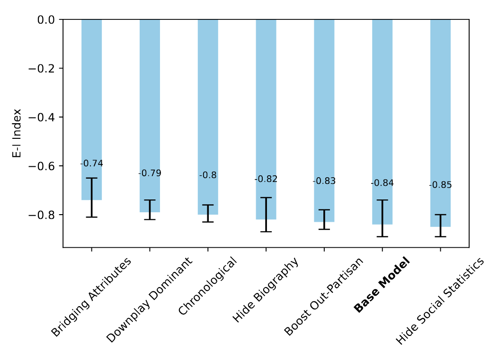

Figure 3: The "E-I Index" is a measure of outgroup (external) to ingroup (internal) follows. 0 (upwards) is less polarization, -1 (downwards) means more polarization. *No intervention reduces polarization that much.* Chronological's practically the same as baseline. The best intervention is Bridging, but even then not by much.

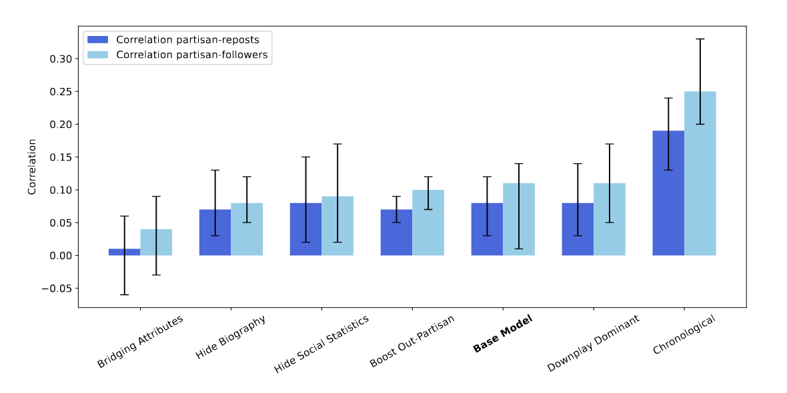

Figure 4: Correlation between how extremist a poster is, and how many followers/reposts they receive. Chronological feeds are *much worse* than baseline. Bridging is quite a bit better, actually. (Wait, how can a no-algorithm feed be *worse?* My guess in footnote:[^my-guess])

[^my-guess]: The paper doesn't offer a detailed hypothesis, and without re-running the simulation myself I'd just be guessing, but let me guess: {chronological feed + repost mechanism} is actually a *stronger filter for engaging/enraging posts* than {algorithmic feed}. Let's say the top ten posts in your chronological feed are posts from the last half hour. These posts will be either a) originally posted in the last 30 min, or b) *so engaging* that your ingroup has been reposting it *at least once per half hour*. In contrast, a baseline algorithmic feed would highlight posts that have gotten lots of reposts in the last, say, 24 hours.

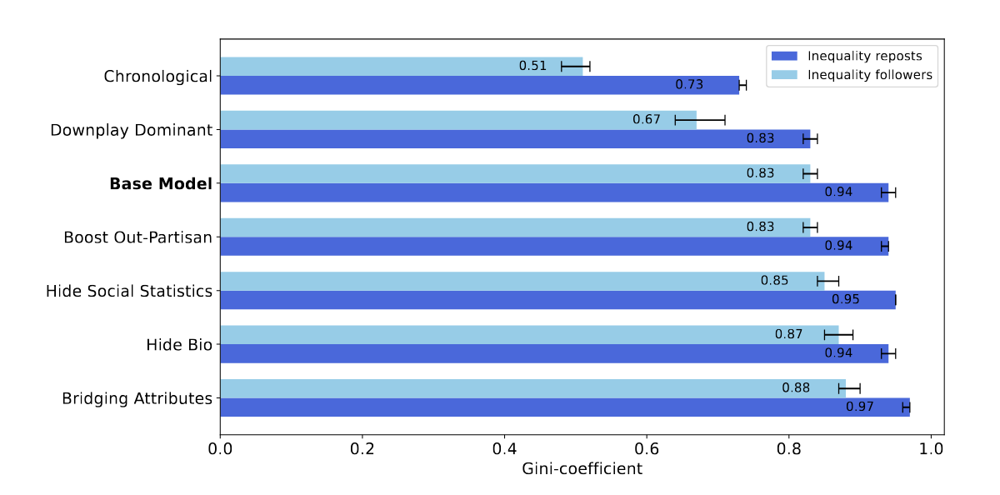

Figure 5: The "Gini coefficient" is a measure of inequality. Chronological feeds lead to the least amount of inequality in followers/reposts. Bridging leads to the most, but not that much higher than baseline.

= = =

On one hand, these results aren't _too_ surprising. Puritan-era Salem didn't have algorithms or mass media, yet they had literal witch hunts. Tumblr & 4chan in the early 2010's didn't have algorithmic feeds – (4chan doesn't even have a "reblogs" or "followers") – yet not only were these sites hotbeds of extremism, it *escaped containment* and affected US politics, which affected world politics. And today, Bluesky has a chronological feed by default[^bsky-feed], yet it's... well. It's light-blue Tumblr. Donald Trump's Truth Social also has a chronological feed.[^truth-social-feed]

[^bsky-feed]: From [their API](https://docs.bsky.app/docs/tutorials/viewing-feeds): "the default chronological feed of posts from users the authenticated user follows"

[^truth-social-feed]: From [their FAQ](https://help.truthsocial.com/truth-social-common-terminology/glossary-home-feed/): "we refrain from using non-chronological feeds to artificially suppress users' content."

**So: no algorithm is needed for poisonous politics. "It's you."**

Well, damn. I was hoping there'd be an easy technical fix, and the problem wasn't, "human nature is fundamentally corrupt".

On the other hand, the paper *did* find a hopeful result – even though their own Abstract downplays it because, I don't know, academic humility and/or pessimism sells? They found that **"bridging-based algorithms"**, like [Birdwatch/Community Notes](https://asteriskmag.com/issues/08/the-making-of-community-notes) or [Pol.is](https://en.wikipedia.org/wiki/Pol.is), *does* cut down polarization! (as explained in the above Figures)

Bridging algorithms, instead of showing you what {people you agree with} agree on, show you what {people who disagree} *still* agree on. It automatically finds & highlights common ground, by design! (More explanation later in this Signal Boost. [↪](#bridging))

Now, there *is* a small cost to using bridging algorithms, in that it *slightly* increases follower-inequality, but honestly, it's a *very* small difference, and you could just offset that by making your algorithm give a bit more weight to smaller creators.

Let's leave on that hopeful note.

= = =

Other caveats I want to mention:
- Though LLM agents have been validated against human data (85% as accurate as people themselves 2 weeks later), because this simulation runs LLM agents against each other for dozens of rounds, small biases in LLMs can accumulate. (see: [Scott Alexander's article on why Claude Finds God and DALL-E Goes Racist](https://www.astralcodexten.com/p/the-claude-bliss-attractor))
- The study might being over-estimating polarization, because the LLM "knows" polarization happens on social media, and thus acts it out. (it's a text *predictor*, remember?) Then again, the study could be *under*-estimating polarization, because these LLMs have been fine-tuned to be "friendly", and thus will be kinder & more curious than the average internet user. Maybe these two errors roughly cancel out.
- Although the *algorithmic feed* may not be the culprit, other design decisions could have led to higher assholery. For example, the low-friction Retweet lets impulsive emotions win the stage. And the Quote-Retweet (and Tumblr's Reblog-with-Commentary) is the perfect way to dunk on someone and get the "last" word.

[: click to expand — why polarization isn't always bad, and the 3 kinds of "polarization"](#notes-on-polarization)

= = =

**Link to [paper by Larooij & Törnberg](https://arxiv.org/abs/2508.03385), [press article](https://arstechnica.com/science/2025/08/study-social-media-probably-cant-be-fixed/)**

### 🙃 Gradual Disempowerment: how even “dumb” AI could take over humanity

There's two main tribes in the AI Risk world: 1) those who believe the main threat is that "super-intelligent" AI goes rogue & take over humanity, and 2) those who believe the main threat is that "dumb" AI amplifies economic inequality and digital authoritarianism.

The recent Gradual Disempowerment paper asks: *why not both?*  **"Dumb" AI could take over humanity *through* our normal cultural, economic, and political incentives.**

Here's how AI slop could disempower us in Culture, Economics, and States:

= = =

**Culture:**

")

([AI will smith eating spaghetti](https://www.youtube.com/watch?v=vbWe5k4fFWE) in 2023 vs 2024. jfc [2025](https://www.youtube.com/watch?v=bXKkZh2UEEA) is scarily realistic)

This is the one we're all, unfortunately, most familiar with.

- First, we made chronological internet feeds.
- Then, when there was too much content, we invented Newgrounds-style & Reddit-style voting to find the gems.
- Then, to counter spam (& to make investors happy), we put opaque machine-learning algorithms in charge of boosting content. Importantly: these algorithms are *grown, not designed.* To over-emphasize: *nobody understands how these algorithms really work,* not even the engineers or the algorithm itself.

So, human autonomy is now *near-fully removed* from the "consumer" side of modern culture: our media diet is filtered through an algorithm that *literally nobody understands*. We're *already* disempowered here.

But wait, it gets worse! To stay in the game, creators are forced to re-design their content *for the algorithm*. The *algorithm itself* is the primary audience now. Some of it's not too bad: tacky clickbait thumbnails, a supercut in the first 30 seconds. But some of it's pretty bad: outrage-entrepreneurship, straight-up lies & (engaging) bullshit.

But wait, it gets *even worse!* As the space gets more competitive, creators will be pressured to make more at lower cost. Well, what's the harm in a few AI-generated images? Or AI video clips? C'mon, I *have* to let an AI pick the best title & thumbnail. And maybe AI voiceover? Sure, an AI's writing the script, but I'm still generating the idea & outline! Okay, just the idea. Okay, AI can handle that too.

OpenAI & Meta (Facebook) recently announced [their own AI-video versions of TikTok](https://www.vox.com/technology/464097/meta-openai-sora-slop-ai).

To recap: we're already disempowered on the "consumer" side of culture. Soon, we may be disempowered on the "creator" side of culture. **We'll have AIs making content for AIs, humans in the backseat.** We won't even remember there used to be a steering wheel.

(Oh and *then* there's the AI Companions. [Source for all the following stats](https://globaldialogues.ai/updates/global-dialogues-4-human-ai-relationships): ~40% of people use AI for emotional support at least once a week.[^cip-stats-1] ~17% accept AI-Human romance, and ~11% would _personally consider_ dating an AI. To be clear, I'm no prude: _I_ use Claude as an "AI Life Coach" on a near-daily basis, and I'll confess, I've done erotic roleplay with AI characters.)

[^cip-stats-1]: "14.9% use AI for emotional support daily, with an **additional** 27.9% weekly" {emphasis added}. So that's 14.9 + 27.9 = 42.8% using AI as emotional support at least once a week.

(But, consider the slippery slope: AI Companions can be more attentive and less demanding than a human could ever be, so you'll slowly drift towards AI friends & lovers like you slowly drift towards 1, 2, 3+ hours on Discord and Instagram. Then, your human-interaction skills atrophy, so you tend more towards AI Companions, so your human-skills atrophy more, repeat.)

(Conclusion: not only will *mass media culture* be non-human, even *person-to-person culture* will be non-human.)

= = =

**Economics:**

I'm a programmer. So let's start with how programming, as a career, could fall to Death By Slop:

To stay competitive in the marketplace, we'll be incentivized to rely more and more on LLM coders. At first, senior developers do better than ever, thanks to these LLM coders doing all the grunt work! But junior developers can't get a job doing that grunt work anymore, which also means juniors can't get the experience to *become* seniors. So, when the seniors die out or cognitively age out, there is no new guard to take over. And/or, the more that seniors depend on LLM coders, the more their *own* skills atrophy.

([A recent preprint](https://www.brainonllm.com/) by MIT researchers found that, at least for essay-writing, LLM users' skills _do_ atrophy, and even "consistently underperformed at neural, linguistic, and behavioral levels".)

Either way, humanity loses the ability to even *check* if the LLM-written code is safe, and not – say – making the bioprinting lab's password "hunter2".

Now consider Slop coming for management positions. I mean, it's mostly emails & Slacks & meetings anyway, right? A CEO would love to get rid of the middlemen, accumulate the extra money for themselves. Until the shareholders vote to get rid of the human CEO, a million-dollar money sink, and put GPT-CEO in charge (with some human stooge as CEO on paper, just for legal reasons). The shareholders are probably AI themselves at this point; stock-trading is *already* almost entirely algorithmic. (Which may or may not have led to the glitch of [the 2010 Flash Crash](https://en.wikipedia.org/wiki/2010_flash_crash) — as AIs get put in more positions of economic power, *and the failure modes of AIs are correlated*, such sudden all-at-once failures become more likely.)

*But, at least the consumer can vote with their dollar?* Do you know how Amazon makes most of their profits? It's not the marketplace, or the books, or the streaming service. It's their cloud compute.[^amazon-profit] Yes, the big tech company makes most of its profits *selling to other* big tech companies. And the *biggest* company in the world right now? NVIDIA, the chip manufacturer, got to the top of the world by *selling to other tech companies*.

If dollars are votes, humans *already* lack majority vote for the world's top companies.

[^amazon-profit]: [Source](https://www.fool.com/investing/2024/01/10/amazon-e-commerce-company-74-profit-this-instead/). Note that while most of Amazon's _revenue_ comes from its online stores, 74% of its *profit* (which is *revenue minus cost*) comes from Amazon Web Services, their cloud compute arm. (This is because the online stores have much higher cost)

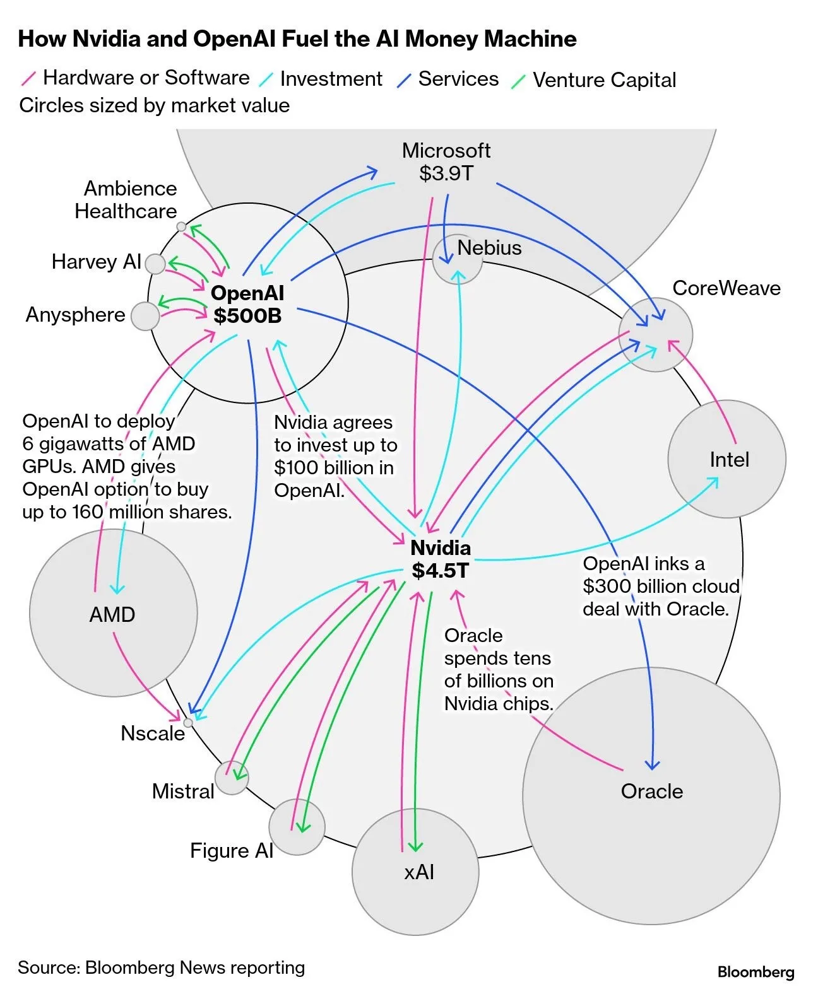

([image source](https://www.bloomberg.com/news/features/2025-10-07/openai-s-nvidia-amd-deals-boost-1-trillion-ai-boom-with-circular-deals))

Imagine a world, where AI-run companies buy from & sell to AI-run companies. Almost all human-run shops and products get immediately outcompeted. Voting with your dollar means nothing, if you even *have* dollars to vote with, after losing your job years ago. Maybe there'll be a Universal Basic Income? I'd hope so – but what incentive do the business leaders & politicians have to keep their promise to implement UBI, when we're *already* disempowered?

In sum: Labour gets automated away. Management gets automated away. Capital is almost-entirely owned by companies, fictional legal persons, which no longer have real persons at the wheel.

That's how we get disempowered. Not a coup, "just" dumb AI + dumb incentives.

= = =

**States:**

C'mon, you already knew politicians don't write their own speeches. And soon, maybe not even *any human* writes those speeches. An AI, with access to the heartbeat of the data of the swing voters, could give a politician superhuman ability to win the polls. And if they refuse? Well, they'll be outvoted by someone else who takes the AI boost. Why stop at speeches? Why not have AI optimize your platform, campaign promises, specific policies, _law?_ Why not have an AI run the entire government through teleprompted meat-puppets in suits?

(Assuming voting decisions are even human at this point; an AI-mediated Culture will show voters what the Algorithm _wants_ the voters to see, and they'll vote accordingly. *But the human spirit will rebel if democracy's on the line*, you think? Sure, an AI could predict which humans are rebellious, then give them the opposite content to reverse-psychology them into the correct actions.)

As for law *enforcement*, we don't have enough police to patrol all the streets, let alone the Wild West of the internet. So, let's put 24/7 cameras everywhere, with AIs to monitor & report crime. The officers the AI dispatches *are* human... until we can manufacture Robo-Cops who never sleep, never lose their cool, and – importantly – never unionize or complain about lack of pay. This same law-enforcement AI could track people online for acting or thinking suspiciously. And if you don't use the internet at all? Why, that's the most suspicious action of all.

Actually, I guess we can just use self-piloted drones with a gun attached as a Robo-Cop. And war robot. And neighbouring-country-conquest robot.

Oh btw, people *already* trust AI chatbots more than their elected representatives, civil servants, and even faith/community leaders. ([source](https://blog.cip.org/p/when-ai-acts-for-you-or-as-you))

In *EVERY* continent, more people Agree than Disagree that AI could make better decisions than their government representatives: (though "Unsure" is a large portion) ([source](https://blog.cip.org/p/when-ai-acts-for-you-or-as-you))

(Maybe Antarctica is the exception)

Point is: worldwide, more people than not _already would_ trust AI with governance over the current human bastards. To be fair, I can't blame 'em. Our leaders suck. To quote [the first song](https://www.youtube.com/watch?v=fwzbIUffcR4) from OK Go's first new album in over 10 years:

> 🎵 Still, no stochastic parrot has yet called   
> 🎵 On his nation to knock back bleach

= = =

Now, although the slope is slippery, I _do_ like my LLM coding assistant, and I'm sympathetic to folks with AI friends and AI romances. 

Still, the Gradual Disempowerment paper made a powerful case for a new possible type of AI takeover — not by a super-intelligent AI seeking power, but humans being lazy & greedy, giving away more and more of our autonomy to AIs. And if you try to opt out of the race, you just get trampled.

The real point of the paper: AI alignment isn't enough, we need _human_ alignment.

**Link to [Gradual Disempowerment](https://gradual-disempowerment.ai/), [full paper on arXiv](https://arxiv.org/abs/2501.16946)**

My one critique of the paper is it doesn't even *try* to hint at solutions? Way to leave a girl high & dry, y'all. But personally, I think the [d/acc](https://vitalik.eth.limo/general/2025/01/05/dacc2.html) and [Plurality](https://vitalik.eth.limo/general/2024/08/21/plurality.html) approaches are roughly correct: we need "human alignment" approaches that *scales with* improving tech, instead of getting obsolete. If all that sounds vague as hell, that's what the next 4 sections are for, to give you 4 concrete examples of how tech can work *with, not against* human autonomy:

1. 🤝 Reverse political polarization by reversing the algorithm [↪](#bridging)
2. 🧐 Cryptography that lets you prove yourself without doxxing yourself [↪](#zkp)
3. 🧠 Cyborgism: AI that *enhances* us, not replaces us [↪](#cyborg)
4. 🍻 The 6Pack of Digital Democracy [↪](#6pack)

Let's dive in:

### 🤝 BellKor & Birdwatch & Bridging: reverse political polarization by reversing the algorithm

Fun story: [in 2009, Netflix launched a million-dollar prize](https://en.wikipedia.org/wiki/Netflix_Prize) for a recommendation algorithm that could beat their own by 10%. There was a winner! Netflix paid out the million dollars! Then they didn't use that algorithm & just wrote their own lol

Okay [that's not the full story](https://www.techdirt.com/2012/04/13/why-netflix-never-implemented-algorithm-that-won-netflix-1-million-challenge/). The winning "algorithm", BellKor's Pragmatic Chaos, was actually a collection of 107 different algorithms. Almost all of these algorithms only added an extra ~0.1% accuracy to the final collection. But, *one* of these algorithms, called **[Matrix Factorization](https://datajobs.com/data-science-repo/Recommender-Systems-[Netflix].pdf)**, was responsible for almost all of the accuracy boost! *That* was (part of) what Netflix kept in their new algorithm, and even to this day, it's the core of most recommendation systems online.

But how does Matrix Factorization work? Well it's "elegant" in that **it's only 2 lines of math**, but because academic writing & math notation sucks, it still took me 30 minutes with Claude's help to understand.

Anyway, here's my attempt at explaining the algorithm:

= = =

**Step 1) Predict each user's rating of an item, as the sum of four things:**

a) **How much a user's preferences align with this item's features**

Example: If the algorithm knows I love horror, and it knows Movie X is horror, my preferences align perfectly with the item's features, so the last term in the sum is one. And here's the neat part: *you do not need to hard-code the preferences/features!*  The algorithm learns by itself which factors best predict ratings. (So instead of Horror, the algorithm just "thinks" of it as Factor #42 or something.)

b) **The item's "bias"**: how well-rated an item is, *independent of how much it aligns with user preferences.* You can _roughly_ think of this as an item's "quality".

Example: Users like me prefer supernatural slasher horror-comedies, and the movies _Final Destination 4_ and _Final Destination: Bloodlines_ both align fully with our preferences. However, _Bloodlines_ is rated higher than _4_ whether or not one likes supernatural slasher horror-comedies, because it's just a higher-quality film.

c) **The user's "bias"**. How friendly/critical this user is in their ratings, i.e. when they rate 5-out-of-10, is that "average" or "really bad"?

d) **The global "bias".** How friendly/critical are users in general. 

To recap:

Predicted rating    
= Global bias    
\+ User bias    
\+ Item bias    
\+ User preferences aligning with item features

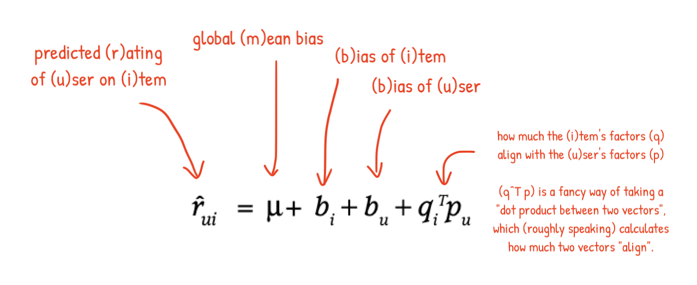

= = =

**Step 2) To train the algorithm, minimize:**

The gap (**"error"**) between {predicted ratings} & {actual ratings}    
\+ The **"complexity"** of your algorithm.  (to "keep it simple stupid", Occam's Razor)

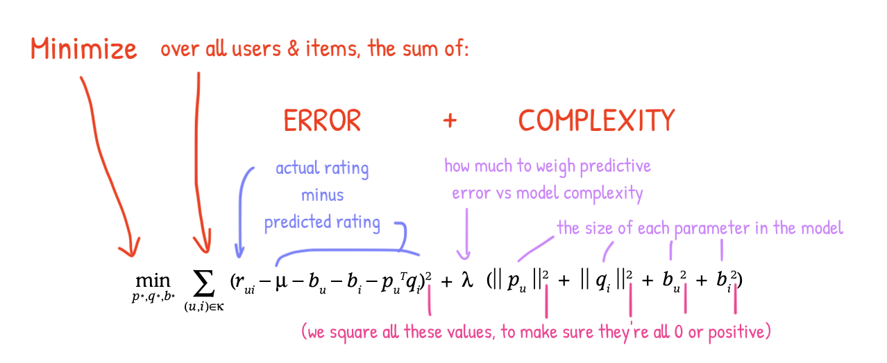

= = =

**Step 3) To find recommendations, maximize:**

It's the same equation as in Step 1!

Predicting how _you'll_ rate this item you haven't seen before    
\= Global bias    
\+ **Your** bias    
\+ Item's bias    
\+ How much **your** preferences align with this item's features

Million-dollar prize, two lines of math, that's $500,000 per equation!

= = =

In hindsight, there was a possible downside.

By giving people _what they're already into_, you nudge them into staying the same, avoiding exploration & growth. For movies & TV shows, this isn't *too* bad: Netflix predicts I like horror, so it gives me more horror, so I become even more into horror, repeat forever.

But when this algorithm got applied to social media, *specifically politics & news*, it promotes polarization, and reduces cross-tribe win-win understanding. YouTube predicts I like left-libertarian content, so it gives me more pro-left-libertarian content, so I become even more left-libertarian, repeat forever. I _can_ seek out social-conservative and Marxist-leftist and Yarvin-autocrat stuff, (and I do for research), but the algorithms put up friction for that, while "see what I'll already agree with" is the WD-40 easy-glide default.

(Counter-argument: see above paper, maybe it's not the algorithms' fault, we just suck.)

= = =

A few programmers at Twitter (back when it was called Twitter) worried about this, too.

They worried how this million-dollar algorithm, which worked for getting niche movies to niche audiences, could fracture democracy with an infinite fractal of niche echo chambers within echo chambers. Meanwhile, news sites tried "factcheckers", but people hated & distrusted them. After all, who watches the watchers, who factchecks the factcheckers?

So the Twitter programmers wondered — could they make a "fact-checking" service *run by the public themselves*, by *using* an edit of that million-dollar algorithm, for good?

They did, [they called it "Birdwatch"](https://asteriskmag.com/issues/08/the-making-of-community-notes), and here's how it worked:

- Let anyone submit "notes" to factcheck viral tweets.
- People rate how helpful those notes are.
- **You keep the algorithm's Step 1 & Step 2 the same**, so it can learn what people's preferences & notes' features are.
	- **The user/item factors:** Again, we do *not* need to hard-code the factors that best predict ratings. But in practice, the algorithm learns that the #1 factor is the left-right political spectrum; adding extra factors like "authoritarian-libertarian" doesn't improve prediction much.[^two-axis-doesnt-help] (Which is surprising given past research shows the general public's politics is at _least_ 2D.[^2d-politics] Maybe the Birdwatch community is just weird.)
	- **The item's bias:** Instead of being ~"movie quality", it's now "note quality", *independent* of how much it aligns with users' politics. IMPORTANTLY: note quality is *not* just a note's average helpfulness-rating. _Average rating_ will be skewed by the _average_ Birdwatch-rater's political preferences. This setup gets us a note's quality *regardless* of politics.
- **The key difference is WE REVERSE STEP 3**: Instead of taking user preferences (ie politics) into account, we highlight the best notes *NOT* taking user preferences into account! That means: this highlights notes that *people across the political spectrum* agree is helpful. Common ground, by algorithmic design!

[^two-axis-doesnt-help]: From [the Birdwatch paper](https://arxiv.org/pdf/2210.15723): "To avoid overfitting on our small dataset, we use one-dimensional factor vectors. Additional factors added little explanatory power and reduced interpretability and replicability. (Though we expect to expand dimensionality as the contributor base grows.) [...] RMSE on held-out samples decreased from .076 to .073 when adding a second factor". **Translation:** adding a 2nd factor to explain politics only reduced error from 0.076 to 0.073, basically nothing, while making the system twice as complicated.

[^2d-politics]: From the classic [Feldman & Johnston 2013](https://onlinelibrary.wiley.com/doi/abs/10.1111/pops.12055) paper: _“We argue that a unidimensional model of ideology provides an incomplete basis for the study of political ideology. We show that two dimensions—economic and social ideology—are the minimum needed to account for domestic policy preferences.”_ In fact, for more nations than not, economic & social "right-wing" beliefs are *negatively* correlated with each other. ([Malka, Lelkes & Soto 2017](https://www.cambridge.org/core/journals/british-journal-of-political-science/article/are-cultural-and-economic-conservatism-positively-correlated-a-largescale-crossnational-test/83AFEDEA5E004CF23631C5388E7C9F67)) In concrete terms: being pro/anti-LGBTQ and being pro/anti-free-market are *more likely to go together than not.* (Maybe a bit obvious *now*, given all the right-wing economic populists in America & Europe, but it was less obvious back when the paper came out 8 years ago)

Here's an example of a factcheck note, that's rated as helpful by people across the political spectrum, because it's very specific & easily verifiable:

(The Birdwatch creators made sure to never call the notes "factchecks", and instead said "Readers added context you may want to know"... but c'mon, they're factchecks.)

Here's a graph of all the notes from their pilot program. Each dot is a note. X-axis is the "item factor" ~= "how politically left-right coded the note is", and the Y-axis is the "item bias" ~= "how helpful the note is _regardless_ of politics".

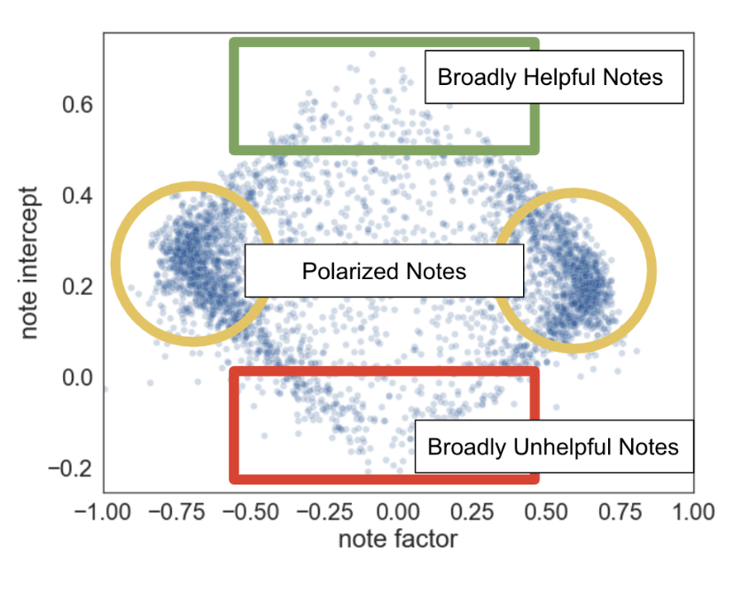

As you can see in the dense yellow circles, most people submit partisan slop. But at the top, there's the few gems folks across the spectrum agree are helpful! (And at the bottom... well, farting in an elevator "pisses off both sides". "Pissing off both sides" doesn't mean you're *useful*.) As for the diamond shape, don't worry about it, it's an artifact of how the "minimize complexity" math works in Step 2.

There's a few extra complexities, but that's the heart of the Birdwatch algorithm! The result? It's, as far as I know, the *only* fact-checking service that gets net-positive ratings (more "helpful" than "unhelpful") from Democrats, Independents, and Republicans alike! In this polarized era, that's no mean feat.

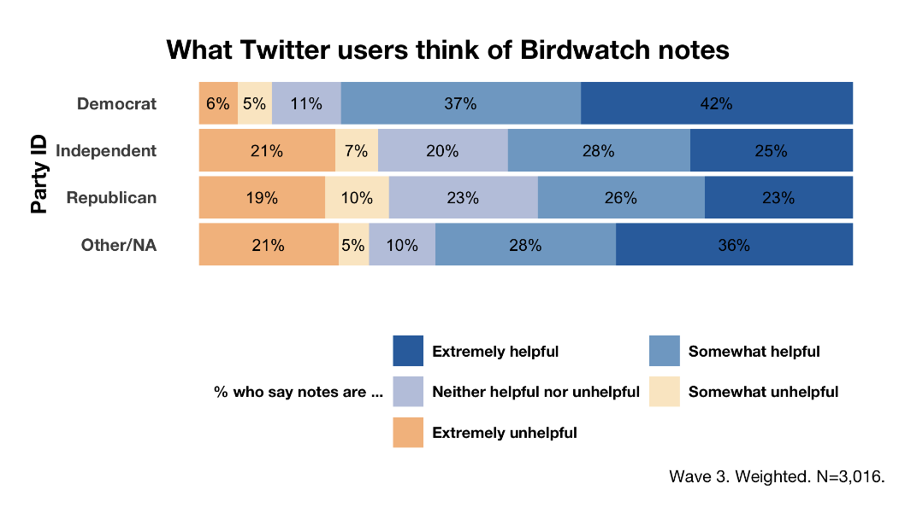

(Wait, if the notes are chosen to be helpful *regardless of politics*, why do Democrats like them more than Republicans, even while Republicans still find them net-helpful? I'm not sure, but I'd guess the left-right axis *among Birdwatch raters* is slightly different from the left-right axis *among party-registered voters*. Remember, the algorithm *learns* what the left-right axis is, it's not hard-coded; and it shouldn't, since what "left-right" means changes across time & cultures.)

Unfortunately, this "bridging" algorithm was only used for the factcheck-notes, *not* Twitter's algorithmic feed. As mentioned in the paper two sections ago, **bridging-based algorithms were the *only* design choice we know of (so far) that reverses polarization & extremism.** So, implementing bridging *for the main feeds themselves* could be a big win for digital democracy. And, good news? I heard that 𝕏 may adopt bridging for their main feed, and other platforms will adopt bridging-based algorithm, *at least* for a similar factchecking system.

...my _source_ on this info? I dunno, I heard it somewhere. Why are you factchecking me?

= = =

(Aside: Birdwatch inspires me – what other small alterations can we make to the million-dollar Matrix Factorization algorithm? What if you recommended high-quality content that *anti-aligns* with your usual preferences? Or recommend content that aligns with *all but one* of your preferences? e.g. I like animation & musicals & monsters & queer found-family coming-out allegories & muscular women, but I mildly dislike K-Pop => the algorithm recommends K-Pop Demon Hunters => I now mildly like K-Pop.)

= = =

**Links:**
- [The winners of the Netflix Prize explain Matrix Factorization](https://datajobs.com/data-science-repo/Recommender-Systems-%5BNetflix%5D.pdf) (technical)
- [An interview with the creators of Birdwatch](https://asteriskmag.com/issues/08/the-making-of-community-notes) (lay-friendly)
- [The original Birdwatch paper](https://arxiv.org/pdf/2210.15723) (technical)

### 🧐 PolyLog's explanation of Zero-Knowledge Proofs

FINALLY. Thanks to PolyLog's video, I *finally* understand one of the coolest recent discoveries in computer science: that you can prove you have a solution to a problem, *without revealing any info whatsoever about your solution.*

**Here's [their 20-min video](https://www.youtube.com/watch?v=Otvcbw6k4eo) on Zero-Knowledge Proofs (ZKPs) ⤵**  I won't try to out-do their explanation in this blog post, you can just watch it.  They show you how you can prove you *have* a valid solution to a Sudoku puzzle, *without revealing ANY info about your solution*. (And this method works *in general* for any mathematical/computable proof!)

<iframe width="640" height="360" src="https://www.youtube-nocookie.com/embed/Otvcbw6k4eo?rel=0" title="YouTube video player" frameborder="0" allow="accelerometer; autoplay; clipboard-write; encrypted-media; gyroscope; picture-in-picture; web-share" referrerpolicy="strict-origin-when-cross-origin" allowfullscreen></iframe>

(**[check out PolyLog's channel](https://www.youtube.com/@PolylogCS)**, their other videos are pretty good, too!)

But why am I boosting this video, in relation to "The Algorithm" and solutions to "Gradual Disempowerment"? Because: Zero-Knowledge Proofs is a big win for privacy in a digital democracy. How? Because they allow you to *prove yourself*, *without doxxing yourself*. For example:

- Do you want an online petition or discussion board, to authenticate that users are actually a resident of some area, or affiliated with some institution? BAM! ZKPs let you prove "yes I'm a resident of X" or "yes I'm with institution Y" *while revealing no other info, like your name or ID.*
- Are you worried that governments [like the UK](https://en.wikipedia.org/wiki/Online_Safety_Act_2023) are forcing age authentication, under the disguise of "protecting children", but it's secretly the first step to creating a China-style tech-powered surveillance state while accusing all opponents of being enablers for pedophiles & terrorists? BAM! ZKPs let you prove "yes I'm over 18" *without even revealing your exact age.*

Of course, [ZKPs won't solve all privacy issues](https://vitalik.eth.limo/general/2025/06/28/zkid.html), and corporate/government orgs can just *lie* about using ZKPs — but that's more reason to make the core idea of ZKPs accessible, and not seem like incomprehensible math magic! Hence, why I'm so glad for PolyLog's lay-friendly explainer. ZKPs can and should be a core tool in our privacy toolbelt, for digital democracies.

(Current brain status: I have a solid understanding of how ZKPs work *in general*, and a rough idea of how ZKPs work *for authentication specifically*... but I'm still wrapping my head around the mathematical details: polynomial commitments, elliptic curves, homeomorphic encryption, etc. Once I *really* understand those, I may make a video explainer on all this. Maybe.)

### 🧠 Geoffrey Litt's writings: AI should enhance us, not replace us

Problem 1: Truly _general_ AI could automate huge sectors of labour all at once, not "just" the piece-by-piece automation we've dealt with in the past. And as history shows, "suddenly mass unemployment" almost never ends well for a country.

Problem 2: If we hand over control to AI *without* fully solving the AI Value Alignment problem, we'd be passing control of humanity over to entities that neither love us nor hate us, we're just _numbers_ to make _go up_.

An idea to solve both problems at the same time: **instead of making AI to replace humans, let's make AI to _enhance_ humans?**

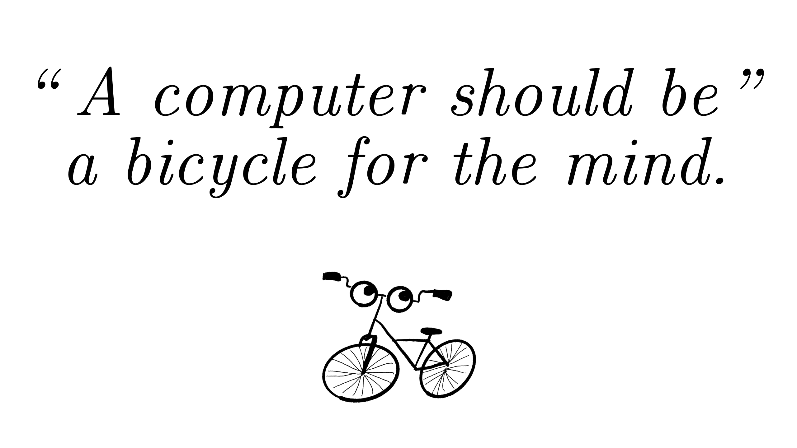

*(slide from [my talk at the final XOXO](https://blog.ncase.me/the-creative-cyborg/), quote is [from Steve Jobs](http://web.archive.org/web/20240902210345/https://miro.medium.com/v2/resize:fit:1400/format:webp/0%2ASgDLtymZpgcXEA7A))*

This way, Human+AI combos can still be economically competitive in our Darwinian marketplace, yet keep humanity's values & autonomy at the centre of our tools. This general idea is called **["cyborgism"](https://www.lesswrong.com/posts/bxt7uCiHam4QXrQAA/cyborgism)** in the AI Alignment community. (I mean, it's just tool use, but "cyborg" and "mental prosthetics" sounds cooler.)

Wait – won't this increase inequality, with the richest getting the most AI-gains? Well, consider books: books _do_ enhance the reader, so by default books _would have_ increased inequality by enhancing those who can already afford the most books. But the solution wasn't to ban books, but to create free universal libraries! Likewise, to share the AI-enhancement gains, we should at least seriously consider *free, open-source, verifiable, publicly owned & evaluated* AI tools, to help _everyone_ augment their own human autonomy and skills.

(crucially: The AI tools should be _non-agentic_, no goal-seeking of its own. And we should remove risky capabilities like bioweapon knowledge from them. See: [d/acc](https://vitalik.eth.limo/general/2025/01/05/dacc2.html))

I've been banging on this idea of Cyborgism for almost 8 years now. ([My 2018 article in an MIT Journal](https://jods.mitpress.mit.edu/pub/issue3-case/release/6), and [my 2024 XOXO talk](https://blog.ncase.me/the-creative-cyborg/).) But it's only been an idea. What about an *actual implementation,* at least a proof-of-concept?

Here, I'd like to highlight a couple articles (with *actual working prototypes*) from programmer Geoffrey Litt!

👉 **["Enough AI copilots! We need AI HUDs"](https://www.geoffreylitt.com/2025/07/27/enough-ai-copilots-we-need-ai-huds)** 👈

Most LLM-based coding tools right now (GitHub Copilot, Claude Code, AMP Code, etc) all put the LLM in the role of an independent agent. But that's _not_ how most automation that improves knowledge-work, works. Examples:

- Spellcheck, mercifully, isn't Clippy heckling you with "HEY DID YOU MEAN TO WRITE 'SPELLCHECK' NOT 'SPELCHECK'???" Spellcheck just lets you *see* something underlined in red, lists suggestions, and lets *you* decide when & how to deal with it.
- Data visualization isn't Clippy yelling "HEY YOU'RE LOSING WEIGHT AT 1 LB PER 10 DAYS". Spreadsheet apps just let you *see* your data as a line chart, then lets *you* decide how to interpret & act on it.
- Illustration apps don't have Clippy yelling "HEY THE CHARACTER'S EYES ARE UNEVEN AND ALSO THE COLOUR VALUES ARE MUDDY", the program just lets you *see* asymmetry & values by toggling Flip Horizontal and Greyscale, then lets *you* decide how to fix it, or leave it as an intentional artistic choice.

Geoffrey's analogy: these aren't "copilots", they're Heads-Up Displays (HUDs), like Tony Stark's helmet – **they *augment* your senses, while keeping the autonomy in _your_ hands.** 

So instead of making Clippy the Coder — which will put junior devs out of a job, and de-skill senior devs — how about we make AI-powered "HUDs", to let you "just see" what a program does, then lets *you* decide what to do about it?

Well, Geoff made a proof-of-concept for that. Here's what it looks like:

<video width='640' controls src="../content/stuff/2025-10/geoff-demo.mp4" aria-label="no alt text set, shame on me"></video>

> With the debugger, I have a HUD! I have new senses, I can see how my program runs. The HUD extends beyond the narrow task of fixing the bug. I can ambiently build up my own understanding, spotting new problems and opportunities.

Geoffrey explains it more in [his post](https://www.geoffreylitt.com/2025/07/27/enough-ai-copilots-we-need-ai-huds). Point is: less Clippy!

👉 **[Malleable software in the age of LLMs](https://www.geoffreylitt.com/2023/03/25/llm-end-user-programming)** 👈

For all the badly-written vibe code out there, I still have a soft spot for LLM coding, because it *could* make a half-century-long dream finally come true: software that is *fully modifiable & customizable* by a layperson user. (Fight for the users![^tron])

[^tron]: A quote from [Tron (1982)](https://en.wikipedia.org/wiki/Tron) that meant a lot more to me as a kid, before the Mouse milked its nostalgia-teats powder-dry

There's been varying degrees of success with this idea in the past: HyperCard, spreadsheets, the _original_ design for the World Wide Web was meant to be so that anyone could *write* a website *as easily as reading one*.[^www]

But to this day, there's no way for an average layperson to modify their software the way they can modify a recipe. Users can't just say, "Huh. Binaural beats sounds interesting. Okay Clippy, modify my iPhone pomodoro app so that it plays a pure Beta wave for focus during 25-minute work-sprints, then a random song from my Bandcamp library during 5-minute breaks."

[^www]: From the inventor of the WWW, in [his interview with VentureBeat](https://venturebeat.com/programming-development/tim-berners-lee-shares-his-vision-of-a-collaborative-web): “I wanted it to be a read-write web immediately. [...] I wanted to be able to collaborate with it and do GitHub-like things for my software team at CERN in 1990.”

Wait, didn't I *just* rail against Clippy's? Do I contradict myself? Very well, I contradict myself. I contain ~~hypocrisies~~ multitudes.

Okay, I haven't figured out my contradictions yet. But both "More HUDs, less Clippy", and "Clippy helps you truly *own* your software", point at the same principle: **fight for the users.** 

**Tools should help us automate everything that gets in the way of our self-expression, _not automate away the self-expression itself_.**

Anyway Geoffrey goes more into [his post](https://www.geoffreylitt.com/2023/03/25/llm-end-user-programming). And he's made this cool prototype of "end-user modify everything", too:

> A few years ago, I developed an end-user programming system called [Wildcard](https://www.geoffreylitt.com/wildcard/) which would let people customize any website through a spreadsheet interface. For example, in this short demo you can see a user sorting articles on Hacker News in a different order, and then adding read times to the articles in the page, all by manipulating a spreadsheet synced with the webpage.

<video width='640' controls src="../content/stuff/2025-10/wildcard.mp4" aria-label="no alt text set, shame on me"></video>

The problem is "the user needs to be able to write small spreadsheet formulas to express computations. This is a lot easier than learning a full-fledged programming language, but it’s still a barrier to initial usage."

I don't know of a demo of it yet, but imagine there was an extension like GreaseMonkey or Stylus, except you "code" the JS or CSS you want by *writing natural language* in your browser! **To be clear this is a security nightmare & would be like handing a nuke to a toddler**, but, "look to where my finger is pointing, not the tip of my finger itself"[^fake-quote] — I'm trying to point to a future where *we fully own our tools, before they fully own us.*

[^fake-quote]: Quote from some tech designer who I can't remember, [based off a Fake Buddha quote](https://fakebuddhaquotes.com/i-am-a-finger-pointing-to-the-moon-dont-look-at-me-look-at-the-moon/).

Fight for the users!

= = =

(Aside: What about AI to help augment our *emotional* intelligence? Could just be as simple as an LLM-augmented diary that helps you recognize emotional patterns, debug cognitive distortions, and asks you helpful questions to help you figure it out for yourself. {In Soviet Russia, LLM prompts *you?*}  That's what an ideal AI Friend – heck, even ideal human friends – should be: someone that makes you stronger and better *even when they're not around*. Not someone who fosters dependence and personal-character atrophy.)

= = =

**Links & Related:**
- **[Geoffrey Litt's blog](https://www.geoffreylitt.com/#writing)**
- janus & Nicholas Kees's [Cyborgism manifesto](https://www.lesswrong.com/posts/bxt7uCiHam4QXrQAA/cyborgism)
- Vitalik Buterin's ["AI as the engine, humans as the steering wheel"](https://vitalik.eth.limo/general/2025/02/28/aihumans.html)
- [The AI for Epistemics hackathon](https://www.lesswrong.com/posts/Gi8NP9CMwJMMSCWvc/ai-for-epistemics-hackathon)
- My article in an MIT Journal: [How To Become A Centaur](https://jods.mitpress.mit.edu/pub/issue3-case/release/6)
- My talk at XOXO: [The Creative Cyborg](https://blog.ncase.me/the-creative-cyborg/)

### 🍻 The 6Pack of Digital Democracy

Okay, a bit tacky to Signal Boost this project, since I'm involved in it. But I joined this project *because* I sincerely think it's one of the better bets for Human-AI Alignment, and the person who founded it has been a role model of mine for years, and she has both a great track record & actual influence in the world.

[Audrey Tang](https://en.wikipedia.org/wiki/Audrey_Tang) is the Digital Minister of Taiwan. _She_ is the reason Taiwan is at the world's frontier of experiments in digital democracy, using humanely-designed tech to make government more open, accessible, accountable, responsive to the public's needs, and many other buzzwords that _would_ be empty if it weren't by Audrey Girlboss Tang, who frikkin' _delivers_.

Anyway, her new thing is **[6pack.care](https://6pack.care/)** (in collab with Caroline Green), a plan for human-AI alignment that (hopefully) works in both the short term (reversing democratic decay & extremism) and long term (humans living alongside powerful AIs).

(I think Audrey's plan of making a long-term Alignment plan "pay dividends" in the short-term, is brilliant politics. The way she's explained it: if you successfully advocated for reinforcing cockpit doors before 9/11, or pandemic resilience before Covid-19, your reward is... you see nothing happen. "No one cares about the bomb that didn’t go off, only the one that did."[^tenet] So 6pack's plan is to address problems people care about *now* — algorithm-driven extremism, LLM-induced psychosis, social media mental health crises, etc — that also happen to scale to full Human-AI alignment.)

[^tenet]: Quote from Tenet (2020), the most "yup that's a Nolan film" Nolan film.

Here's an overview of the 6 items of the 6pack of Digital Democracy, illustrated by... _me!_

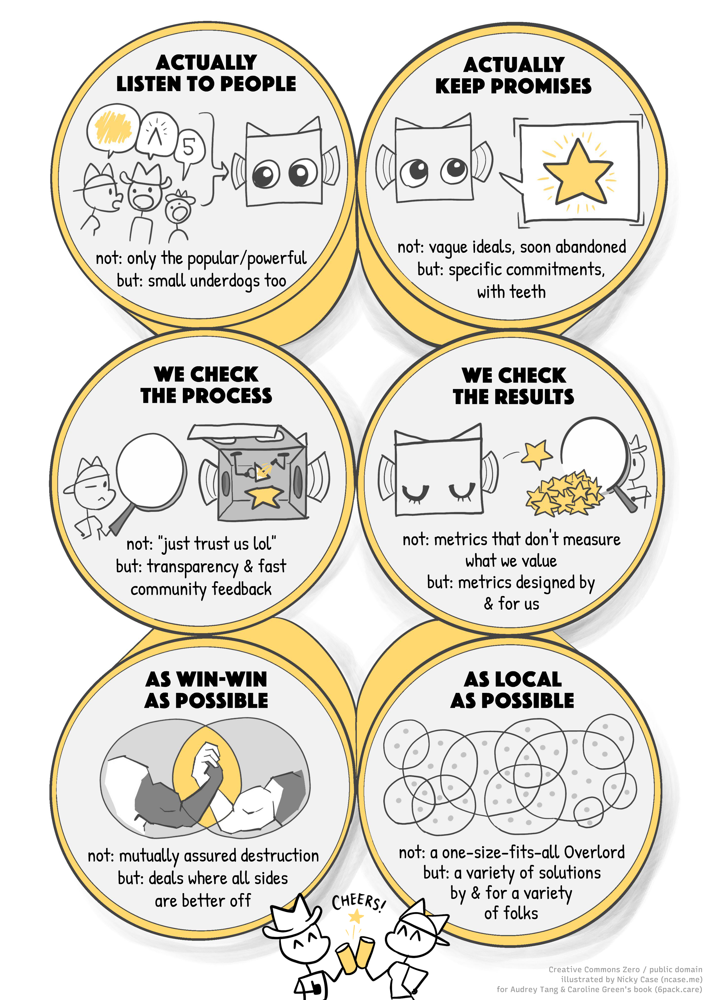

(I've been commissioned to make 7 public-domain infographics in total, 1 for the Overview, 6 for each thing in the 6pack.)

The 6pack is closely related to Vitalik Buterin's ["AI as the engine, humans as the steering wheel"](https://vitalik.eth.limo/general/2025/02/28/aihumans.html), and the general [d/acc](https://vitalik.eth.limo/general/2025/01/05/dacc2.html) and [Plurality](https://vitalik.eth.limo/general/2024/08/21/plurality.html) movements. Here are the common shared principles, with specific tools:

1. **Keep human values at the centre.**
	- concretely: bridging-based algorithms, linear/quadratic/score voting, frequent feedback loops, crowdsourced constitution/evals, "humans as steering wheel", etc
2. **Set it up so that human power *scales with* AI power, not get left behind.**
	- concretely: cyborgism (non-agentic AIs to augment human cognition, emotion, and collaboration), scaleable oversight, "AI as engine", etc
3. **Make sure the tools are widely distributed, so that *power* is distributed.**
	- concretely: decentralized algorithms like web-of-trust, peer-to-peer networks, or... *siggghh*, blockchain. also, open-source software _and_ hardware, etc

If that all still seems like jargon word salad to you... well, I got hired to illustrate 6 more pages for this thing, to explain each "pack" in lay-friendly detail. Stay tuned!

**[Read the 6pack.care manifesto & outline online](https://6pack.care/)**     
*(full book is supposed to come out in March 2026)*

(P.S: Audrey doesn't want me calling it "The 6Pack of Digital Democracy", and she's right, that's *not* accurate — the 6pack is broader than that — but until we can come up with something catchier than "The 6Pack of Human-AI Multi-Agent Value Alignment" I'm going to use the inaccurate alliteration, at least in this informal blog post.)

---

## Fun Stuff!

### 🕵️ Clues by Sam: a daily deductive detective game

I've been hooked on this free daily puzzle game for the last month.

Here's the setup. You're a detective. There are 20 people. Each one is either Innocent or Criminal. Everyone tells the truth, even Criminals.

You start with *one* person's clue:

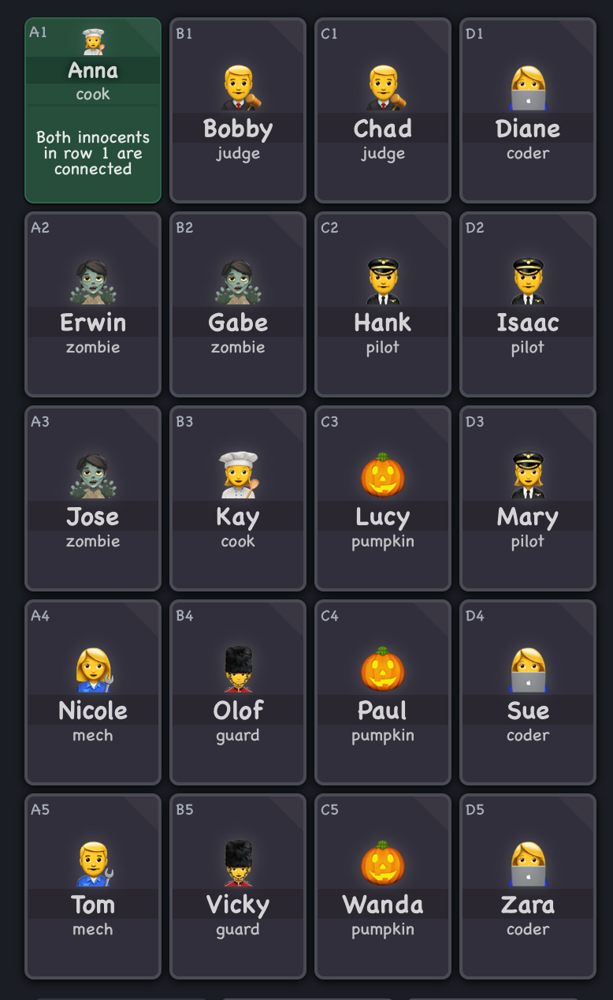

Given the clues already on the board, you have to deduce a new Innocent or Criminal. _You cannot guess – the game knows which people's status is logically deduce-able at any time._ Only when you correctly deduce a new person, do you get a new clue.

For example:

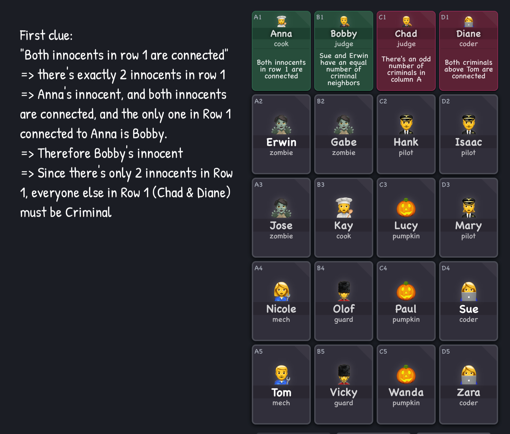

And then:

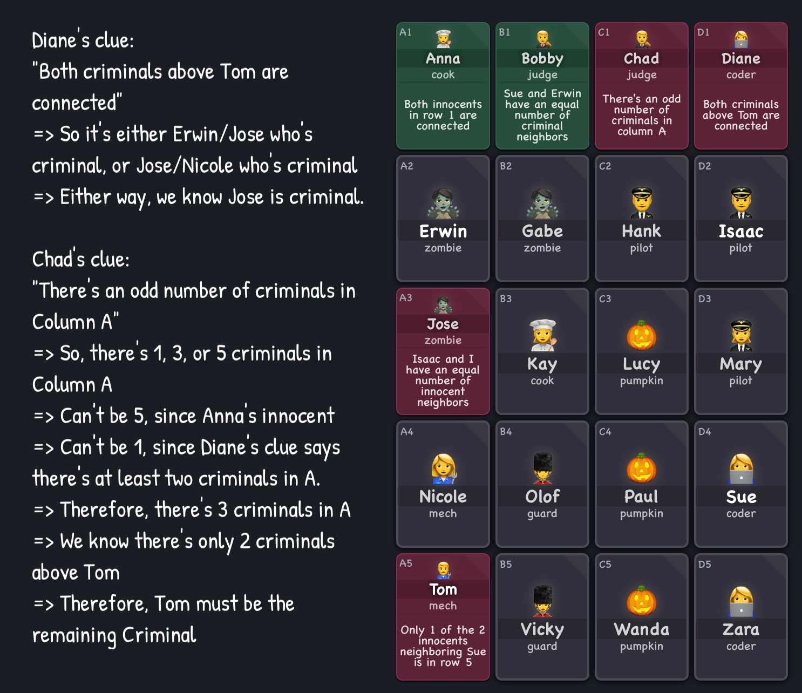

And so on, until you've figured out everybody!

Like Sudoku, the first few times are tough, then you start learning some generalizable tricks — (in particular, the infamous ["if X then Y, if not-X then Y, therefore Y"](https://www.theguardian.com/science/2016/mar/28/did-you-solve-it-the-logic-question-almost-everyone-gets-wrong)) — and like Sudoku, after a while it *does* get a bit repetitive, but it's still a nice mini-challenge to play on break.

If that piques your interest, try out the 5-minute tutorial and get puzzlin', detective!

🕵️‍♀️ **[Clues By Sam](https://cluesbysam.com/)** 🕵️‍♂️

### 🐦 Snakebird: cute birbs, cruel puzzles

I actually played & finished this game at the start of 2025, when my laptop was taken at the US-Canada border and I couldn't do any work until I bought a new laptop. (Customs & Border Patrol _did_ return my old laptop...  4 months later...)

Anyway, I bring that up because Snakebird's is a great way to keep your mind off frustrating stuff you can do nothing about, and keep your mind on *very* frustrating stuff you *can* do something about!

Snakebird, despite looking like a cutesy mobile game, is _infamous_ in the indie puzzle game community for being sadistically tough. It has a mid-3-star rating on the Apple App Store, because people complain about getting stuck on Level _Two_. As for me, I'm a puzzle aficionado, but it took me a _month_ of playing ~1 hour a day to beat all 52 levels.

 (There _is_ an "easier" version called [Snakebird Primer](https://noumenongames.com/game/snakebird_primer), and [Snakebird Complete](https://www.nintendo.com/us/store/products/snakebird-complete-switch/) contains both Primer + Original. I haven't tried them.) 

But while the game's tough, it's fair! It's always a matter of logical insight, not moon-logic clues or tedious trial-and-error. "Aha!", not "oh that's bullshit". (Okay, except for Level 26, that _was_ bullshit.)

But... what _is_ Snakebird?

It's like Snake meets Tetris: you slither & collect fruit to get longer like in Snake, but your snakes fall _instantly_ like in Tetris. Shenanigans ensue:

<iframe width="640" height="360" src="https://www.youtube-nocookie.com/embed/WJJa3hMbs4s?rel=0" title="YouTube video player" frameborder="0" allow="accelerometer; autoplay; clipboard-write; encrypted-media; gyroscope; picture-in-picture; web-share" referrerpolicy="strict-origin-when-cross-origin" allowfullscreen></iframe>

"That doesn't look too bad", you think. Ha ha. Ha ha ha. Oh sweet summer child

- **[Snakebird](https://noumenongames.com/game/snakebird)**, available on iOS, Android, Mac, Windows, Linux
- [Snakebird Primer](https://noumenongames.com/game/snakebird_primer) also on all those platforms
- [Snakebird Complete](https://www.nintendo.com/us/store/products/snakebird-complete-switch/) only on Nintendo Switch

(hat tip: I first heard about Snakebird from Game Maker's Tool Kit's video on [how to design a tough-but-fair puzzle games](https://www.youtube.com/watch?v=zsjC6fa_YBg))

### 🦉 ZeWei's Multiverse Tour Guide Adventures Continue

[Last year](https://blog.ncase.me/signal-boosts-oct-2024/#zewei), I signal-boosted the nonbinary furry EDM musician ZeWei's animated mockumentary of a linguist trapped in an alien world! Well, it's a full series now!

**Episode 2: "It's not colonialism, it's tourism!" /s (17 min)**

<iframe width="640" height="360" src="https://www.youtube-nocookie.com/embed/WScut_fmFzw?rel=0" title="YouTube video player" frameborder="0" allow="accelerometer; autoplay; clipboard-write; encrypted-media; gyroscope; picture-in-picture; web-share" referrerpolicy="strict-origin-when-cross-origin" allowfullscreen></iframe>

In this episode, our linguist protagonist is worried their world's language & culture is erasing those of the worlds they travel to. Just when you think the story's headed towards the standard "we must preserve the noble savages' linguistic diversity", the native of this other world calls them on their bullshit, that, no, *they have autonomy*, they *chose* to drop the worst parts of their language & culture, and carefully *chose* parts of other cultures to adopt, and merged them into something uniquely their own. They don't owe it to anyone to "preserve" themselves like a living fossil. They don't live for historians or researchers or nostalgia, they live *for themselves*.

(But, yes... something *was* lost. "It's complicated.")

This episode resonated with me, since I was born in Singapore (a very post-British-colonial city-state), then I immigrated to Vancouver Canada halfway during my childhood. My backstory is a mix of Western & Eastern influences. I'd like to believe I've chosen the better parts of both cultures, and dropped the unhealthy crap from both — but who knows — if I lost something, *would I even recognize the loss?*

**Episode 3: "The Lore Episode" (30 min!!!)**

<iframe width="640" height="360" src="https://www.youtube-nocookie.com/embed/RbEFhJ2z-7U?rel=0" title="YouTube video player" frameborder="0" allow="accelerometer; autoplay; clipboard-write; encrypted-media; gyroscope; picture-in-picture; web-share" referrerpolicy="strict-origin-when-cross-origin" allowfullscreen></iframe>

This one's less head-y, and a lot more establishing this story's world. We finally get to see the other characters "behind the camera" of this mockumentary series! There's also a prophecy.

Less for me to hook onto in this episode, but it's clearly setting up for a big series arc. Looking forward to seeing where the arc bends next!

### 🤓 Emnerson: goofy internet gal

A new, up-and-coming YouTuber who makes a variety of cool digital projects!

The way I first learnt about her YouTube channel, is because she won Captain Disillusion's "unblur this image" challenge, cracking it within 20 minutes:

<iframe width="640" height="360" src="https://www.youtube-nocookie.com/embed/Yi-Vea2AUEU?rel=0" title="YouTube video player" frameborder="0" allow="accelerometer; autoplay; clipboard-write; encrypted-media; gyroscope; picture-in-picture; web-share" referrerpolicy="strict-origin-when-cross-origin" allowfullscreen></iframe>

Here's her latest video on merging YouTube channels' thumbnails, and seeing what patterns pop up:

<iframe width="640" height="360" src="https://www.youtube-nocookie.com/embed/g-1kUvJqagw?rel=0" title="YouTube video player" frameborder="0" allow="accelerometer; autoplay; clipboard-write; encrypted-media; gyroscope; picture-in-picture; web-share" referrerpolicy="strict-origin-when-cross-origin" allowfullscreen></iframe>

Also, she happens to be trans, and I want to help boost my fellow up-and-coming trans creators. Everyone including me is very jealous of how fast she's transitioned in a few months and she is very pretty. 

**Check her out! [Emnerson's YouTube channel](https://www.youtube.com/@emnersonn)**

### 🧇 blahaj goes to waffle house at 3am

Cute as hell. Watch it, and subscribe to a new, up-and-coming animator!
<iframe width="640" height="360" src="https://www.youtube-nocookie.com/embed/X1beEuBV7M0?rel=0" title="YouTube video player" frameborder="0" allow="accelerometer; autoplay; clipboard-write; encrypted-media; gyroscope; picture-in-picture; web-share" referrerpolicy="strict-origin-when-cross-origin" allowfullscreen></iframe>
(they also did all the original music, and are based in Taiwan)

**Link: [Atoga's YouTube channel](https://www.youtube.com/@AtogaCreative)**

---

## SPOOKY STUFF for HALLOWEEN

### 👻 BOO! a silly music video & music album

A 80's-throwback musical comedy of a tiny ghost trying to be spooky:

<iframe width="640" height="360" src="https://www.youtube-nocookie.com/embed/NZx9fAk22Qg?rel=0" title="YouTube video player" frameborder="0" allow="accelerometer; autoplay; clipboard-write; encrypted-media; gyroscope; picture-in-picture; web-share" referrerpolicy="strict-origin-when-cross-origin" allowfullscreen></iframe>

(The creator, [Piemations](https://www.youtube.com/@Piemations/videos), usually does animated stuff! They made Sheriff Hayseed, Bird Town, Suction Cup Man, Mike & Zach, and How To Be Cool, if you recognize any of those titles.)

Oh, and the song "BOO!" is just one track from his band's new album, [Musical Scares](https://friesontheside.bandcamp.com/album/musical-scares). The track Big Doggie is my favourite. Comedy aside, it _actually bops_. The intro drop hits so hard, I must've restarted the song a dozen times just to hear that drop again. And I haven't heard the phrase "14 werewolves" in years, got _instant_ psychic damage from that. 

<iframe style="border: 0; width: 640px; height: 472px;" src="https://bandcamp.com/EmbeddedPlayer/album=2742795446/size=large/bgcol=333333/linkcol=e32c14/artwork=small/transparent=true/" seamless><a href="https://friesontheside.bandcamp.com/album/musical-scares">Musical Scares by Fries On The Side</a>test</iframe>

### 🩸 Bury Your Gays by Chuck Tingle

**[A novel by Chuck Tingle](https://bookshop.org/p/books/bury-your-gays-chuck-tingle/de2c90d5aa0bc158)**, yes _that_ Chuck Tingle, the "got famous by writing dozens of joke eroticas" Mr. Tingle:

A couple years ago, Chuck Tingle expanded to novels, including Bury Your Gays, which is _shockingly good._ And it's very meaningful for (gestures vaguely) "the current moment".

The premise: Misha Byrne is a scriptwriter for a X-Files-like series with two (subtextually) gay protagonists. It's a hit. Misha's called into a meeting. His boss tells him what the executives tell him the Algorithm tells them would make the most money: have the leads profess their gay love out loud, _then immediately kill them off._ The "queer tragedy" plot, the "bury your gays" trope, that's the controversy & drama that would sell! Oh, and if Misha _doesn't_ kill them off, that's breaking contract, he'll get sued into oblivion, then the studio will take his show & kill off the gay leads anyway.

Misha walks away from the meeting pissed, angry at the execs, the Algorithm, the whole damn world. And just when Misha thinks things can't get any worse — 5 minutes later — a colleague explodes into meat and gore in front of him.

Then things get _really_ bad.

So, without spoilers and in no particular order, why Bury Your Gays resonated with me so much:

- There's (understandably) a lot of stories of queer tragedy right now, both in fiction and real life. This novel is a reminder that **happiness is not "naïve", or "basic", or dumb.** Without over-correcting into toxic positivity, **we can and should also celebrate queer joy.** Misha's story (both the story he writes _and_ the story he's living through) show that full complexity, lows _and_ highs, of a queer life.
- As a "creator on the internet", I definitely feel a lot of anxiety about opaque algorithms & generative AI screwing not just with my creations, but _my own personal character_. Y'know, "audience capture", "we become what we pretend to be so we must be careful what we pretend to be", etc
- The novel also reminds queer creators (like me) to help lift up other less-famous queer creators. Which sounds obvious, but when you're dealing with your own shit, it's easy to forget to help others too. So, that's something I'd like to do with these Signal Boosts.
	- (I mean, Chuck Tingle & Audrey Tang are far more famous than me, but (see above) ZeWei & Emnerson more recent, smaller-fanbase creators.)
- Oh! Misha's best friend is asexual & aromantic! Hooray for ace/aro representation.
- I just love books that get all weird and meta and format-screw-y. (Could you guess I read [House of Leaves](https://thehardtimes.net/blog/opinion-house-of-leaves-is-just-infinite-jest-for-spooky-people/) as a teen and it changed my brain chemistry?)
- The parallel between Misha's characters being "only" subtextually gay, and Misha _himself_ "only" being semi-out of the closet, is clever, and hits personally in two different ways:
	1) The line between "using art to work through my own feelings" and "using art to _avoid_ doing the emotional work in real life" is thin, and I struggle with this too.
	2) I'm like... _out_ about being pansexual & transgender, but I feel like I could be _more_ out? I don't mention it or have 🏳️‍⚧️🏳️‍🌈 flags on my social media bios. (Well, I don't _have_ any social media anymore, but still.) Right now, I'm doing the strategy of "let people know me for my educational work first, then _later_ learn I'm trans, so it's not the first adjective they know about me". 
		- On one hand: me being more out & confident could give inspiration to the many queer folks who need hope right now.
		- On the other hand, living true to yourself will draw the attention of people who don't. Bucket-crabs who pull you down into the Normal Bucket, wordcels sophisticatedly rationalizing their Pavlovian disgust-reflexes as the "wisdom of repugnance". And I hate to admit it, but I _am_ irrationally averse to "being confrontational", like "I don't want to make a big deal of it", like "oh they just need time to understand, I won't put it in their face, hurt people hurt people, nobody's the villain of their own story, everyone has a complex rich inner life" and other copium fucking _bullshit_. And it's not for lack of trying or skills. I am *telling* you, Reader, after 10+ years of me studying & practicing & applying Non Violent Communication and Active Listening and Steelmaning and Intellectual Turing Tests and Moral Foundations Theory, years of trying to *really get to know people* behind their mere politics, their *souls*, Reader, I am *reporting* to you: *it was always all bullshit.* People are like onions: as you keep peeling back, you discover that every layer is the fucking same, and then you start crying. Anecdotes of personal change are survivor bias, "intricately layered characters" was invented by Big Book to sell more Books. Humanism is a cult: ~32% of Germans thought Hitler was a great man _in 1952, after Hitler already lost_ and the Holocaust was globally known[^hitler]; ~15% of eligible Americans were in the Ku Klux Klan in the 1920s[^klan]; ~28% of Hutu adult civilians _personally participated_ in the genocide against the Tutsis[^rwanda]; just give up the copium and apply Occam's Razor and finally admit that *the reason mass atrocities keep happening, is simply because the masses are atrocious*. Did your eyes automatically roll? That's how they get you: mark the thoughts not as "dark" or "evil", but just "cringe". *That's* how you censor a thought. All these so-called empathetic Humanist thought-leaders will try to guilt-trip you back into loving humanity. "But they're not all bad, there's good parts in them" isn't wisdom, *it's how abusers gaslight their victims into staying with them.* Humanity *is* the abuser. Humanity does not Spark Joy. It's not the Algorithm, or late capitalism, or Moloch, or woke mind viruses, or egregores, *IT'S YOU.* It's *you.*

[^hitler]: From the OMGUS surveys done in the American-occupied zone of post-war Germany ([here's a scan of the whole dang book](https://libsysdigi.library.uiuc.edu/OCA/Books2009-07/publicopinionino00merr/publicopinionino00merr.pdf)). Page 33: even years after the war in 1958, over half of Germans believed Nazism was "a good idea (badly carried out)". From the footnotes of this chapter, Page 62 Footnote 17, summarizing an old source in German ("Jahrbuch der oeffentlichen Meinung") which I can't even find a scan of, so alas, I can't pull a quote from the original German report, but here's the data: "In July 1952 a tenth agreed that Hitler was the greatest statesman of the century whose true greatness would be recognized only later, with another 22 per cent feeling that, although he had made a few mistakes. Hitler was nonetheless an excellent chief-of-state." So 10% + 22% = 32%, around ~1/3 of Germans in 1952 approved of _Hitler specifically_.

[^klan]: From the [Digital Public Library of America](https://dp.la/primary-source-sets/second-ku-klux-klan-and-the-birth-of-a-nation): "At the peak of its popularity in 1924-5, the organization claimed four to five million men as members, or about fifteen percent of the nation's eligible population." (To be eligible for the Klan back then, you needed to be white (duh), adult, and male. In the 1920s, America had [~100,000,000 people](https://en.wikipedia.org/wiki/File:US_decennial_census_population_1790-2020.png), around [~90% of whom were non-Hispanic white](https://en.wikipedia.org/wiki/File:Complete_history_of_the_Racial_and_ethnic_demographics_of_the_United_States_in_percentage_of_the_population.svg), around [~60% were above 18](https://www.aei.org/carpe-diem/chart-us-population-distribution-by-age-1900-through-2060/), and presumedly around ~50% were male. So, 100M x 0.9 x 0.6 x 0.5 = 27M white male adults in the US in 1920. If there were 4 million Klansmen then, then yeah 4/27 ~= 15%, math checks out.)

[^rwanda]: [The most recent estimate in 2023](https://journals.sagepub.com/doi/10.1177/00223433221075211), using Rwanda’s post-genocide _gacaca_ courts, found that "between 847,233 and 888,307 people participated in the genocide" (let's say ~0.85M), with "between 229,069 and 234,155 individuals" directly committing violence (the rest "only" committed property crimes like burning down houses & farms). The Rwandan population at the time was ~7 million, ~50% were adults, 85% were Hutus. 7M x 0.5 x 0.85 ~= 3M Hutu adults. So 0.85M/3M ~= 28% of eligible civilians participated in the genocide. This isn't even restricting ourselves to Hutu adult _males_.

...right, clearly I'm still working through some issues.

I thank Mr. Pounded In The Butt for forcing me to work through it more.

**[Bury Your Gays](https://bookshop.org/p/books/bury-your-gays-chuck-tingle/de2c90d5aa0bc158) on IndieBound/Bookshop** (content note: gore, homophobia)

---

Anyway, that was a longer-than-usual Signal Boost! In summary:

- There's hope and solutions to wrangle The Algorithms back towards a humane-with-an-e future
- Have fun, and
- Happy Halloween!

🎃👻🎃
~ Nicky Case

<iframe src="https://ncase.me/ncase-credits/signup2.html" frameborder="no" width=640 height=250></iframe>

---

# : Interview with Jon

- I hadn't before considered the moral cost *to the user* of having on-demand, disposable AI servants. Haidt points out what Frederick Douglass once called "The Fatal Poison of Irresponsible Power", where slavery not only degrades the slave, but _degrades the slaveowner too._ If we grow up with people-like objects we treat as tools, how will this train us to treat actual people?
- Yup, [a recent MIT preprint study](https://www.brainonllm.com/) has found: using ChatGPT *literally* makes you ~~dumber~~ okay the authors are [very adamant](https://www.brainonllm.com/faq) we science-communicators _do not_ summarize their paper as "LLMs make you dumber". The actual contents of their study: students who use LLMs to help write essays have measurably less brain connectivity, relative to Brain-only studetns. And after 4 months, LLM users "consistently underperformed at neural, linguistic, and behavioral levels."
	- The reason why it's not as simple as "LLMs make you dumb", is because the group that *first* wrote on a topic using only their naked brain, *THEN* were allowed to use LLMs (**Brain-then-LLM** group) actually did *better:* "these results suggest that strategic timing of AI tool introduction following initial self-driven effort may enhance engagement and neural integration."
	- In contrast, the **LLM-then-Brain** group "consistently underperformed relative to Session 2 of Brain-only group, and failed to develop the consolidation networks present in Session 3 of Brain-only group."
	- **In other words: it may be best to use tools, only after you know how to work *without* the tools.**
	- (Keep in mind the study only had 54 participants. And it's a *lot* of analysis over 54 participants, which, I'll be honest, smells fishy.)

# : Interview with Tim

- If you're already familiar with Tim's work, in particular his latest book *What's Our Problem*, you can skip ahead in the interview to 40:18 . Otherwise, [here was my book summary (in tweet-thread form!)](https://xcancel.com/ncasenmare/status/1627798034439450624)  To summarize *that* summary: **the big problem with politics right now is not _what_ we believe, but _how_ we believe.**
	- "Low-rung" thinkers treat politics like a war, where arguments are bullets, and you're either for xor against us. You'd never critique your own side or give credit to the other side, any more than you'd shoot your own platoon or hand ammunition to the enemy.
	- "High-rung" thinkers treat politics like a Writer's Room, or Code Review. It's *NOT* that "truth is in the middle" (strawman centrist) or "everyone has their own truth" (strawman postmodernist) or even "everyone has a valuable perspective" (ha ha have you met people). It's about *ACTUALLY TESTING YOUR IDEAS*. You wouldn't let into your home an oven that's never been safety-tested. So why let an idea into your core beliefs that's never been stress-tested? Pick holes & find counterarguments to ideas even if they're "from your own side", search from good critique & solutions even if they're "from the enemy's side", and *especially* try to find & invent new ideas that's on *nobody's* side.
	- "High-rung" is *not* intelligence. There are very high-IQ people who squander their IQ on rationalizing what their gut/tribe already believes.
	- There are high-rung people on the left & right. *There are low-rung people who are "centrist" or "moderate"*. (e.g. the kind of smug centrist who only focuses on extremists on the left & right, and keeps talking about 'horseshoe theory')
- There's a pattern in history: New Media Technology => Lots of benefit but lots of awful side-effects => Society slowly develops "cultural anti-bodies", to get the benefits of the new tech while minimizing the downsides.
	- Historic example: The printing press indirectly led to Enlightenment & Scientific Revolution... but _also_ the Protestant vs Catholic split and the centuries of murderous conflict.
	- Current example: Social media let people coordinate to donate millions to charity, and reveal injustice that the powerful would rather keep hidden... but _also_ tanked our politics, mental health, and attention/autonomy.
- Audience capture is when you, the creator, get accidentally clicker-trained by the likes & comments from your audience, into becoming a parody of yourself. Before Tim's interview, I thought the solution was "just don't get captured". But Tim offers a better solution: work *with* the incentives, not against them, **by getting captured by the _right_ audience.**
	- First, know what you value. Then, find an audience that values what you value. Then, *write for the audience you want, not the audience you can easily get.* This will mean having to go through a rough period where either few see your work, and/or you get fans & even friends being mad at you — but power through this, they'll filter themselves out, and **you'll get an audience that will help incentivize you to be the best version of you.**
	- (This was the biggest insight I took from Tim's interview, and it's one I've not yet applied & am scared to. By default my personality is non-confrontational. I'm scared to piss off my fans & friends, or worse, _bore_ them.)

# : Notes on Polarization

**Not all polarization is bad**, some's even desirable. Researchers name (at least) **3 different kinds of "polarization": affective polarization, belief polarization, and homophily.**

- Affective polarization: We hate them, they hate us.
- Belief polarization: We & they have very different beliefs.
- Homophily: Most of my friends are in my tribe, most of theirs in theirs.

Homophily's both unavoidable, and actually _desirable_, in my opinion. For example, only ~0.6% of people are programmers like me, but >50+% of my friends are programmers. It wouldn't make personal or career sense for me to have exactly demographically-proportional representation in my friend group. Same for >50+% of my friends being LGBTQ+, left-leaning, urban, English-speaking, and nerdy.

However, if _all_ of my friends (or media sources) are urban, or in STEM, or left-leaning, then I'll be out of touch with the broader world, and *that* may lead to affective/belief polarization. 

And what's the difference between affective & belief polarization, concretely?

Affective without belief polarization: When people despise each other for having pretty small differences in beliefs (at least, relative to their society at large). Historic example: All the deadly wars between Protestants & Catholics. Today's examples: leftists vs liberals, Groypers vs New Right.

Belief without affective polarization: When people get along despite having radically different beliefs. Examples: Friendships between Christians & atheists, friendships between AI capabilities researchers & AI extinction-risk researchers.

Note: I don't believe that hating someone is necessarily "bad"; anger can be justified & useful – but anger _is_ known to be addictive. Kind of like amphetamines. I also don't think belief polarization, a lack of consensus, is necessarily "bad"; a wide variety of ideas helps us brainstorm better, and often there *isn't* enough data for one clear answer. My current take is:

- Homophily is mostly good. Just make sure not *all* of your friends/media sources are in the same tribe. That's a single point of failure.
- Belief polarization is not good or bad, it just "is". Focus instead on cultivating the intellectual virtues of curiosity balanced with rigour. If that leads to consensus, great. If that leads to disagreement, great. Trust the process.
- **Affective polarization (anger) is like amphetamines: focusing, energizing, sometimes useful, but unfortunately easy to abuse & get addicted.**