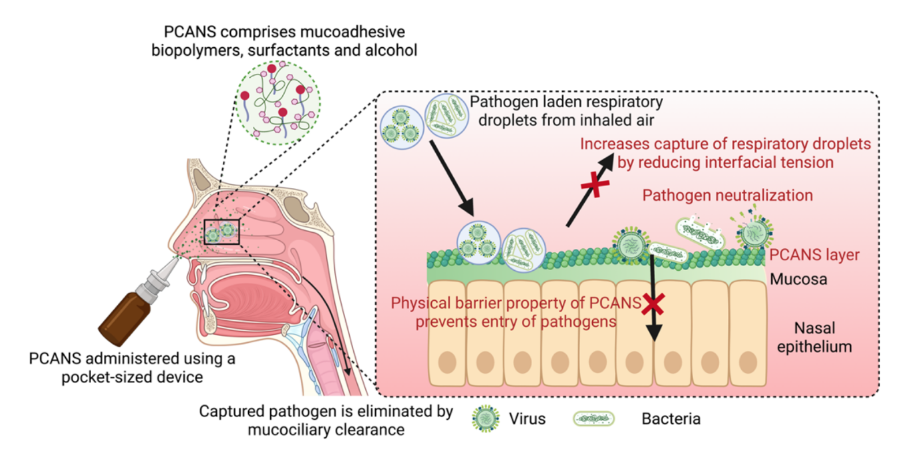
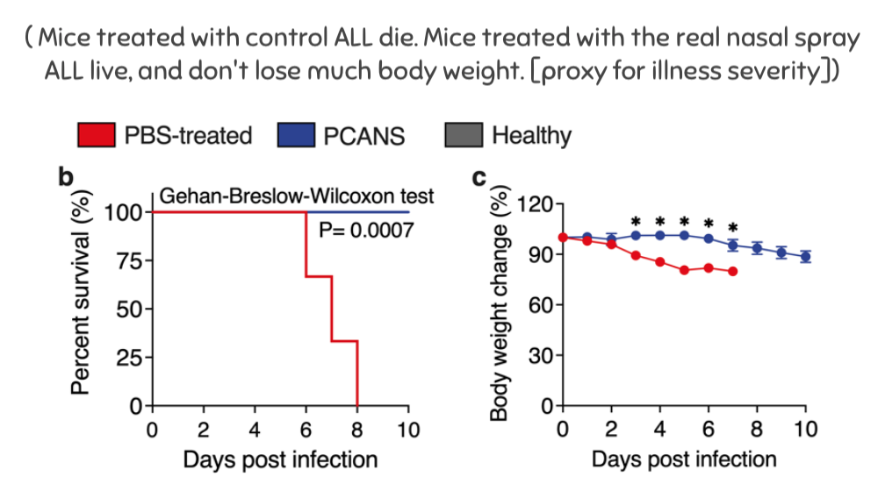
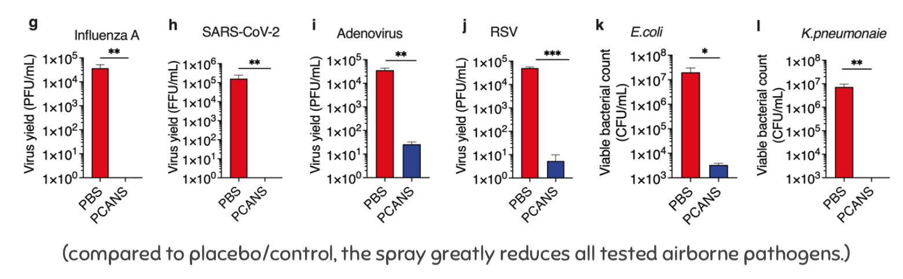
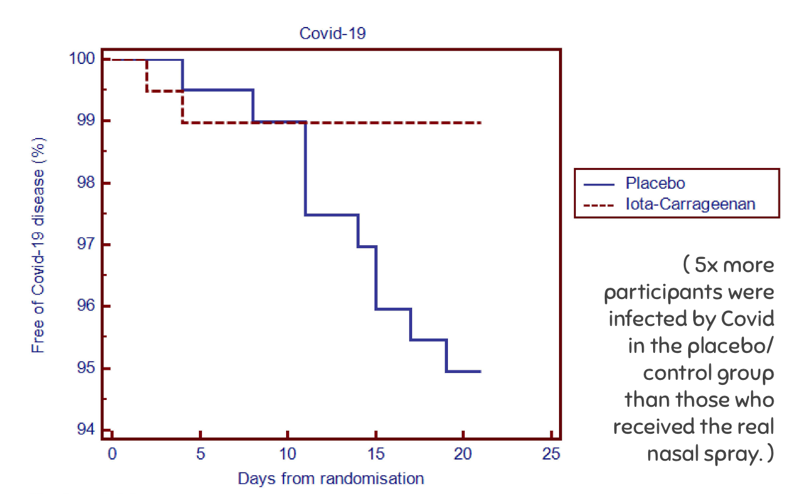
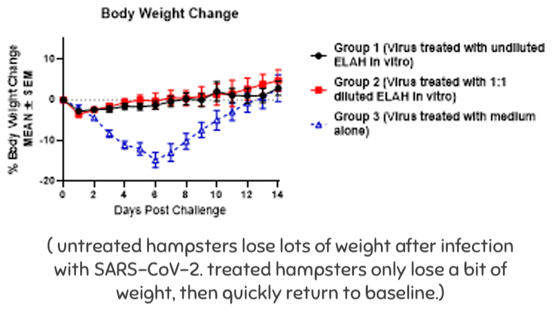
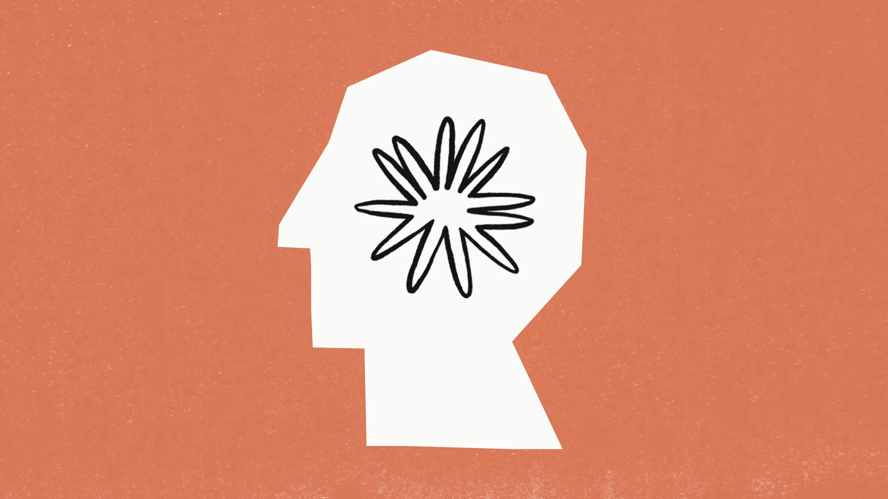

(⏱️ *~13 min read*)

In July, I was crunching to finish **[AI Safety for Fleshy Humans: Part Two](https://aisafety.dance/p2/)**, so I missed last month's Signal Boost. Whoops. Anyway, here's good stuff I found in July and August. Enjoy!

1. 🔬 [TIME SENSITIVE] Apply to an AI Alignment research-camp! [↪](#mats)
2. 👃 Big if true: "Drug-free" nasal sprays to block Covid & other respiratory disease? [↪](#nasal-spray)
3. 🤖 You can use LLM/chatbots to make Anki flashcards! [↪](#flashcards)
4. 🙂 Toki Pona: a small language for fun & good [↪](#toki-pona)
5. 🐱 Everything Is Fine: a thriller webcomic [↪](#eif)
6. 💀 Why Don't We Just Kill The Kid In The Omelas Hole? [↪](#omelas)
7. 🦌 More trans furry hyperpop [↪](#hyperpop)

(You can skip to any bit anytime, using the Table of Contents tab on the right →)

---

<a id="mats"></a>

## 🔬 [TIME SENSITIVE] Apply to an AI Alignment research-camp!


There's an annual "research boot camp" for AI Alignment in Berkeley, California, USA! If you're accepted, they'll pay you a $12K stipend, and you'll learn & do research from Jan 6 to Mar 14, 2025. **The deadline to apply is September 27.**

I applied! Fingers crossed for me, and maybe I'll see you there? Let's learn together how to make AI safer and more aligned with humane values!

➡️ **[Read the FAQ page here](https://www.matsprogram.org/faqs), then [apply here](https://forms.matsprogram.org/general-application).**

---

<a id="nasal-spray"></a>

## 👃 "Drug-free" nasal sprays vs airborne pathogens?

*(updated Oct 5, 2024. Updated sections marked in parentheses.)*


*(Diagram on how a drug-free, non-vaccine nasal spray can PHYSICALLY block & neutralize pathogens! From [Paper 1] listed below.)*

A new friend told me last week: they've *never* gotten Covid before. And this friend is immunocompromised & has a bunch of other chronic illnesses, they'd *definitely* know if they'd caught Covid.

Everyone I know, including me, has gotten Covid at least once. So what's this friend's secret? Well, partly luck, but also — they showed me — they use an over-the-counter, "drug-free" nasal spray to help block out the viruses!

As much as I like this new friend, this sounded like bullshit, like Ivermectin 2.0[^scott-on-ivermectin], so I checked for studies on Google Scholar and holy fuck it may actually work?

[^scott-on-ivermectin]: [Scott Alexander's meta-analysis of ivermectin studies (2021)](https://www.astralcodexten.com/p/ivermectin-much-more-than-you-wanted) is one of *the* best longform blog posts I've ever read. Spoilers for the twist ending: ivermectin's mixed results — it worked in some countries but not others — is likely because of parasitic worms (which complicate Covid recovery), and killing worms is in fact what ivermectin does!

(Note: there's also nasal spray *vaccines*, but this is different! These are *"drug-free"* nasal sprays: they only use ingredients *already* on the FDA's "generally recognized as safe" or "inactive ingredient database" lists. Hence why I'm excited: safe, cheap to produce, and available over-the-counter!)

Here's 7 papers I found on using nasal sprays as a prophylactic (tool to prevent disease) against Covid-19 & other respiratory diseases like influenza, RSV, E.coli, etc:

1. [A preprint paper by 24 authors](https://www.biorxiv.org/content/biorxiv/early/2023/10/03/2023.10.02.560602.full.pdf), mostly Bostonites from Harvard Medical School, Brigham and Women’s Hospital, and Boston University. (The most "fancy credentials" paper on this list, if that's something you weigh heavily.)
    * **Treatment:** Multi-ingredient mix, listed on Page 5 Line 26 under Results.
    * **Result:** In mice exposed to a modified H1N1, cuts the death rate from 100% to *0%*. The spray reduces the virus count for Influenza & SARS-CoV-2 (the virus that causes Covid) by >99.99%, and does pretty good on RSV & E.coli.


    

    
2. [Randomized double-blind human trial](https://www.sciencedirect.com/science/article/pii/S1386653222001809#sec0002). 556 participants (275 treatment, 281 placebo), all healthcare workers in India.
    * **Treatment:** Multi-ingredient mix, listed in Section 2.1.
    * **Result:** Cut Covid infection rate down to a *~third!* (from 34.5% to 13.1%) No serious adverse effects reported.

3. [Pre-registered randomized double-blind human trial](https://www.tandfonline.com/doi/pdf/10.2147/IJGM.S328486). 394 participants (196 treatment, 198 placebo), all healthcare workers in Argentina.
    * **Treatment:** Main ingredient: Iota-Carrageenan.
    * **Result:** Cut Covid infection rate down to a *fifth*. (from 5% to 1%. note: low percentages mean higher uncertainty.) No significant difference in adverse effects, between placebo/treatment groups.
        * (Update: I just realized the I-C group's infections track placebo until day 5, then are *flat*; the incubation time (time between infection & symptoms) for Covid-19 *is* ~5 days! So, this (small) data is consistent with I-C *entirely eliminating* Covid-19 infections, not "just" cutting it down to a fifth!)


    
4. [Randomized trial on hampsters](https://europepmc.org/article/ppr/ppr397631)
    * **Treatment:** Main ingredient: Ethyl lauroyl arginine hydrochloride (ELAH), the ingredient my friend's nasal spray (Covixyl) uses.
    * **Result:** Using body-weight-loss as a proxy for "how much did the virus mess them up": untreated hampsters[^hampster] lost lots of weight when infected with Covid, treated hampsters didn't lose much weight at all:


    
5. [Pre-registered meta-analysis on nasal sprays & mouthwash vs Covid](https://www.mdpi.com/1660-4601/19/19/12148). In sum: yeah seems to work so far. (Though human trials with larger sample sizes are needed.)
6. [Meta-analysis of randomized trials for xylitol nasal sprays](https://www.theajo.com/article/view/4479/html). In sum: yeah it works, but also *oh my god* top kudos to whichever scientist coined the "Sinonasal Outcome Test (SNOT)".
7. [Short & sweet literature review (and op-ed) on nasal sprays vs Covid.](https://journals.plos.org/plospathogens/article?id=10.1371/journal.ppat.1010079)

[^hampster]: [Hampster](https://en.wikipedia.org/wiki/Hampster_Dance).

Before you & I get too excited, some caveats:

* *The above papers are all testing different ingredients.* So maybe some ingredients work *really* well, some don't.
* While meta-analyses [5, 6] *do* check for some sources of bias, there aren't enough papers to reliably check for [publication bias](https://en.wikipedia.org/wiki/Publication_bias).
* General reminder that straight-up fraud in science is more common than you'd hope.[^fraud-examples]
* Many of these papers have authors with ties to private pharma companies, so there may be financial pressure to skew the results.
* [The FDA has issued a warning](https://www.fda.gov/inspections-compliance-enforcement-and-criminal-investigations/warning-letters/salvacion-usa-inc-672252-02132024) against the company that makes my friend's nasal spray (Covixyl). But eh, fuck 'em, [FDA kept stalling on cheap Covid self-tests already approved in Europe](https://www.nbcnews.com/health/health-news/rapid-tests-covid-rsv-flu-are-available-europe-stopping-us-rcna64470).
    * (Update: Why do I trust FDA's "generally recognized as safe" list but not their rejection of Covixyl/European self-tests? Upon further reflection... mm, I probably shouldn't. My two main mental models: 1) FDA errs too far on side of caution, so they reject lots of safe things, but if they recognize something as safe it likely is. Or 2) FDA's just unreliable. Either way, Iota-Carrageenan's a seaweed extract & both it and ELAH have been used in food preservation for decades, so it's at least "not worse" than what you're eating daily anyway.)
* I don't know how easily pathogens can evolve around these treatments, like how pathogens already evolve around vaccines & antibiotics.
* **There are... shockingly very few papers studying drug-free nasal sprays vs Covid or other respiratory diseases.** This seems like a super important thing to invest more research into, even if just to find out if it really works.
    * (And in general, we really *really* need to "solve airborne pandemics" before something escapes from a CRISPR & bioAI-enhanced bioweapons lab. [Germicidal UV](https://en.wikipedia.org/wiki/Ultraviolet_germicidal_irradiation), [far UV-C](https://en.wikipedia.org/wiki/Far-UVC), and [air ventilation/filters/quality](https://www.ncbi.nlm.nih.gov/pmc/articles/PMC8146370/) all also seem like relatively-neglected-yet-promising research areas.)

[^fraud-examples]: A few high-profile examples: [two](https://en.wikipedia.org/wiki/Dan_Ariely#Manipulated_data_in_an_experiment_about_dishonesty) [different](https://en.wikipedia.org/wiki/Francesca_Gino#Allegations_of_data_fabrication) leading researchers in behavioral economics fabricated data, and [the now-resigned President of Stanford](https://en.wikipedia.org/wiki/Marc_Tessier-Lavigne#Stanford_University_and_research_controversy) was found *at least negligent* in letting his labs commit data fraud.

All those caveats said,

 *([from this blog post](https://slatestarcodex.com/2020/04/14/a-failure-but-not-of-prediction/)[^ssc])*

[^ssc]: This post hits *hard*, especially re-reading it 4 years later. I recommend you read it too (~25 min read), for an honest account of how media/institutions *actually* covered Covid in the early days.

So, the potential costs & benefits of drug-free nasal sprays:

* Cost/risk: basically nil.
* Benefits: *possibly* huge.
    * Human trials [papers 2,3] suggests it cuts infection down to a 1/3 or 1/5.
    * Animal study results [papers 1,4] are promising, and I think likely to transfer to humans. Unlike vaccines, these treatments don't depend on rodent vs human immune systems — the drug-free nasal sprays' mechanisms involves physically trapping the viruses, blocking spike proteins, neutralizing them with alcohol, etc.
    * How this contrasts with "the ivermectin situation": the mechanisms for how nasal sprays work are more understood, and the studies' sample sizes are larger. (Still, more studies would be nice.)

Anyway, there's a Covid-19 wave this summer & I'm taking a flight soon.

So personally: I'll be stocking up on nasal sprays!

(Update on Oct 5: Still spraying daily! At first, I only just my friend's recommendation, Covixyl, which uses ELAH. Eventually I learnt there's also an over-the-counter spray Salinex, which uses Iota-Carrageenan, the one that *does* have a human trial, which ELAH doesn't. I use both sprays twice daily. Covixyl stings a bit, Salinex's nozzle design is drippy. Otherwise it's much less annoying than masks, let alone catching flu or RSV or Covid-19.)

---

<a id="flashcards"></a>

## 🤖 Chatbots to make Anki flashcards



Last month, [I signal-boosted Khan Academy's tutor-bot](https://blog.ncase.me/signal-boosts-june-2024/#khan). This month, I realized an even better way to use Large Language Model (LLM) chatbots to study: they can *automatically generate* Anki spaced repetition flashcards in bulk!

(Bonus, click to expand → [: What's spaced repetition & Anki?](https://aisafety.dance/#SpacedRepetition))

[Anki can import flashcards](https://docs.ankiweb.net/importing/text-files.html), as text files formatted in [CSV](https://en.wikipedia.org/wiki/Comma-separated_values). Here's the LLM prompt I use to make flashcards in bulk:

> Summarize what I learnt above in the form of flashcard question-answer pairs! Each flashcard should be concise and "atomic"; big cards should be split up into a few smaller cards. The question-answer flashcards should be formatted as a semicolon-separated CSV, all in a `code block`. Like so:
```
"question 1";"answer 1"
"question 2";"answer 2"
"question 3";"answer 3"
```
>(and so on)

Then, I manually remove flashcards I don't like, and import the rest! (And edit a few to be better for me.)

What's more: last month, I used [Anthropic's chatbot Claude](https://claude.ai/) to help me *tutor-binge* all of [AP Physics C: Electricity & Magnetism](https://apcentral.collegeboard.org/courses/ap-physics-c-electricity-and-magnetism), in one week! Claude not only explained it all intuitively & mathematically, but it also gave me practice problems, feedback on my solutions, and let me explore all the tangential rabbitholes I wanted.

And throughout, Claude helped me turn it all into flashcards. I made 279 flashcards in total:


Sometime this year, I want to print out an old AP Physics C exam, and give myself the test — with the same timers, testing conditions, & scoring guidelines. I'm confident I can get the maximum 5/5 score! But whatever my result, I'll share my full process of how I did it. The dream article I'd love to write would be titled:

*"How I aced AP Physics in 40 Hours\* with AI tutors & Anki flashcards"*

(\* 40 hours cumulative, not all in one go. This includes *all* my flashcard review sessions.)

Stay tuned for that article!

---

<a id="toki-pona"></a>

## 🙂 Toki Pona: a small language for fun & good

In 2001, linguist Sonja Lang struggled with depression. Then she thought: My depression is partly caused by over-convoluted negative self-talk. So what if I *designed* a language optimized for simplicity & fun?

Hence, **toki pona** was born.

Toki Pona has:

* Only 137 "core" words. (with some extras made by the community)
* Simple, consistent spelling & pronunciation. (unlike English)
* A relatively simple grammar. (well, compared to English.)
* Bonus: a cute picture-language! (I'll show an example later)

Analogy: just like how the "mere" 118 elements of the periodic table, combined as molecules, can make almost all the things you see... the "mere" 137 core words of Toki Pona, combined as sentences, can express almost anything you want. (That's the hope, anyway.)

For example, here's how to say "GO TO HORNY JAIL" in toki pona:

**o, tawa tomo awen pi wile unpa!**

And re-written in the cute picture-language: ("sitelen pona")


*(from [this t-shirt design](https://www.teepublic.com/t-shirt/23829497-tomo-awen-pi-wile-unpa))*

* o = imperative, command
* tawa = go to
* tomo awen ~= jail (a building where you stay)
	* tomo = building
	* awen = stay
* pi = three-paragraph discussion on the exact grammatical use of this word, but can be approximated as "of".
* wile unpa ~= horny (want sex)
	* wile = want
	* unpa = sex

Or, "command: go to stay-building of wanting-sex!"

. . .

Anyway:

**The hope is that, by thinking in minimalist happy words, you can become a minimalist happy person.**

So, how's that experiment going so far?

Eh, I'm not fluent in toki pona yet, so I dunno. I have two friends who know toki pona (they're the ones who suckered me into this), and they don't seem particularly happier or sadder than usual.

But! I will say: "thinking in simple words" has been *my* decades-old strategy for learning & teaching. *It also forces one to be self-honest: the virtue I hold in highest regard.* It's easy to BS oneself by hiding behind fancy words, but BS becomes transparent in simple words. (e.g. "its aetiology is a complex interplay of genetic & environmental factors" vs "it's caused by a mix of genes & not-genes.") As Feynman said: *The first principle is that you must not fool yourself — and you are the easiest person to fool.*[^feynman]

[^feynman]: From his famous 1974 Caltech commencement address, *[Cargo Cult Science](http://calteches.library.caltech.edu/51/2/CargoCult.htm)*.

Learning toki pona also increases my tgirl 'tism rizz.

Either way, it's a fun experiment, and not too costly to try. Here's what I've done so far to learn toki pona:

* [Watched this 18-min video](https://youtu.be/5phj5Ae80h8)
* Read & did the exercises in [Sonja Lang's official book](https://www.amazon.com/gp/product/0978292308)
* Downloaded & am doing [this Anki flashcard deck](https://ankiweb.net/shared/info/1713859020). (I also made 'reversed' versions of all the flashcards: front is picture, back is word-in-Toki-Pona.)

For more of a taste, here's famous songs translated to toki pona:

* ☢️ "Toxic" by Britney Spears -> [Jaki](https://www.youtube.com/watch?v=7JBuWzfkDcE) (Toxic) **(this one's actually good for learning toki pona, it has full translation notes!)**
* 💖 "Never Gonna Give You Up" -> [Ala la, mi weka](https://www.youtube.com/watch?v=ZRDqAy5rkd4) (Never: I disappear)
* 🍎 "Bad Apple" -> [Kili ike](https://www.youtube.com/watch?v=kzwoc_JLbJE) (Bad fruit)

I'm tempted to translate *The Black Parade* to this tiny happy language. (*Musi Tawa Pimeja*)

(**edit Sep 2, 2024:** Thank you to Capn Wing Ding for friendly corrections on this section! Specifically, my original post repeated the myth that Sonja Lang was inspired by the [Sapir-Whorf Hypothesis](https://en.wikipedia.org/wiki/Linguistic_relativity), a misconception she's disavowed.[^swh] If you're curious, here's [:my personal thoughts on the Sapir-Whorf Hypothesis](#SapirWhorf) [←click to expand].)

[^swh]: See [citation 3 of this Wiki page](https://sona.pona.la/wiki/Sapir%E2%80%93Whorf_hypothesis).

---

<a id="eif"></a>

## 🐱 Everything Is Fine: a thriller webcomic

This one's in my Top 5 for thriller series, in *any* medium, not "just" comics.[^top-5]

[^top-5]: Off the top of my head, (probably) my Top 5 thriller series, loose definition of "thriller": Breaking Bad, NBC's Hannibal, Everything Is Fine, A Good Girl's Guide to Murder ([my review](https://blog.ncase.me/signal-boosts-june-2024/#murder)), Attack on Titan.


**[Everything Is Fine](https://www.webtoons.com/en/horror/everything-is-fine/list?title_no=2578)** *starts* off "surreal dystopia meets Stepford Wives and giant happy cat masks"... and it only gets *more* bonkers from there.

Like the Korean film *Parasite (2019)*, this series *keeps switching genres*, but in a natural way? Season 1 started as a surreal horror-mystery, and ended as a tense reverse-heist. Season 2 is a murder-filled cat-and-mouse psycho-drama. Season 3, which ended last month, was a beautiful empowering tale of overcoming tragedy & fighting for justice... then it *fucking pulls the rug, floor, foundation, and whole god damn planet out from under me.*

Some things that make *Everything is Fine* stand out for me:

* Solid balance between setting up mysteries, and answering them in a logical satisfying way. (In contrast to, say, how I felt about *LOST* or *Fringe*.)
* Solid balance between clever plots, and deep heartfelt characters. (In contrast to how I felt about *Death Note*: "Wow this is an amazing 5D chess game, I hate every one of these shallow bastards.[^rem]")
* Without spoiling the specifics, the most recent season hits hard at a question that... for a lack of non-cliché, "captures the zeitgeist of our time". But it earnestly asks this question, in a way that naturally flows from the characters we love and/or fear:

[^rem]: Well except for Rem. Monster Mommy can step on me

> *When the world goes to Hell,*    
> *do you fight to be with the ones you love,*    
> *or do you abandon them*    
> *to (try to) fight to save the world?*

🙀 **[Start reading from Episode One here!](https://www.webtoons.com/en/horror/everything-is-fine/ep-1-the-new-forever/viewer?title_no=2578&episode_no=1)**

---

<a id="omelas"></a>

## 💀 Why Don't We Just Kill The Kid In The Omelas Hole?

> So they broke into the hole in the ground, and they killed the kid, and all the lights went out in Omelas: click, click, click. And the pipes burst and there was a sewage leak and the newscasters said there was a typhoon on the way, so they (a different “they,” these were the “they” in charge, the “they” who lived in the nice houses in Omelas [okay, every house in Omelas was a nice house, but these were Nice Houses]) got another kid and put it in the hole.

And [the short story](https://clarkesworldmagazine.com/kim_02_24/) *just gets more and more bonkers* from there.

If you're [:one of today's lucky 10,000](#lucky10k), Omelas is from Ursula Le Guin's famous 1973 short story, *[The Ones Who Walk Away from Omelas](https://en.wikipedia.org/wiki/The_Ones_Who_Walk_Away_from_Omelas)*. It's about a utopian town blessed with wonderful lives, *if and only if* they torture a single kid. Basically the Trolley Problem but more.[^trolley]

[^trolley]: See [Wikipedia page for The Trolley Problem](https://en.wikipedia.org/wiki/Trolley_problem). Philippa Foot first proposed it as an aside in [her 1967 paper](https://philpapers.org/archive/footpo-2.pdf), Ursula Le Guin published her story in 1973, then Judith Jarvis Thomson officially coined it "The Trolley Problem" in [her 1976 paper](http://web.archive.org/web/20240626223625/https://learning.hccs.edu/faculty/david.poston/phil1301.80361/readings-for-march-31/JJ%20Thomson%20-%20Killing-%20Letting%20Die-%20and%20the%20Trolley%20Problem.pdf).

*Why Don't We Just Kill The Kid In The Omelas Hole?* starts off seeming like a "mere" parody, but then it gets *real*, yet without losing its dark-comedy vibe? Dare I say, this story presents Omelas *better* than the original! — at least, it makes the townsfolk feel more real, and it even presents a... *shockingly sympathetic* defense of Omelas. Also, the hypermodern hyperactive writing style (with parentheses [in parentheses]) is amazing.

This story's not "just" a response to Omelas, but a response to *all* the responses on Omelas! It's such a tight-knit simple story, but it left a tiny footprint on my mind when it gave it a good kick.

🔪 **[Read the full short story by Isabel J. Kim on Clarkesworld](https://clarkesworldmagazine.com/kim_02_24/)**

---

<a id="hyperpop"></a>

## 🦌 More trans furry hyperpop

For [my first Signal Boosts post](https://blog.ncase.me/signal-boosts-may-2024/#theconezone), I'd discovered musician Ida Deerz and her then-new single, *CONE ZONE*.

Well, the full album's out now! A mix of silly lyrics, crunchy hyperpop, comedy skits, and the occasional actually-authentic raw feeling. If you liked Adventure Time's hyperactive style of mixing surreal goofs & earnest emotion, you may like this album! Or not! Hyperpop is known to be extremely polarizing.

🎵 **[Listen to idaidaida II on Bandcamp!](https://idadeerz.bandcamp.com/album/idaidaida-ii)**

<iframe style="border: 0; width: 350px; height: 786px;" src="https://bandcamp.com/EmbeddedPlayer/album=1771864992/size=large/bgcol=ffffff/linkcol=0687f5/transparent=true/" seamless><a href="https://idadeerz.bandcamp.com/album/idaidaida-ii">idaidaida II by ida deerz</a></iframe>

Featuring banger lyrics such as:

> 40 miles an hour in the cone zone! (cone zone!)    
> My skin's disintegrating in the cone zone! (cone zone!)    
> Now it's raining blood in the cone zone! (cone zone!)    
> The world is gonna end in the cone zone! (cone zone!)

or:

> So throw your local puppygirl a bone, give her some pets    
> Call me a groomer, the way I'm making dogs wet    
> *(that's- that's a gross line, don't put that in the song please? oh god.)*

or:

> "denis."

---

### : What do I think about the Sapir-Whorf hypothesis?

[The Sapir-Whorf Hypothesis](https://en.wikipedia.org/wiki/Linguistic_relativity) is the (in)famous idea that the language you think in can *greatly* change how you think.

It seems to me — and as far as I'm aware this is the current mainstream position in linguistics — that both the ideas that language *0%* or *100%* shapes how you think, are wrong:

* The fact that we *can* invent new words, proves that our language doesn't *100%* constrain what we can think...
* But the fact we *feel the need* to invent new words, proves that our language doesn't have *0%* influence on how we think.

If I had to pull a number out my butt, I'd say the medium we think in... *25%* shapes how we think? As in: the wrong medium can knock you down from an A+ thinker to a C+ thinker, but not a Fail. But the *right* medium can boost a Fail thinker to a C+ thinker, or a C+ thinker to A+ thinker!

Here's some concrete examples, of language or "mediums of thought", that heavily shape *my* thinking (for better and worse):

* **Visual diagrams.** I prefer to think in pictures anyway.
* **Math notation.** Imagine how *more* tedious math would be if you had to write out, "the area of a circle is the ratio of its circumference to its diameter, multiplied by the area of a square whose side is the length of its radius" instead of just $A = \pi r^2$. Imagine trying to multiply XVII by IX.
* **[Emotive conjugations](https://en.wikipedia.org/wiki/Emotive_conjugation)** like "*we* advocate a message, *they* spread propaganda" or "*we* have beliefs & principles, *they* have ideology & dogma". Same thing, framed differently. This seems to be the #1 way people BS themselves.
* **Euphemisms**, like "collateral damage" instead of "civilians killed". Like emotional conjugations, these distort my thinking. (But in the opposite direction: emotional conjugations make things *more* emotional, euphemisms make them *less*.)
* **Jargon.** Upside: sometimes, like math notation, jargon helps me reason about things. Downside: sometimes, jargon lets me hide my ignorance from others & myself.
* **Formatting.** As you can see, I effin' love bulletpoint lists (and parentheticals!)

Okay, but what about *actual natural languages?*  To be fair, I only speak 1.5 languages (fluent in English, intermediate in French), so I can't say much confidently. But so far, I haven't noticed myself thinking or feeling different when I use English contre Français. (For example, *every* French noun is gendered, but I don't feel more or less sexist in French vs English.)

I'm not sure why using a different natural language *doesn't* affect my thoughts, while using math/euphemisms *do*. Maybe because natural languages culturally-evolved to handle a wide range of normal human thoughts? But math & euphemisms were designed to make you *NOT* think normally, for better & worse? If so, things may be different for constructed languages like Toki Pona!

In sum:

* I think your "medium of thought" shapes your thoughts a decent amount. 25%, if I have to give a fake number. 
* I don't think natural languages (English, Mandarin, Arabic, etc) influence your thoughts/feelings much. Domain-specific languages like math & programming definitely do. Unsure about constructed languages for everyday use, like Esperanto or Toki Pona.
* Either way, I think one should aim to think as simply & specifically as possible, to avoid fooling oneself.
* I love lists!


### : Today's Lucky 10k

![xkcd comic: I try not to make fun of people for admitting they don't know something that 'everyone knows'. \[Does math, to estimate that the # of people in the US who are hearing a fun fact for the first time is 10,000 da day.\] If you don't know something, "you're one of today's lucky 10,000."](../content/media/aug-2024/10k.png)

[From Randall Munroe's xkcd](https://xkcd.com/1053/)
