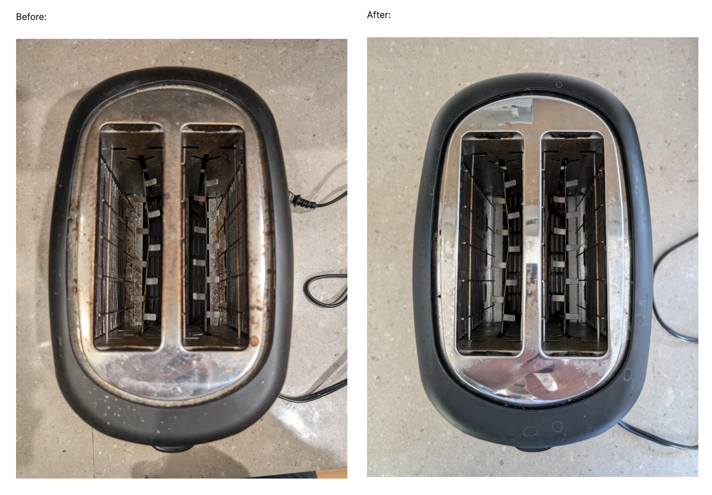

(⏱️ *~8 min read*)

Once again I got swamped with work so I missed last month's Signal Boost / Links post, so here's a two-fer, for all the stuff I recommend that I found last & this month.

Previous months' Signal Boosts: [July/Aug 2024](../signal-boosts-aug-2024/), [June 2024](../signal-boosts-june-2024/), [May 2024](../signal-boosts-may-2024/)

This month's Signal Boosts:

1. 🐦 Trans furry hyperpop conlang musical mockumentary [↪](#zewei)
2. 👋 DynamicLand is back, bay-beeeee [↪](#dynamicland)
3. 🍞 "I put a toaster in the dishwasher" [↪](#toaster)
4. 🧢 "I wish I could wear hats" [↪](#hats)
5. 🌕 "H.S." [↪](#hs)
6. 🐺 A 3D-printable claw [↪](#claw)
7. 👟 Slip-on Shoes [↪](#shoes)

---

## 🐦 Trans furry hyperpop conlang musical mockumentary

Previously, I signal-boosted the constructed language (conlang) [toki pona](https://blog.ncase.me/signal-boosts-aug-2024/#toki-pona), and the trans furry hyperpop musician [Ida Deers](https://blog.ncase.me/signal-boosts-aug-2024/#moretransfurryhyperpop).

This month, a fan emailed me to tell me an artist who combines *both*: **[ZeWei](https://www.zewei.xyz/)**. (ok I guess their music's more IDM than hyperpop, but w/e)

Recently, ZeWei created a mockumentary for a "cursed conlang" contest. Imagine *Arrival (2016)* but furry. It's a short film about a linguist who gets stuck in an alien world full of cyborg-trees, whose language a) has 600 pronouns, b) the phonemes are microtonal music, and c) the formality system is *so* intense, that the social authority of who you're talking to modifies not just Subject-Verb-Object order, but even order of *sentences and paragraphs*. And that's just *three* of the many messed-up features of this constructed language!

And then at the end, as a total flex, ZeWei performs *an entire song* in this language.

22 minute video, very worth the watch:

<iframe width="640" height="360" src="https://www.youtube-nocookie.com/embed/Ql0VKM7tCCo?rel=0" title="YouTube video player" frameborder="0" allow="accelerometer; autoplay; clipboard-write; encrypted-media; gyroscope; picture-in-picture; web-share" referrerpolicy="strict-origin-when-cross-origin" allowfullscreen></iframe>

This artist also has a Bandcamp! [Here's an older album from them](https://zewei.bandcamp.com/album/flickering), with accompanying YouTube release:

<iframe width="640" height="360"  src="https://www.youtube-nocookie.com/embed/O3jLuPHEXMA?rel=0" title="YouTube video player" frameborder="0" allow="accelerometer; autoplay; clipboard-write; encrypted-media; gyroscope; picture-in-picture; web-share" referrerpolicy="strict-origin-when-cross-origin" allowfullscreen></iframe>

Check them out!

## 👋 Dynamicland is back, bay-beeeee

**[THEY'RE BACK!](https://dynamicland.org/)**

(after being closed for the pandemic & a bunch of internal restructuring)

What is Dynamicland? Well first, *why* is Dynamicland? Right now, the overall trend in computing is to be isolating, take away user agency, and limit ourselves to our thumbs. Dynamicland wants to reverse all those trends. Dynamicland is a lab, a proof-of-concept, of computing that's social, where everyone can be a creator, and you use your full bodies to interact with it.

**Dynamicland is _a whole building that is a computer interface._**

(Here's a 7-minute intro:)

<iframe width="640" height="360"  src="https://www.youtube-nocookie.com/embed/5Q9r-AEzRMA?rel=0" title="YouTube video player" frameborder="0" allow="accelerometer; autoplay; clipboard-write; encrypted-media; gyroscope; picture-in-picture; web-share" referrerpolicy="strict-origin-when-cross-origin" allowfullscreen></iframe>

*Right now*, Dynamicland accomplishes this by having cameras that track objects, and projectors to put displays on them. It's like mixed reality except it doesn't require that everyone buy their own $3,000+ headset. However, I need to emphasize: *this cameras-and-projectors system is NOT the point of Dynamicland,* it's just the closest that can be accomplished with today's tech. (Maybe in the far future we'll have fully programmable matter?) As the saying goes: *"Look where I'm pointing at, not at the tip of my finger."*

Two personal notes:

1\) The founder of Dynamicland, Bret Victor, greatly inspired me, is a good mentor, and invited me to the first Explorable Explanations workshop, which basically single-handed created my whole career over the past decade. So, this is a note of gratitude! (and/or disclosure of conflict-of-interest)

 2\) A few years ago, at Dynamicland, I made a game called FROG WARS played with origami frogs. The goal was to hop your (physical) frogs towards (virtual) flies, while also bumping your opponents' (physical) frogs out of the arena.

It was the best game I ever made and I'll never live up to it again.

## 🍞 "I put a toaster in the dishwasher"

**[A lil' anecdote from JD Stillwater](https://jdstillwater.blogspot.com/2012/05/i-put-toaster-in-dishwasher.html).** Common sense says no of *course* you shouldn't put a toaster in a dishwasher — and a *lot* of sarcastic, over-confident internet comments back that up.

But, if you actually think about the physics step-by-step, an electrical short happens when there's an unintended path for electricity to travel (e.g. through water), which can cause damage. So, if you were to put an unplugged toaster in a dishwasher, *then let it dry for several days*, there would be no leftover water in it (toasters are *designed* to avoid trapping moisture), and thus, no risk of an electrical short.

But that's all theory. Toasters are cheap. So, JD Stillwater just *tried it*, and,

yup, it worked!

Signal boosting this because it's a great short (real-life) story, that shows the conflict between *seeming* scientific & rational, and *actually being* scientific & rational. Similar vibes to [Feynman's famous Cargo Cult Science talk](https://calteches.library.caltech.edu/51/2/CargoCult.htm).

(Hat tip to Slime Mold Time Mold [for helping me discover this essay](https://slimemoldtimemold.com/2024/08/30/links-for-august-2024/), and kudos to Nehaveigur [for successfully replicating this experiment!](https://nehaveigur.com/2024/09/05/i-put-my-toaster-in-the-dishwasher/))

(That said, I'm still too cowardly to *actually* try putting a toaster in a dishwasher. If *you* want to try replicating this experiment, then: 1) *Please let it dry for several days before plugging it back in.* 2) Just in case, get a large fire extinguisher graded for electrical fires (you should have a fire extinguisher anyway), and 3) Neither I nor the authors of the above links are responsible if you die, lol.)

## 🧢 "I wish I could wear hats"

Last month, a friend introduced me to the works of Brian David Gilbert, and...

... look, I can't explain BDG. I can only beseech you to look & listen to this 98-second video:

<iframe width="640" height="360"  src="https://www.youtube-nocookie.com/embed/bmFGbBmlyKQ?rel=0" title="YouTube video player" frameborder="0" allow="accelerometer; autoplay; clipboard-write; encrypted-media; gyroscope; picture-in-picture; web-share" referrerpolicy="strict-origin-when-cross-origin" allowfullscreen></iframe>

*Right?!*

*"Heh, that's a charming silly idea. Oh. Oh okay it's body dysmorphia and possibly gender dysphoria. Oh okay that hat at the end is wearing a hat. Oh."*

But don't worry, [not all his songs are metaphors](https://www.youtube.com/watch?v=Sfw9n2ktX9k). One time he just published [a half-hour-long video explaining healthcare terminology](https://www.youtube.com/watch?v=-wpHszfnJns). It was actually upsettingly useful; I made like 20+ Anki flashcards off that video.

## 🌕 "H.S"

Just a vague cherry-picked hypothesis, but I've noticed at least two (& a half) major "vibe eras" in Western comedy during my lifetime:

* The 90's & 00's were the peak of edgy transgressive humor, like (early) South Park, (early) Family Guy, Dane Cook, etc.
* Perhaps, as a reaction to the hollowness of "being edgy for edgy's sake", recent decades had more self-deprecating, introspective humor, like: Bo Burnham, Bojack Horseman, and the comics of Shen Comix, Sarah's Scribbles, and Hyperbole & a Half. (Even South Park has become more reflective & character/story-driven.)
* And now, perhaps as a reaction to how much of a downer *that* vibe is — especially "post"-pandemic — comedy might now be shifting towards a "WE ARE SO BACK" vibe?

As an example of that last vibe shift, consider Australian comedy musician Tom Cardy. His early work was all [very self-deprecating](https://www.youtube.com/watch?v=GbmP2c6TGKc), but in recent years it's shifted more towards a defiantly upbeat style.

For example, this, a recent song & music video (animated by [LankyMF](https://www.youtube.com/@LankyMF)), **"H.S."**:

<iframe width="640" height="360"  src="https://www.youtube-nocookie.com/embed/kK0KPuH32mc?rel=0" title="YouTube video player" frameborder="0" allow="accelerometer; autoplay; clipboard-write; encrypted-media; gyroscope; picture-in-picture; web-share" referrerpolicy="strict-origin-when-cross-origin" allowfullscreen></iframe>

This song & music video genuinely makes me feel *so* emotional. I've listened to it several times on loop, it's a great comfort pump-yourself-back-up song. And huge props to LankyMF for the delicious character designs, and the music video's story!

**[You can get Tom Cardy's latest album here!](https://tomcardy.bandcamp.com/album/the-dancefloor-at-the-end-of-the-universe)** And watch the other music videos [on his YouTube](https://www.youtube.com/channel/UCW7AGm8JSBEEew61dJIgl_A).

## 🐺 A 3D-printable claw

Being an adult means you can put minimal effort into a Halloween costume because it's "sexy". Anyway here I am:

<video width="360" height="640" controls style="display:block; margin:0 auto;"><source src="../content/stuff/2024-10/meow.mp4" type="video/mp4">Your browser does not support the video tag.</video>

A friend helped me 3D print five of these claws (at different sizes to fit my fingers) and, wow:

1. They are surprisingly sharp, and can leave marks that last a *week*.
2. They have improved my quality of my... relationships.

**[Check out the 3D printable file here, by Tioh!](https://www.printables.com/model/478899-fursuit-finger-claw)** (If you don't have a 3D printer nor know a friend who does, you *might* find one at a local makerspace or library.)

If anybody asks you why you're printing them, tell 'em it's for Halloween.

If it's past Halloween by the time you're printing them, tell 'em it's for next Halloween.

## 👟 Slip-on Shoes

I hate tying shoelaces.

Let's crunch the numbers, shall we?

* 1 minute *at best* to tie-on and take-off shoes each day
* That's ~365 minutes lost a year, or ~6 hours.
* If I value my time at $30/hour, that's $180 lost a year. You can definitely buy slip-on shoes for less than $180.

But wait, let's go further:

* Let's conservatively estimate that ~50% of adults globally wear shoes with shoelaces. (The rest wear slip-on sandals, no shoes, etc.)
* There are ~6,000,000,000 adults worldwide. So, 50% of that, ~3,000,000,000 adults lose 6 hours every year. Or: 18,000,000,000 person-hours lost per year.
* Since there's 24 hours a day, 365 days a year, ~80 years per lifetime, that's... ~25,000 person-lifetimes a year, lost to tying shoelaces.
* For comparison: In the US, ~25,000 people are murdered annually. The 9/11 attacks killed ~3,000 people.
* Therefore: Shoelaces are equivalent to American murder, or eight 9/11's a year.

*Obviously tone-indicator sarcastic*, but the point still stands:

I HATE TYING SHOELACES

**Anyway, I got some slip-on shoes [from KEEZMZ on Amazon](https://www.amazon.com/dp/B08TBT3KBX).** I originally wanted Velcro but I suggested this to a friend and he said "yeah if you wanna look like a kid?" so I guess I got adult-shamed into buying slip-on:

---

That's it, that's all for this month.
